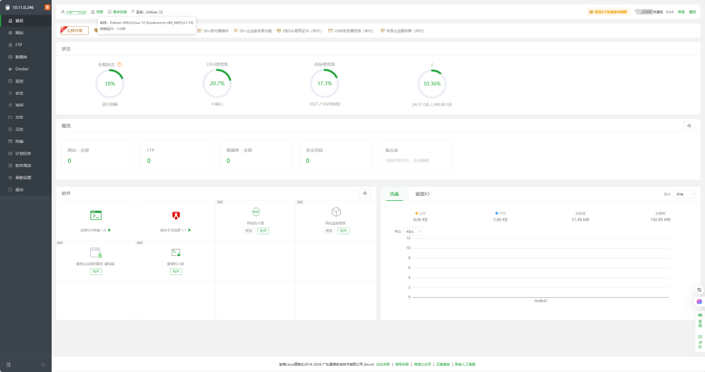
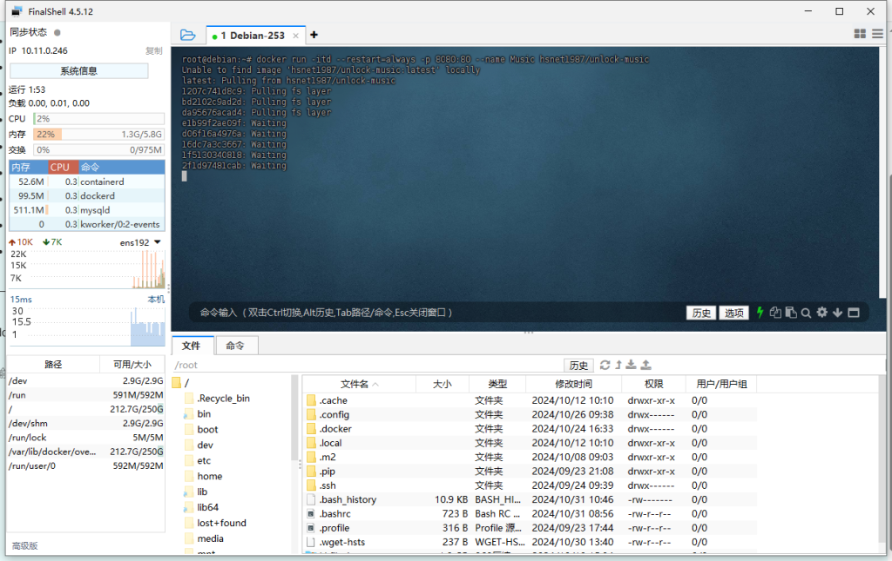
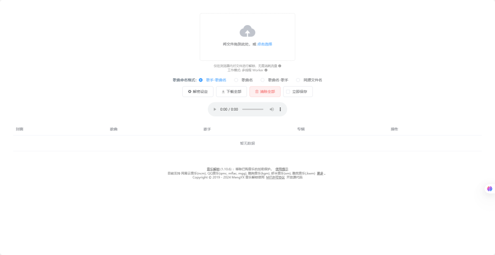

# Docker Unlock Music 解锁音乐格式，享受自由聆听

在浏览器中解锁加密的音乐文件.话就不说了 自行查看官网和文档。[连接](https://git.unlock-music.dev/um/web)

支持的格式

- QQ 音乐 (.qmc0/.qmc2/.qmc3/.qmcflac/.qmcogg/.tkm)

- Moo 音乐格式 (.bkcmp3/.bkcflac/…)

- QQ 音乐 Tm 格式 (.tm0/.tm2/.tm3/.tm6)

- QQ 音乐新格式 (.mflac/.mgg/.mflac0/.mgg1/.mggl)

- QQ 音乐海外版JOOX Music (.ofl_en)

- 网易云音乐格式 (.ncm)

- 虾米音乐格式 (.xm)

- 酷我音乐格式 (.kwm)

- 酷狗音乐格式 (.kgm/.vpr)

- Android 版喜马拉雅文件格式 (.x2m/.x3m)

- 咪咕音乐格式 (.mg3d)

演视环境Debian12和宝塔面板。

docker run -itd --restart=always -p 主机端口:80 --name Music hsnet1987/unlock-music

