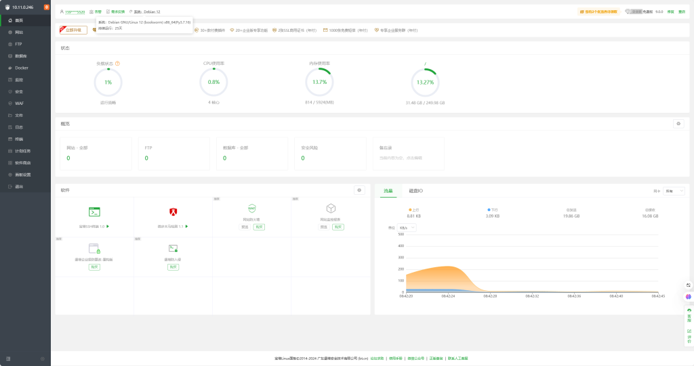
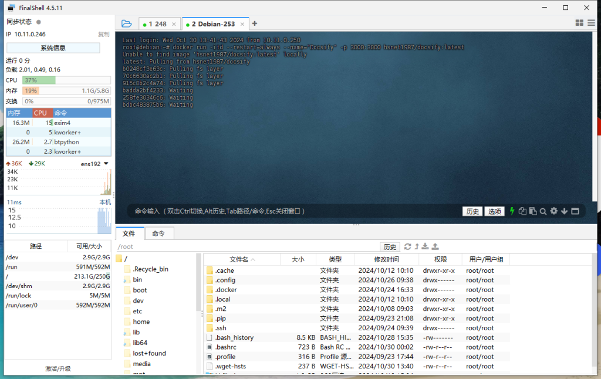
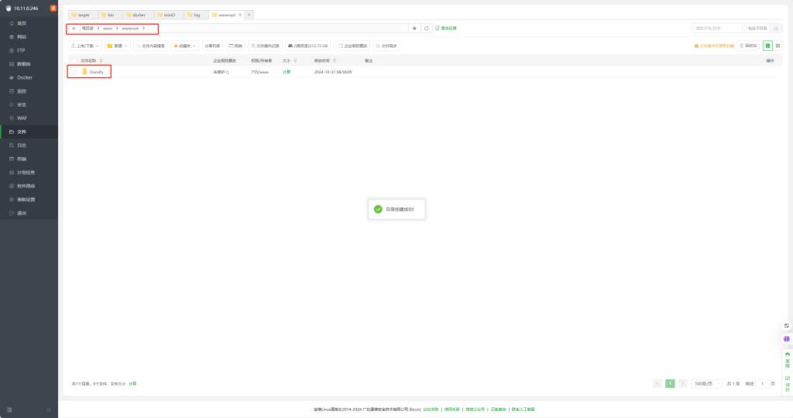
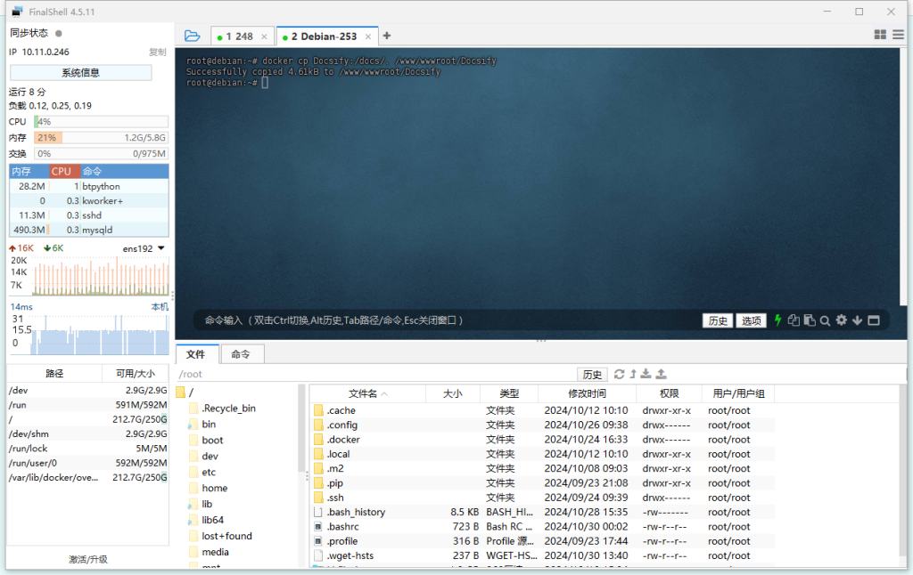
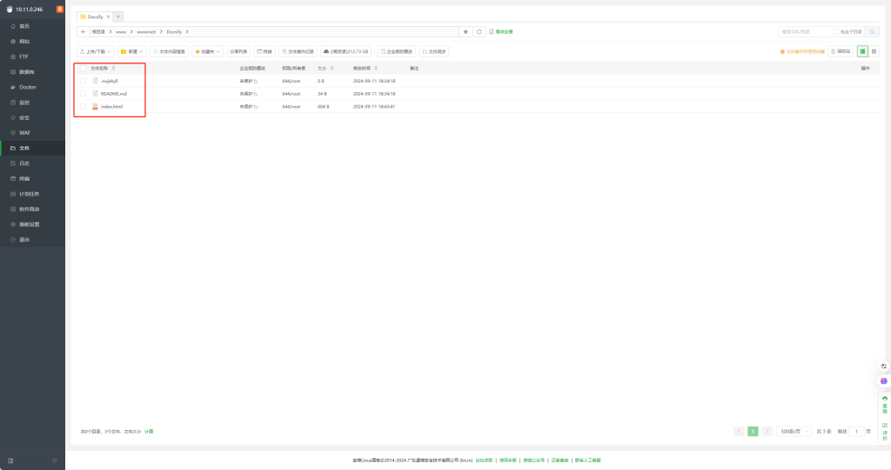
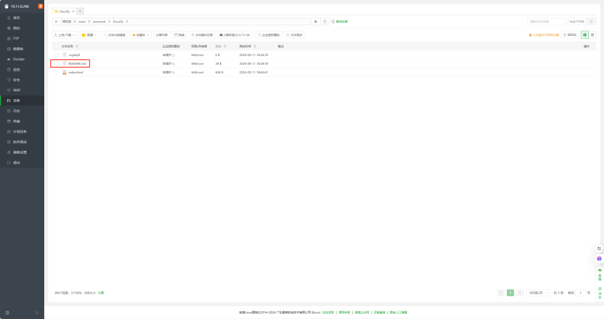
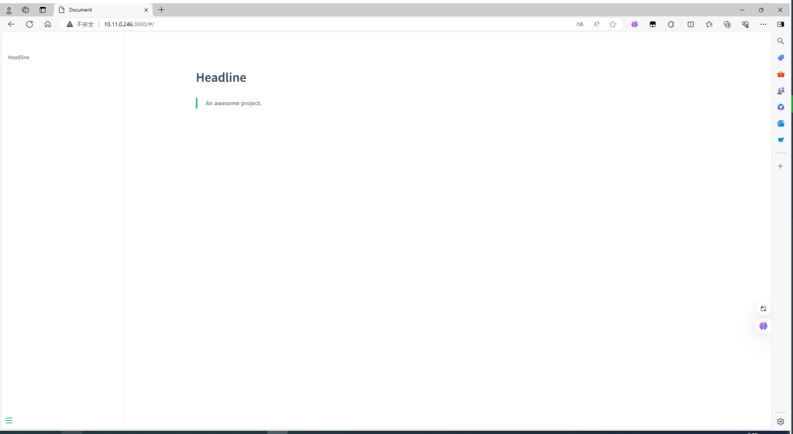
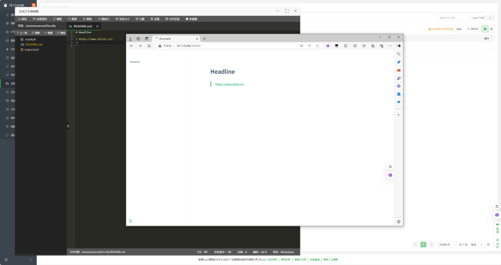

# Docker 快速部署搭建Docsify个人知识库

#### Docsify介绍与文档

一个神奇的文档网站生成器 具体请自行参考官方网站 [点击连接](https://docsify.js.org/)

下面是自己打包的Docker镜像，可以完美的映射文件到宿机上大大方便后期编辑和修改。

本次演视环境基本Debian12 和宝塔面板。该教程同样支持群晖。

###### 首先拉取并运行容器

打开FinalShell连接好服务器

docker run -itd --restart=always --name="Docsify" -p 3000:3000 hsnet1987/docsify:latest

创建存放文件的文件夹Docsify，BT默认在 /www/wwwroot下

复制容器内的文件夹到主机上

docker cp Docsify:/docs/. /www/wwwroot/Docsify

注意 /docs/. 的/后有一点

确保第二张图片里的三个文件夹存在就好了。

删除容器

docker rm -f Docsify

再次运行容器并设置映射文件夹做长久存储。

docker run -itd --restart=always --name="Docsify" -p 3000:3000 -v /www/wwwroot/Docsify:/docs hsnet1987/docsify:latest

浏览器访问 http://IP:3000 就可以访问网页了。想要个性化设置详情请访问官方文档

后面只要修改README.md 的内容就可以了。后期可以配合Code-server编辑器可以在线编辑不用每次登录宝塔面板

