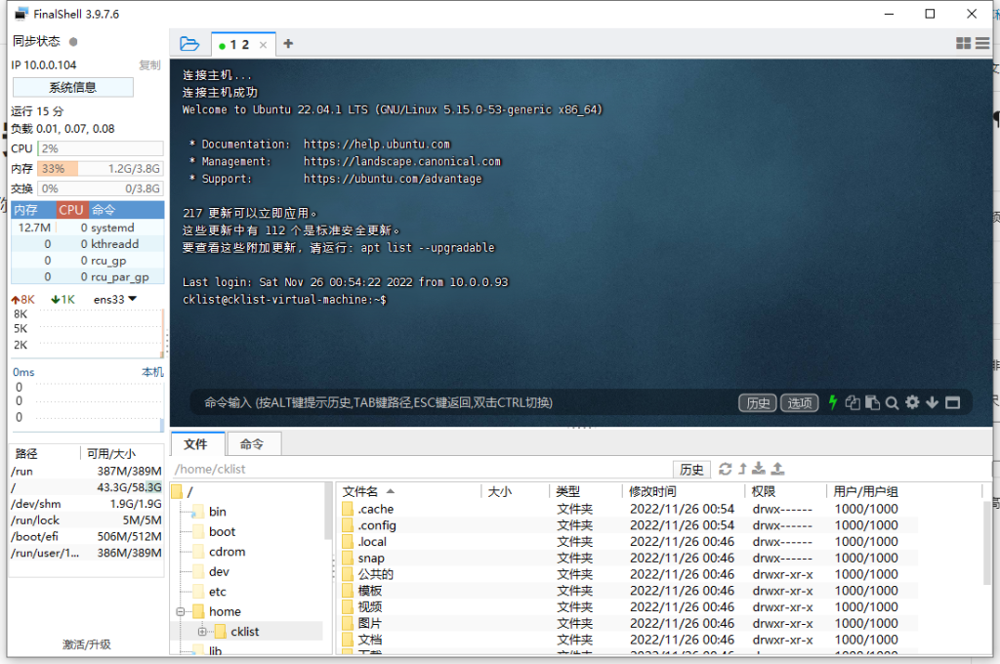
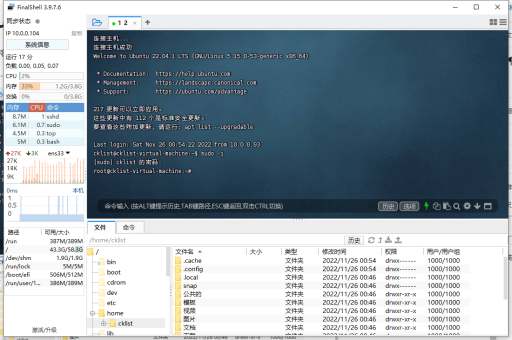
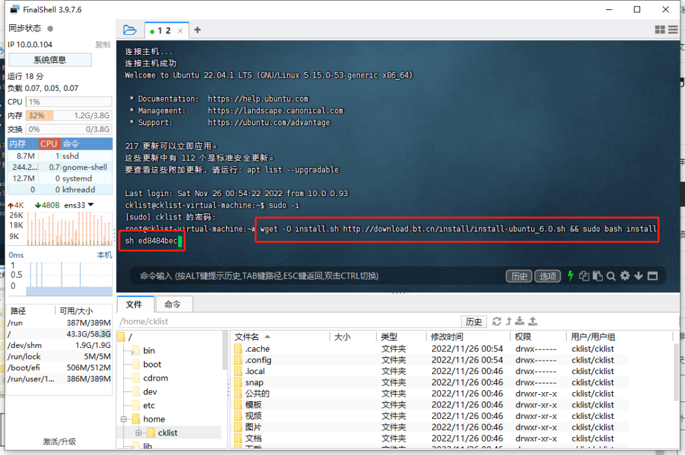
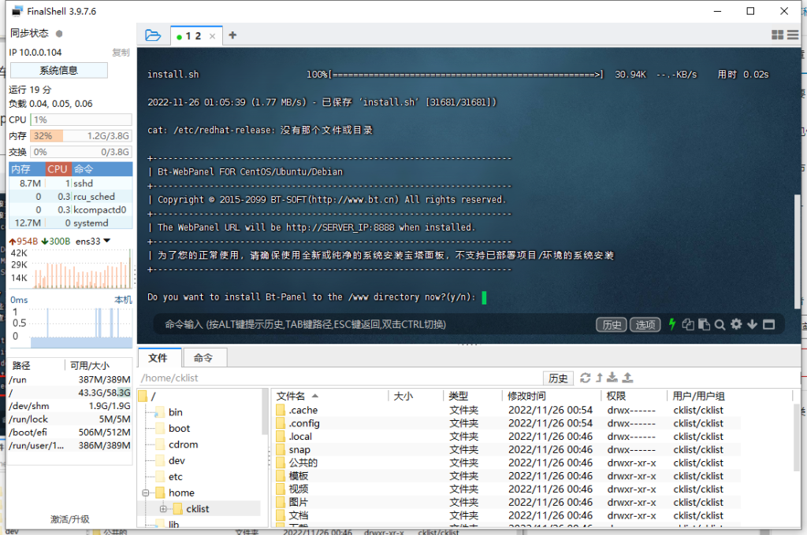
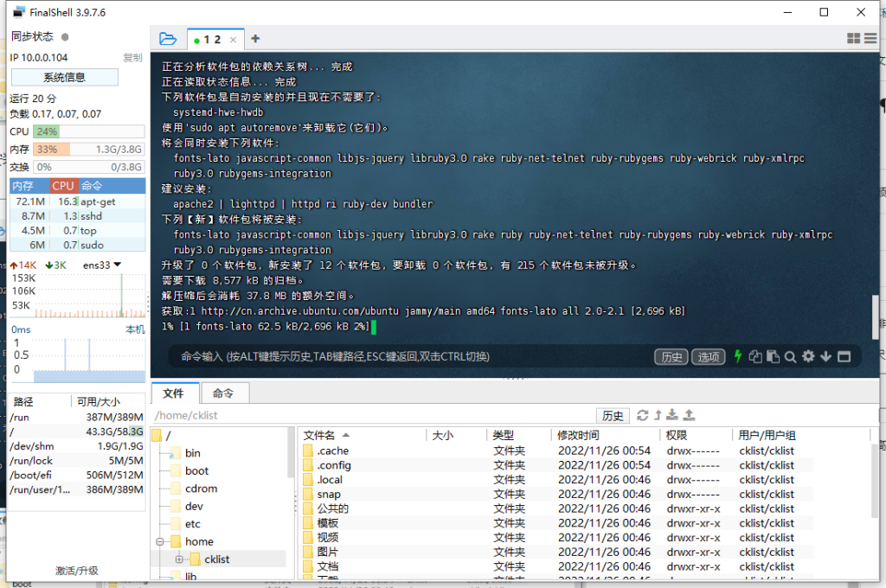
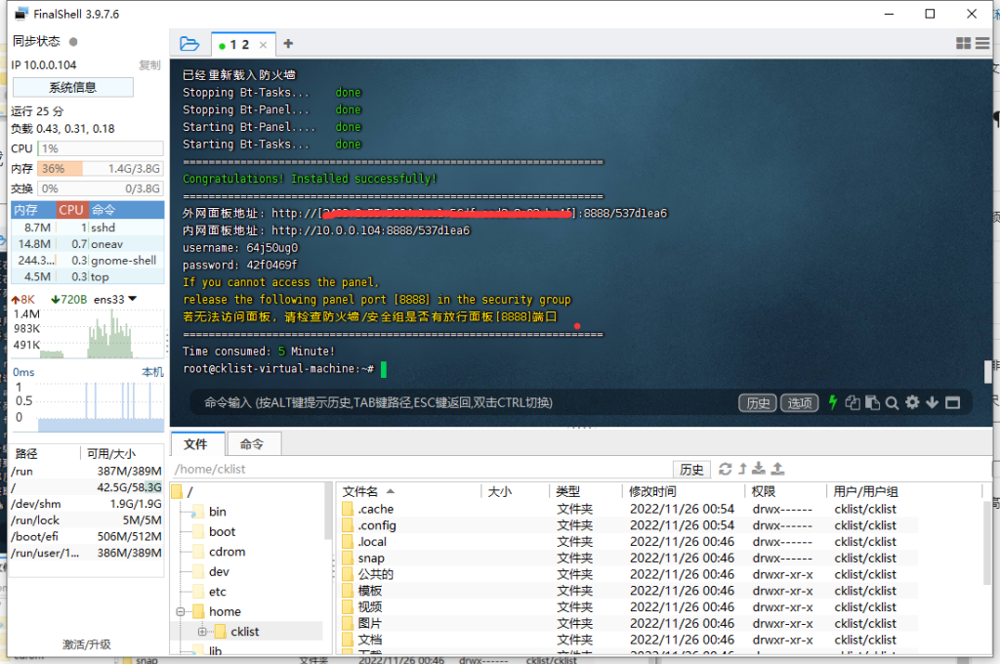
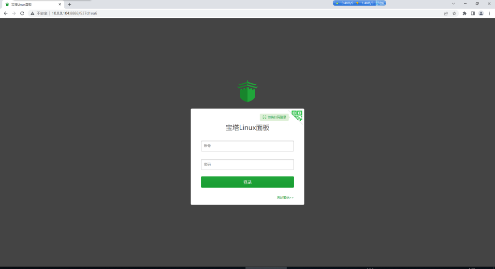
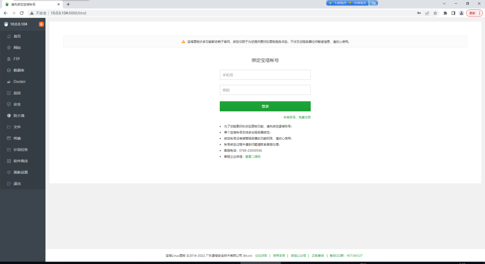

# Ubuntu 安装宝塔面板

首先用SSH工具连接你的ubuntu服务器 我用的是FinalShell

输入  sudo -i 来提升为root权限 再次输入密码  注意 密码不显示

在ssh输入 以下命令 回车

> wget -O install.sh http://download.bt.cn/install/install-ubuntu_6.0.sh && sudo bash install.sh ed8484bec

期间会让你选择是否安装 输入 Y

这会让他跑完数据下载 速度 取决你网络速度和服务器性能

直到出现以下画面 宝塔就安装成功了

用浏览打开内网显示URL,如果是外网请在防火墙放行8888端口

国内宝塔登录要绑定手机号码和账号没有的请自行注册 输入账号密码

宝塔面板安装完成