# 宝塔面板安装IT Chemex资产管理系统

咖啡壶（Chemex）是一个轻量的、现代设计风格的 ICT 资产管理系统。得益于 [Laravel](https://gitee.com/link?target=https%3A%2F%2Flaravel.com%2F) 框架以及 [Dcat Admin](https://gitee.com/link?target=https%3A%2F%2Fdcatadmin.com) 开发平台，使其具备了优雅、简洁的优秀体验。 咖啡壶（Chemex） 是完全免费且开源的，任何人都可以无限制的修改代码以及部署服务，这对于很多想要对ICT资产做信息化管理的中小型企业来说，是一个很好的选择：低廉的成本换回的是高效的管理方案，同时又有健康的生态提供支持。

相关详情请移到官方 [chemex: 🔥 咖啡壶是一个免费、开源、高效且漂亮的资产管理平台。资产管理、归属/使用者追溯、盘点以及可靠的服务器状态管理面板。基于优雅的Laravel框架开发。 (gitee.com)](https://gitee.com/celaraze/chemex)

安装前把宝塔面板安装好，不会的请移到 [Ubuntu 安装宝塔面板 – 不再優雅 (cklist.cn)](https://www.cklist.cn/?p=199)

把这三个运行环境安装好。

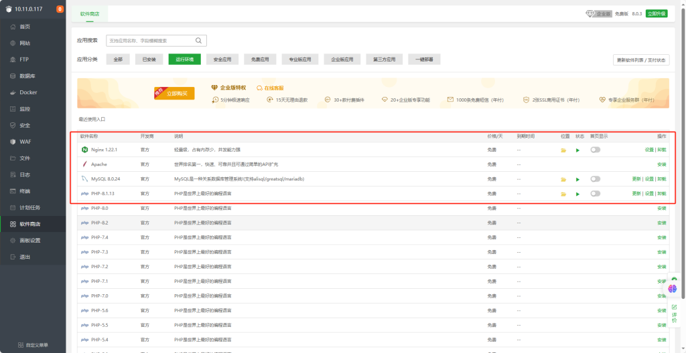

接下来把扩展安装 fileinfo

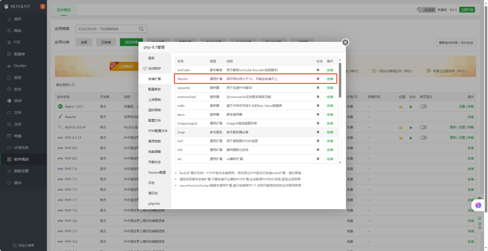

安装扩展ldap

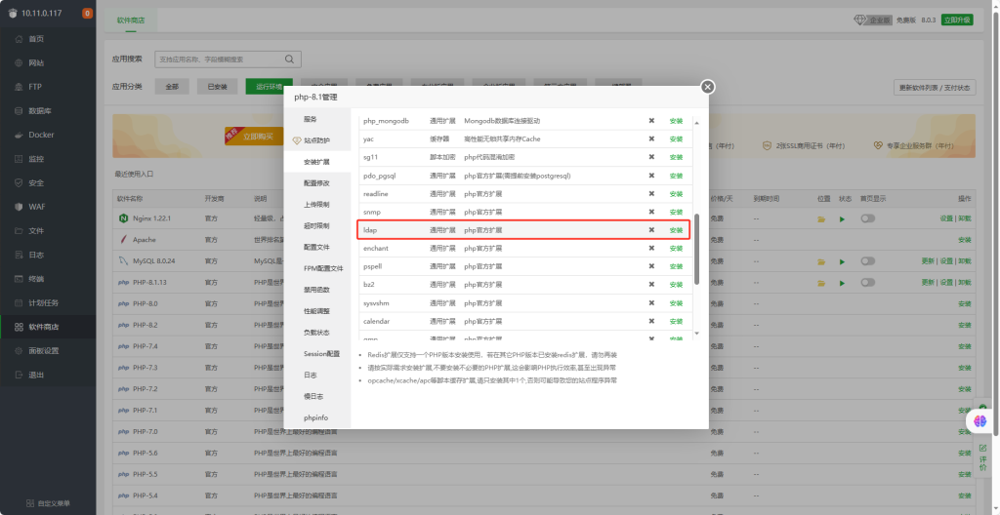

删除禁用函数

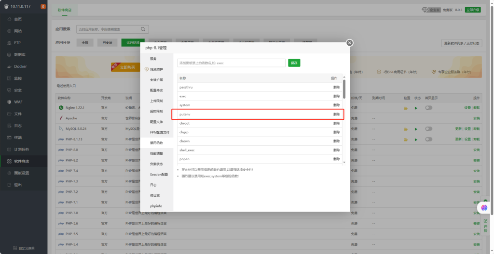

```
<code>yum -y update</code>composer self-update
composer -v
cd /www/wwwroot/
```

打开SSH工具连接上服务器更新一下系统包和把composer升级到最新版本

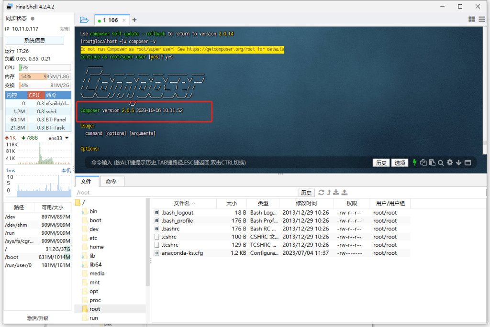


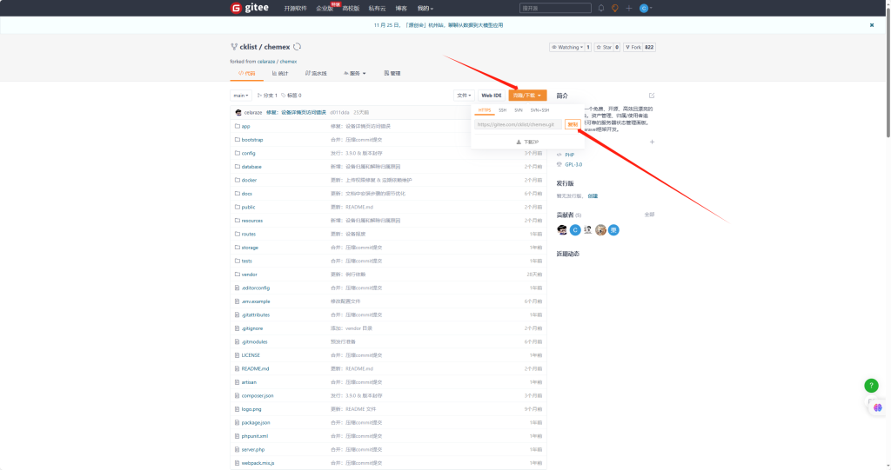


cd到项目文件夹下执行

```
<code>git submodule init && git submodule update</code>
复制配置文件

cp .env.example .env
```


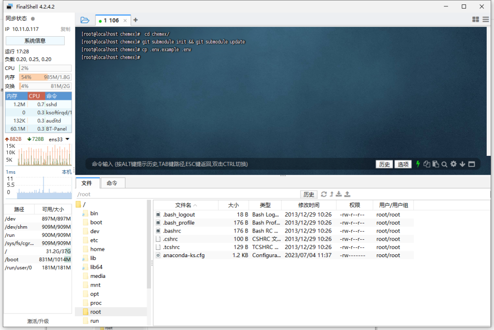

回到宝塔面板设置数据库先把root密码重置一下

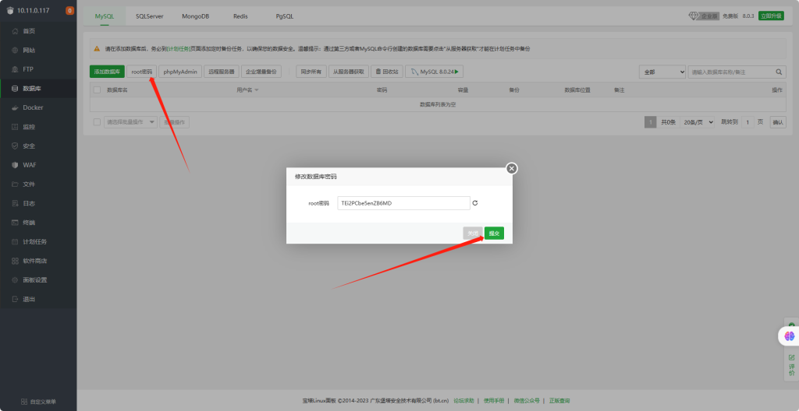

添加一个数据库 数据库名 用户 密码可以自定义请记住

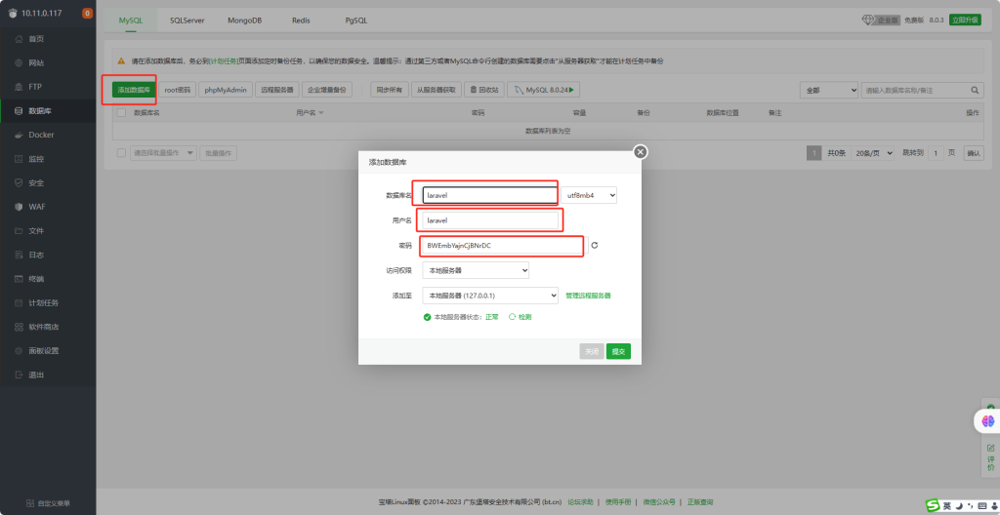

把env配置修改一下数据库连接 保存退出

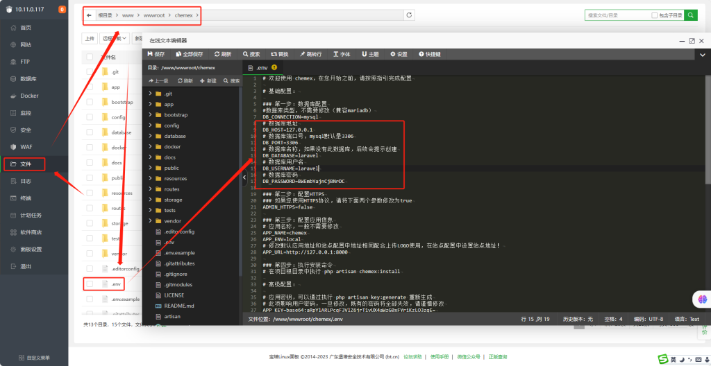

回到SSH工具 安装依赖 记住要在 /www/wwwroot/chemex下执行

```
composer install -vvv
```

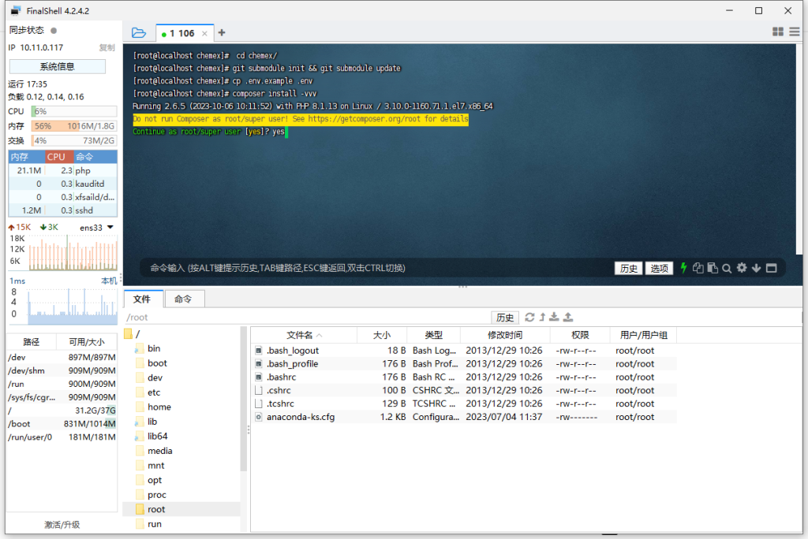


回到面板添加站点 域名写本机ip

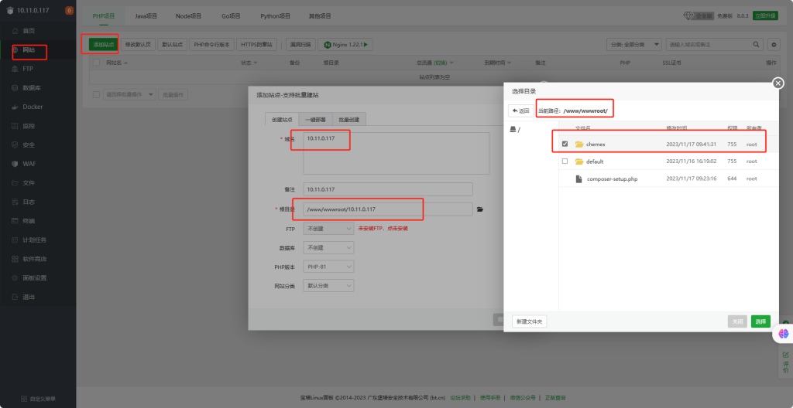

设置伪静态和运行目录和设置权限

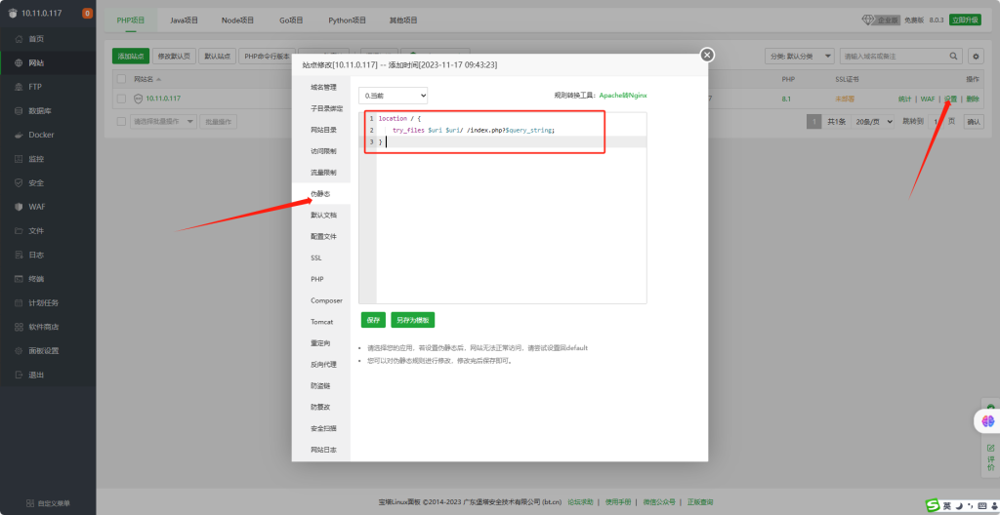

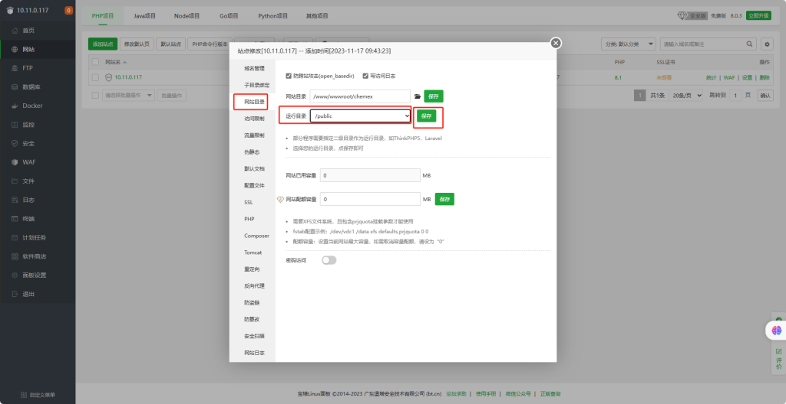

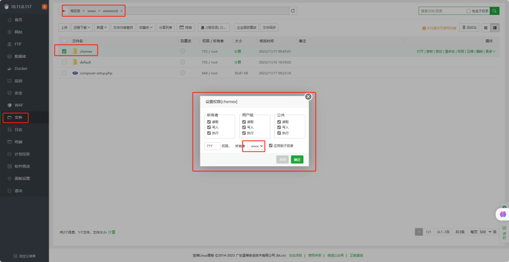

回到SSH工具 进行数据迁移

```
php artisan chemex:install
```


浏览器输入IP就可以打开系统了

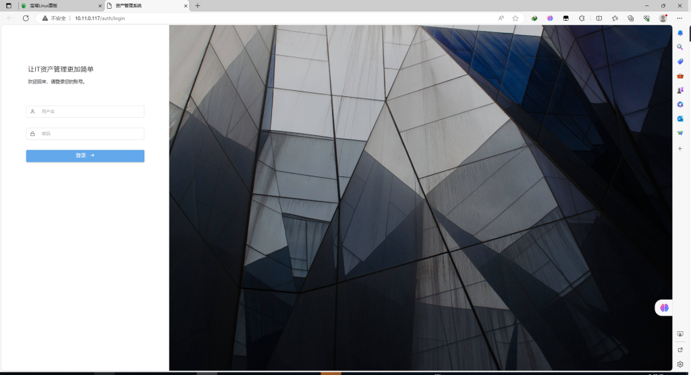

站点logo不显示原因请把env的配置成外网访问的http地址即可

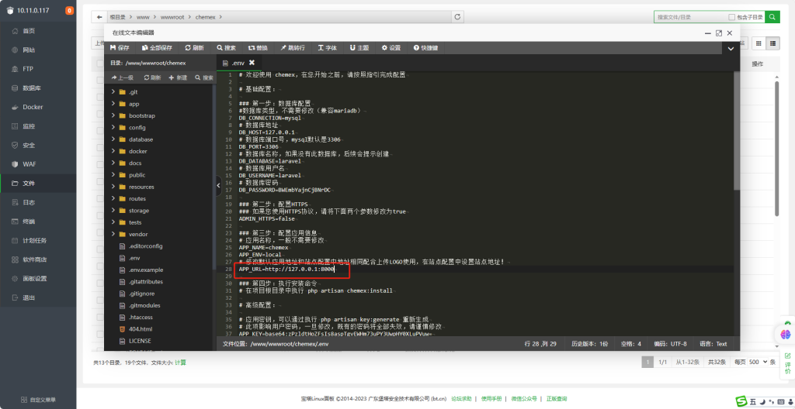

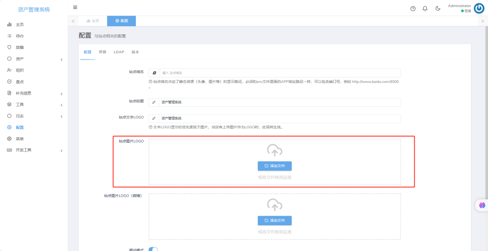