# (已失效)宝塔安装 Cat一站式IT运维管理平台

建议用centOS 8以上 我这里用的阿里的 AnolisOS-8.8 官方下载地址[关于龙蜥(Anolis) OS 8 (openanolis.cn)](https://openanolis.cn/anolisos)

提前安装好宝塔面板，不会的请参考[Ubuntu 安装宝塔面板 - 不再優雅 (cklist.cn)](https://www.cklist.cn/?p=199)

来一杯咖啡与茶，为 IT 运维从业者减轻管理负担，提升管理效率，从繁重无序的工作中解压出来，利用剩余时间多喝一杯休息一下。

这是一个专为 IT 运维从业者打造的一站式解决方案平台，包含资产管理、工单、工作流、仓储等功能模块。

与 chemex 对比，CAT 有什么不同：

1，CAT 采用全新架构设计，大量提升使用体验的细节，及紧跟最新版本潮流。

2，CAT 大部分会还原 chemex 的基础功能，但部分设计可能由于实际业务需求将被弃用。

3，重做了数据导出、导入功能，现在将提供一个更加人性化的方式。

4，简化了部署需求。

5，增加各类资产编号自动生成规则。

项目地址 [celaraze/cat: ☕ 一个开源的、开放的一站式 IT 运维管理平台。资产管理、工单、盘点以及可靠的移动端应用支持。 (github.com)](https://github.com/celaraze/cat)

首先更新系统包

`yum -y update`

注意MySQL 8.0要3700M内存以上 如果你虚拟机不满足请安装5.7版本

宝塔安装完成成请把以下四个模块安装完成

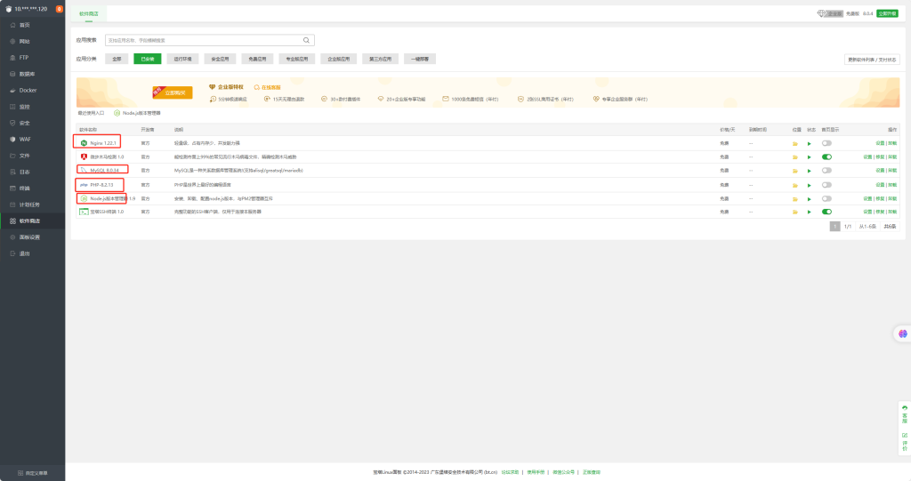

打开Node.js管理器安装最新稳定版并设置命令行版本

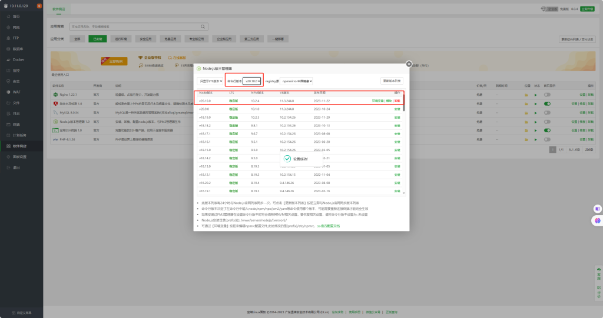

打开PHP设置 看图添加扩展

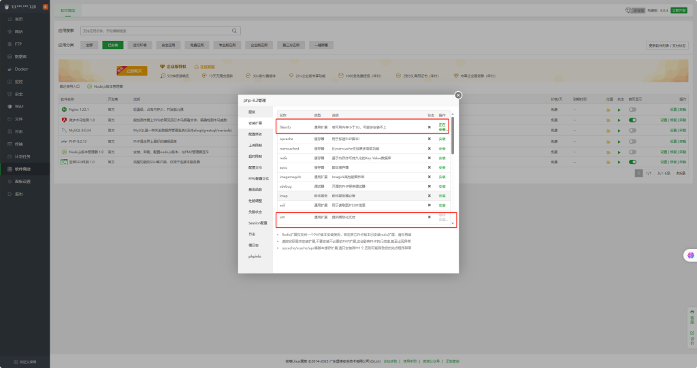

删除函数

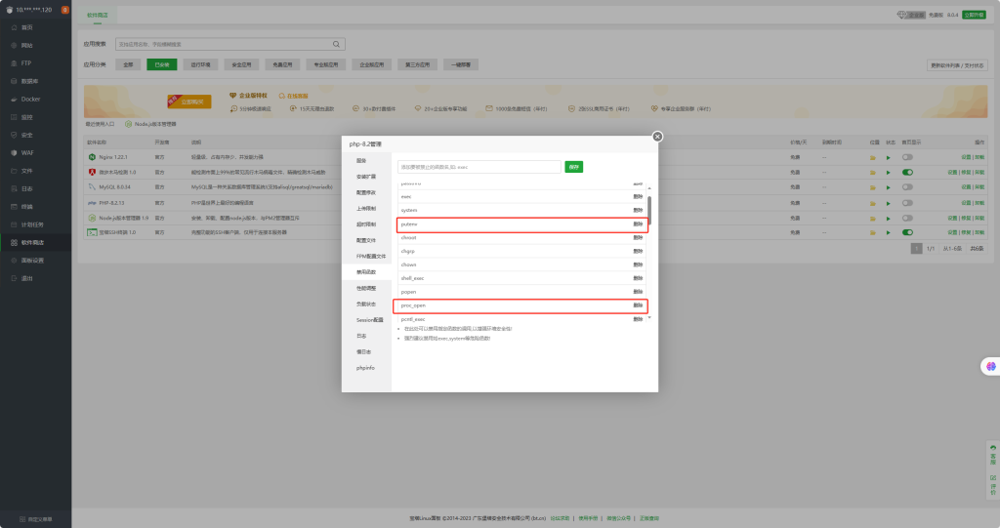

新建数据库

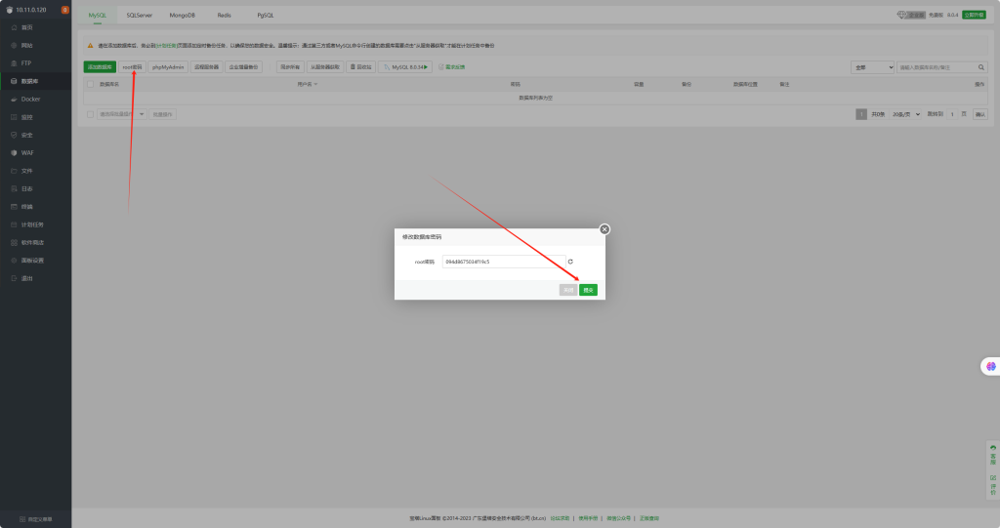

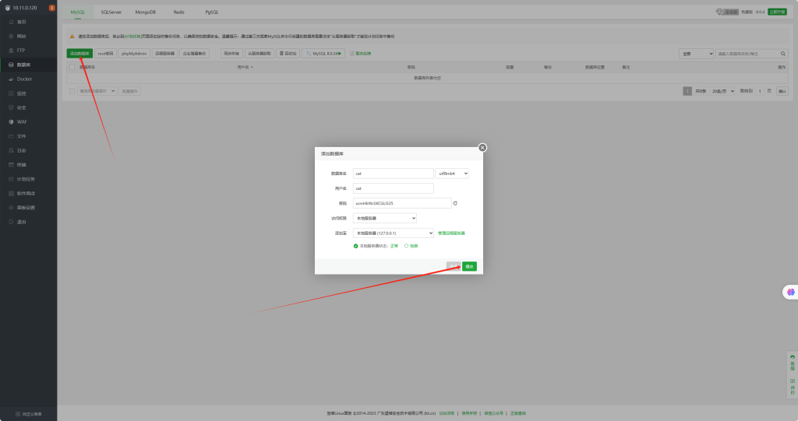

转到SSH工具 查看git有没有安装

`git -v `

如果没有运行

`yum -y install git `

检查各模块是不是正常

`npm -v`

`node -v`

`git -v`

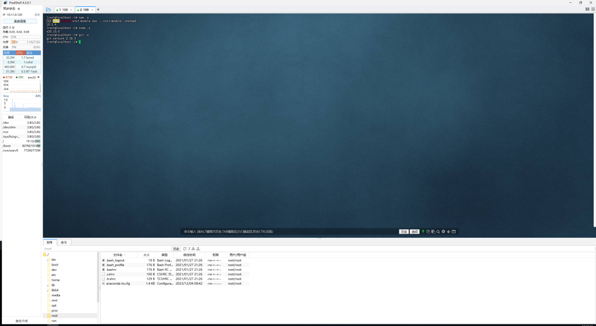

拉取代码 前建议重启一下服务器

`cd /www/wwwroot/`

`git clone https://github.com/celaraze/cat.git`

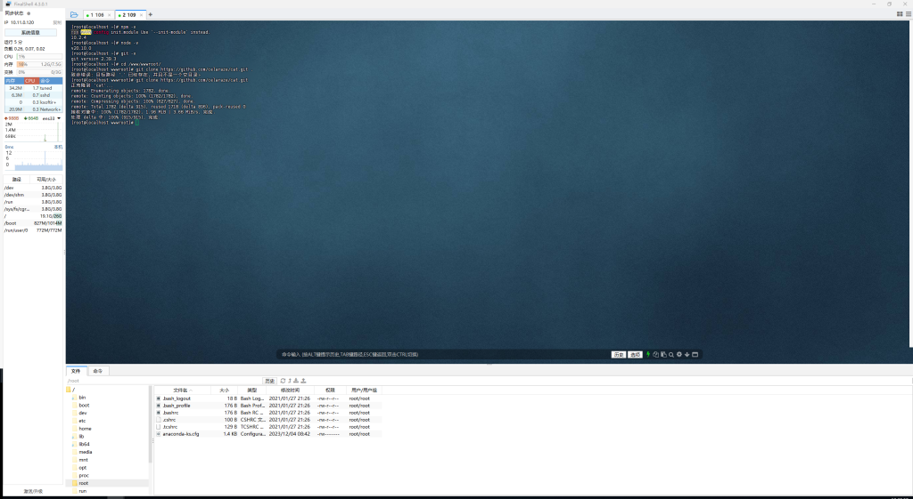

配置数据库文件

`cd cat/`

`cp .env.example .env`

把刚才新建的数据密码记一下的 在面板 双击编辑文件把数据库名字用户密码补上然后保存关闭 把APP_URL=http://127.0.0.1：8000的端口删除

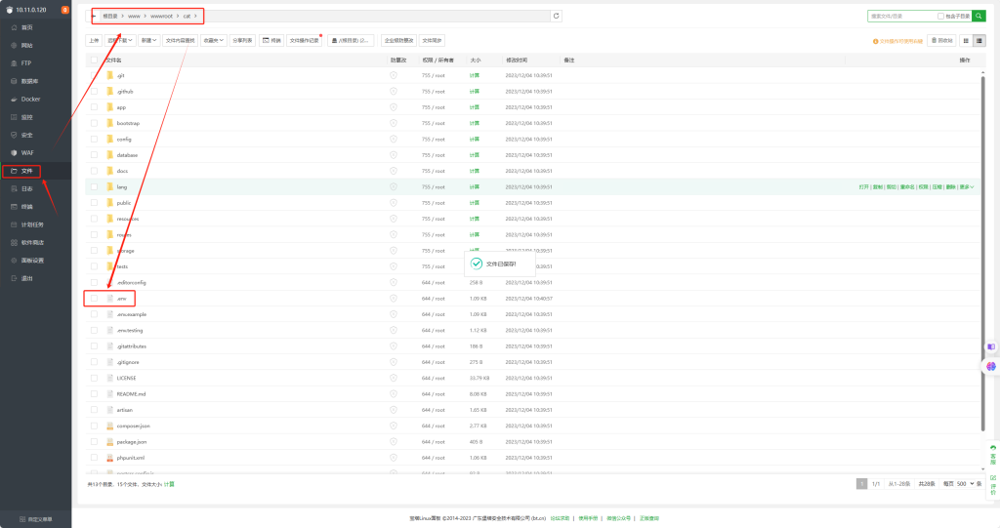

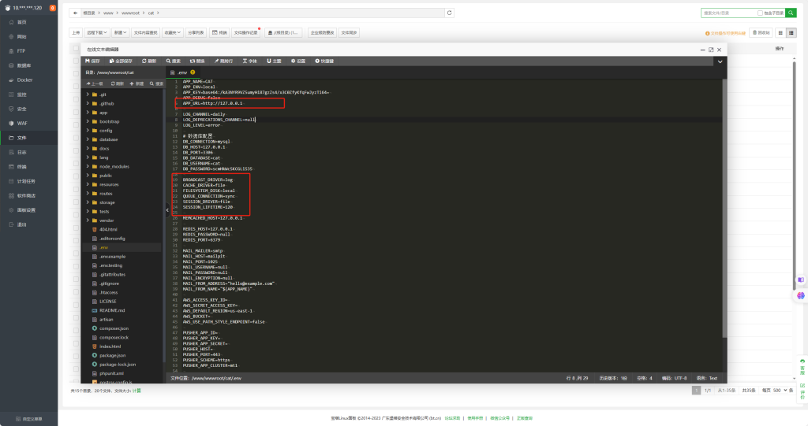

回到SSH工具.注意运行目录是不是在cat下如果是请依次运行以下命令。如有报错请使用魔法

`composer self-update`  升级一下`composer`

`composer install`     安装后端依赖。

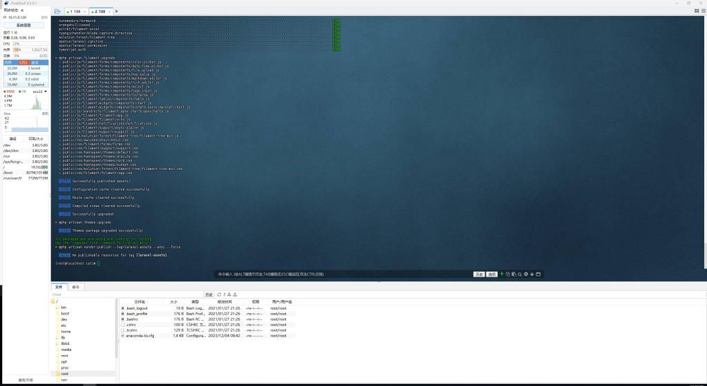

`npm install ` 安装后端依赖。

`npm run build`    编译前端依赖

`php artisan cat:install`   根据提示创建管理员账户。

回到宝塔新建网站，然后看图片设置

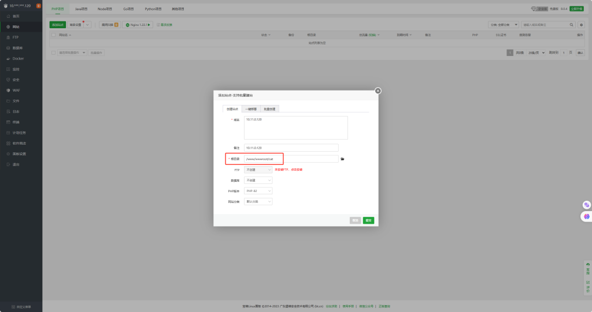

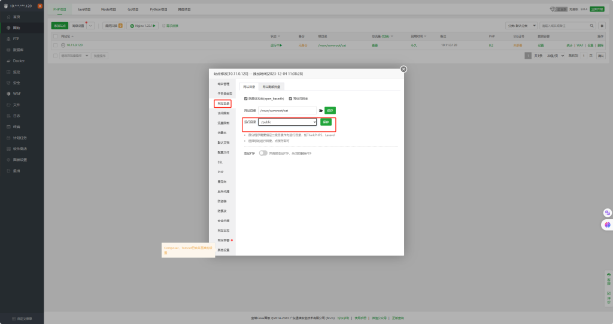

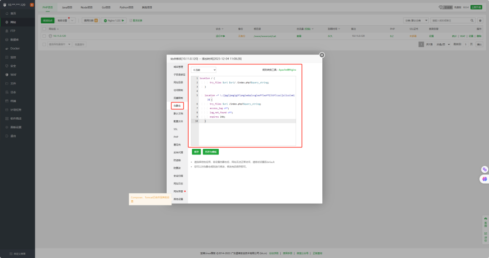

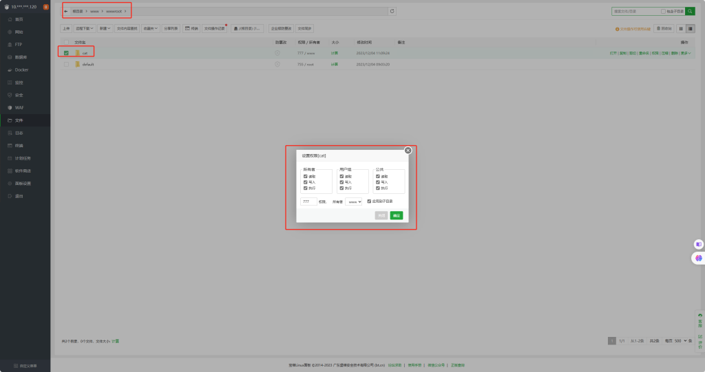

然后打开http://服务器IP 就可以登录了

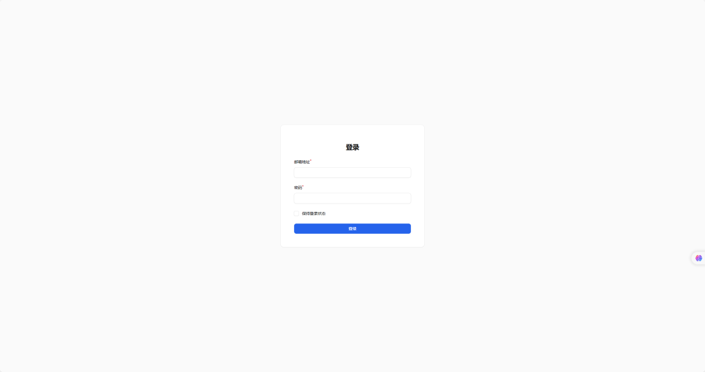

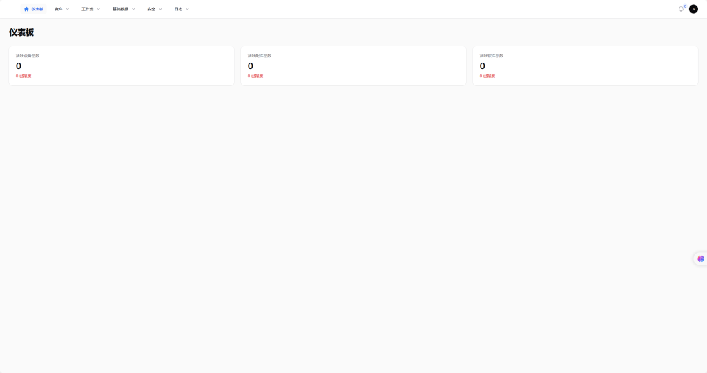

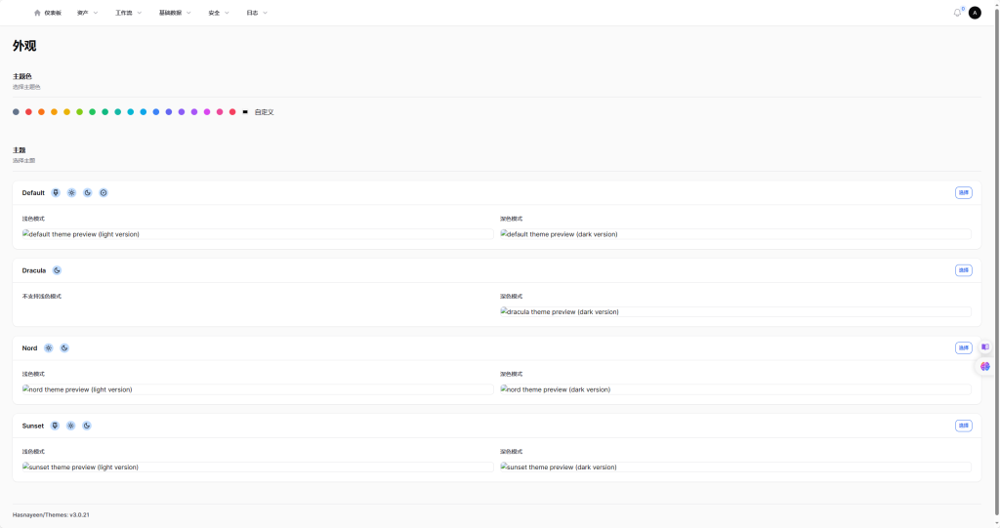