# 新宝塔安装 Cat一站式IT运维管理平台正式版

这是一个专为 IT 运维从业者打造的一站式解决方案平台，包含资产管理、工单、工作流、仓储等功能模块。

❤ 感谢各位支持。CAT 提倡与各位使用者、开发者一起创建健康生态，让本项目变的更好，欢迎提供 PR 贡献。

安装好宝塔，如果不会请参考 [Ubuntu 安装宝塔面板 - 不再優雅 (cklist.cn)](https://www.cklist.cn/?p=199)

进入软件商店把三个环境安装好

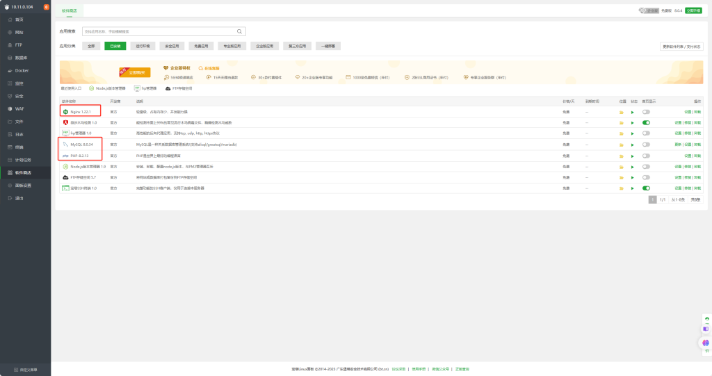

安装PHP扩展 参考下图  注意 安装完扩展建议重启一下服务器！安装完扩展建议重启一下服务器！安装完扩展建议重启一下服务器！

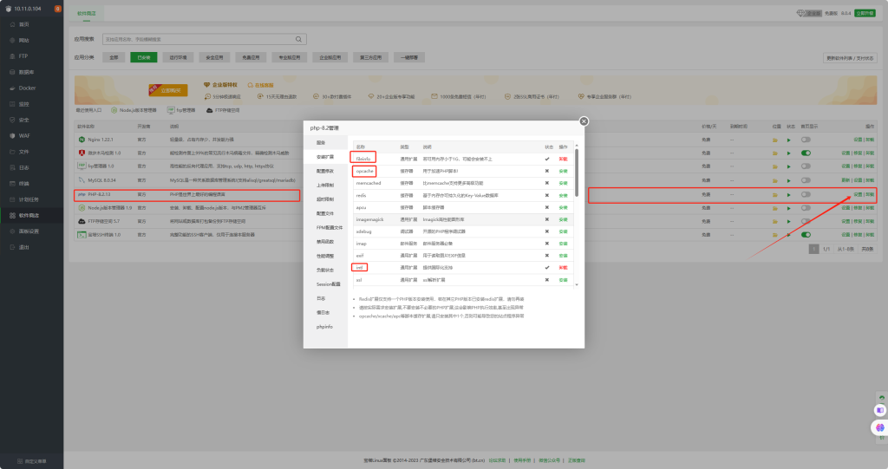

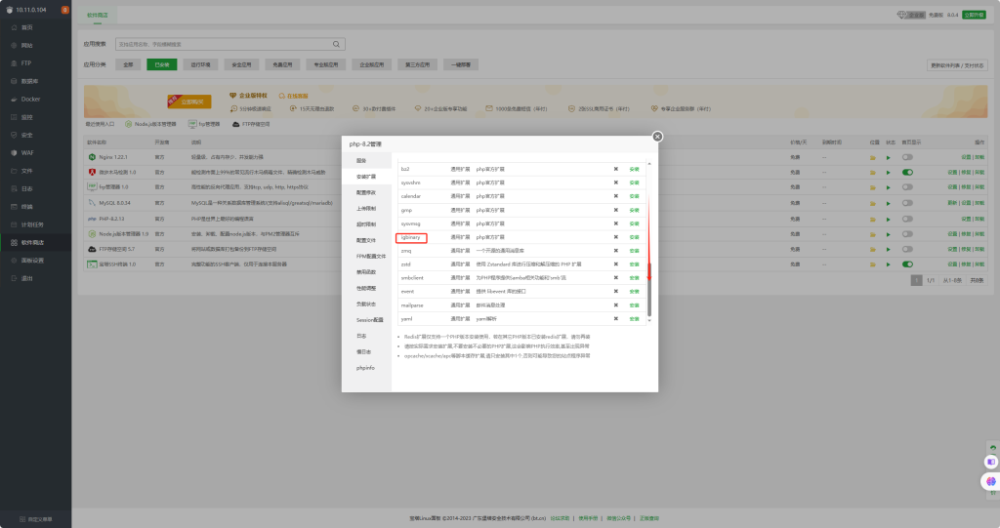

打开宝塔终端  cd 网站目录

`cd /www/wwwroot`

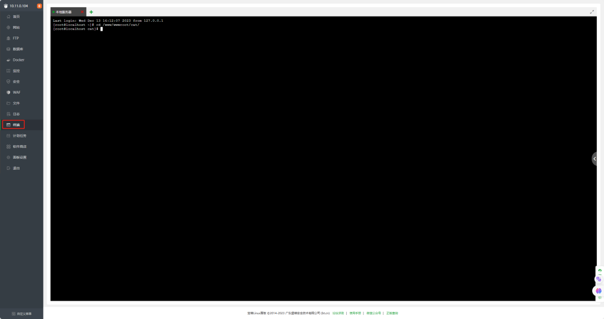

拉取代码  `git clone https://github.com/celaraze/cat.git `

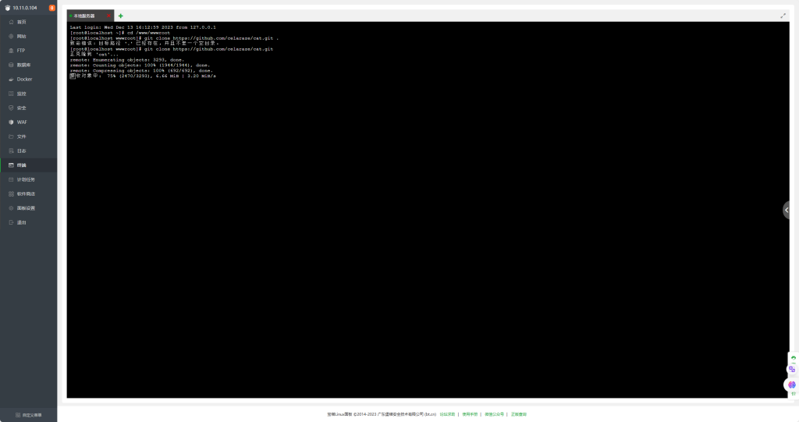

新建网站 域名可以绑定域名或服务器IP 我这里用的内网 网站目录选择刚才下载的文件夹

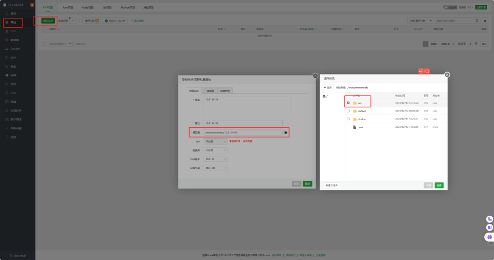

打开设置网站 看下面的图设置

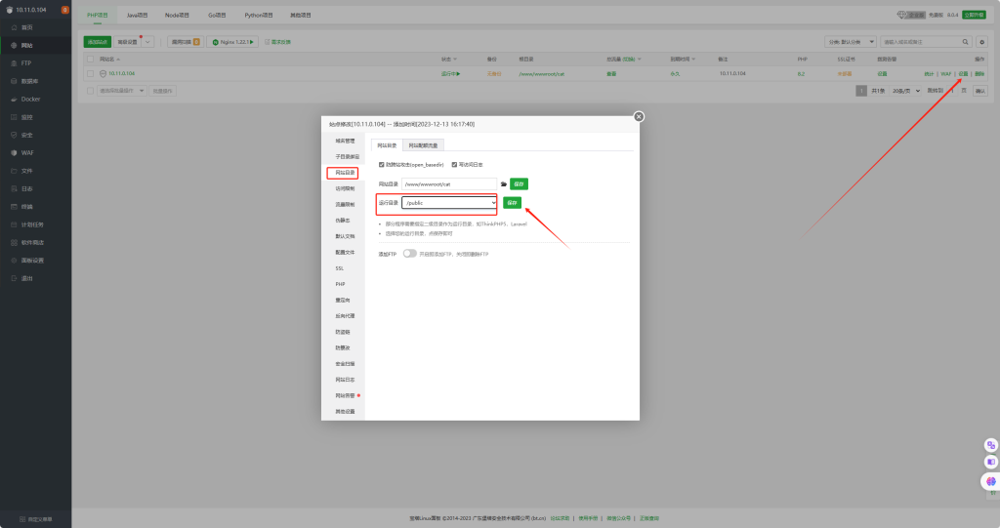

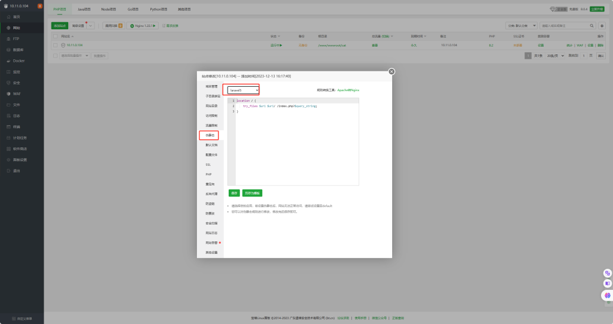

```
# 找到下面代码块
    location ~ .*\.(gif|jpg|jpeg|png|bmp|swf)$
    {
        expires      30d;
        error_log /dev/null;
        access_log /dev/null;
    }

    location ~ .*\.(js|css)?$
    {
        expires      12h;
        error_log /dev/null;
        access_log /dev/null;
    }

# 修改为下面代码块
    location ~* \.(jpg|jpeg|gif|png|webp|svg|woff|woff2|ttf|css|js|ico|xml)$ {
        try_files $uri /index.php?$query_string;
        access_log off;
        log_not_found off;
        expires 14d;
    }
```

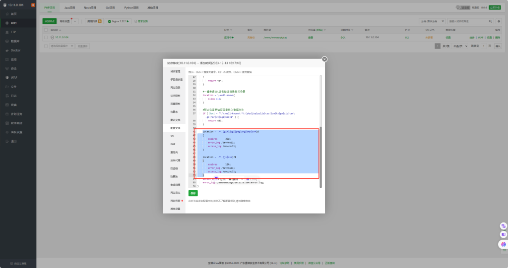

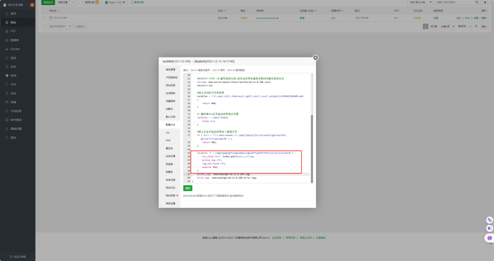

设置MySQL数据库  把数据库 用户 密码 记下

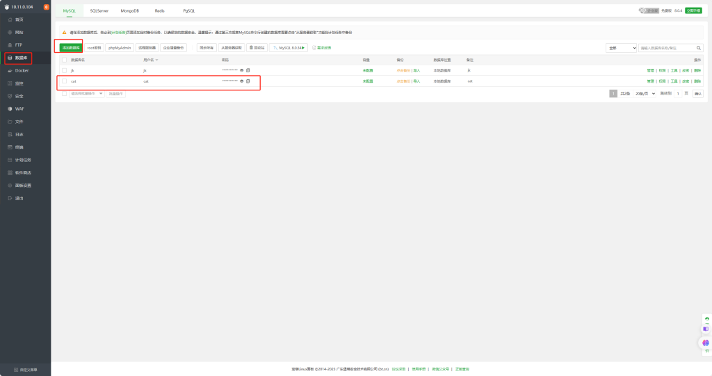

打开网站目录 复制粘贴一下这个文件并改名为 .env

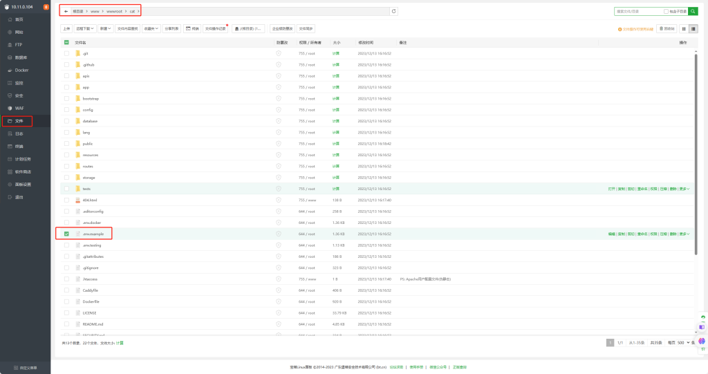

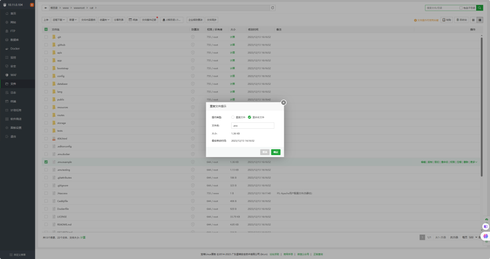

双击打开.env配置数据库 默认的sqlite数据屏蔽掉 把下面的MySQL前面的#删除并配置用户密码数据库名

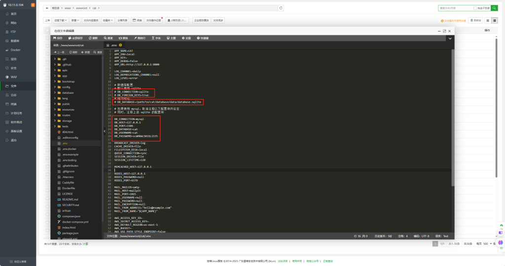

修改权限

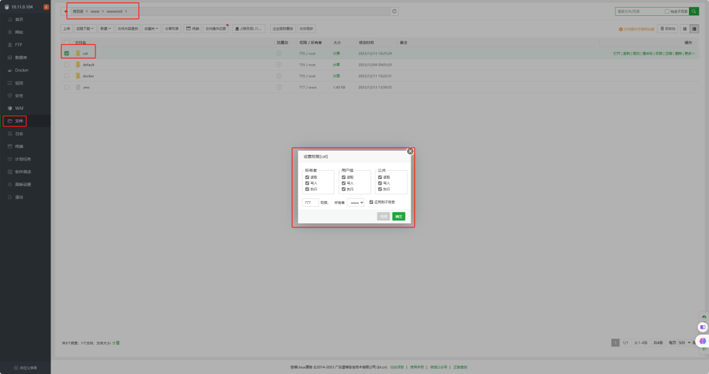

安装依赖 如果版本不在2.6.5以上的请点击右边升级版本

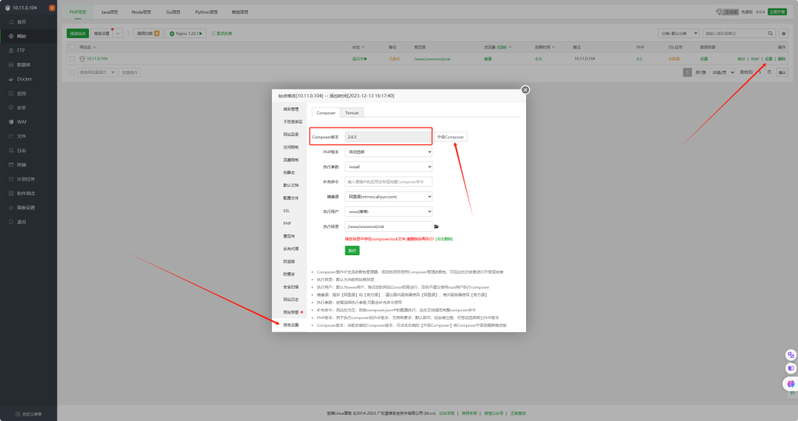

回来终端` cd /www/wwwroot/cat`   再执行 `composer install`

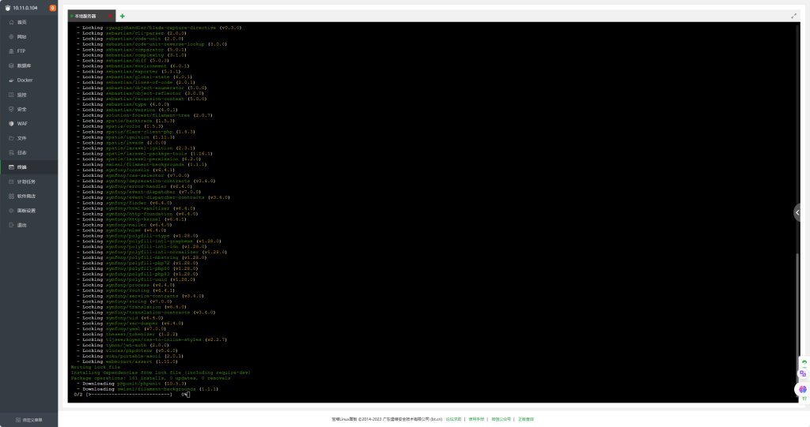

像这样就完成了

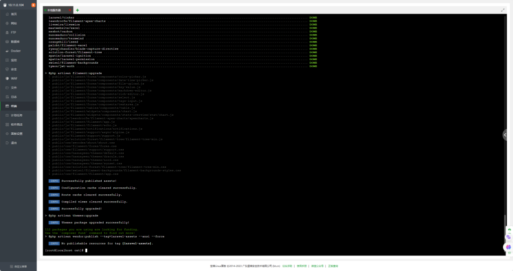

执行数据迁移 `php artisan cat:install`

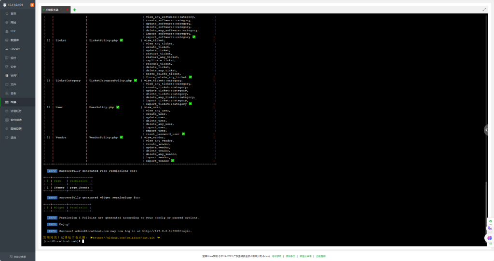

访问 `http://服务器IP `默认用户 admin@localhost.com 密码 admin

如果登录报500  请把cat文件夹重新赋予777权限


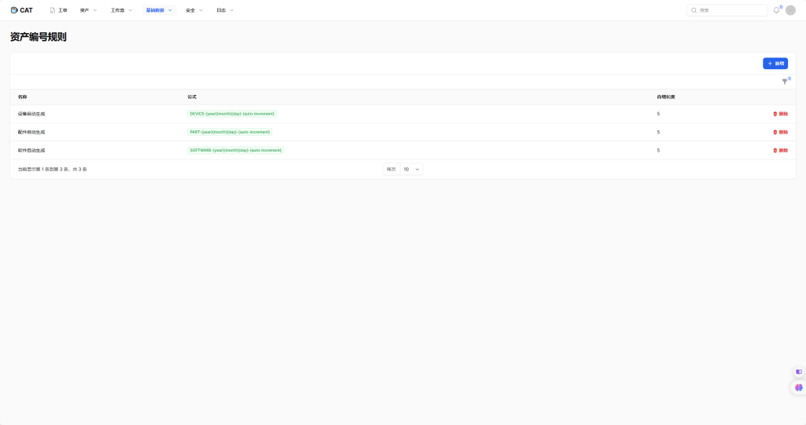