# Arpl在线编译安装群晖教程安装黑群晖7.1.X

一位巴西人在github上分享的源代码（github地址是 [https://github.com/fbelavenuto/arpl](https://github.com/fbelavenuto/arpl) ），让黑群晖DSM7.X引导的编译变得非常简单，一点都不夸张的说：简单到连小学生都能操作！感谢这位巴西的大佬！

如果你决定使用物理机安装群晖系统的，那么需要把机器装好，包括键盘、鼠标、显示器、硬盘、网线等等，如果还有其他外设（比如：额外添加的网卡、扩展卡、阵列卡等）要装起来，让所有的硬件处于可以正常工作的状态，编译系统会自动检测你使用的硬件并且自动加载驱动进行编译

如果你决定使用虚拟机安装群晖系统的，那么需要配置好虚拟机，包括设置CPU、内存、存储大小等等，以及有直通硬盘、直通核显、直通网卡、直通扩展卡、直通阵列卡等外设的，全部设置好，编译系统会自动检测虚拟机的硬件信息并且自动加载驱动进行编译；

到【[github](https://github.com/fbelavenuto/arpl/releases)】把编译引导需要用的文件下载到电脑上（不是在NAS这台机器）。截止2022年12月23日，github上最新的版本是arpl-1.0-beta9（如果将来作者更新，可以下载最新的版本），我下载的img文件，这个格式是通用的，物理机可以用，虚拟机也可以用。

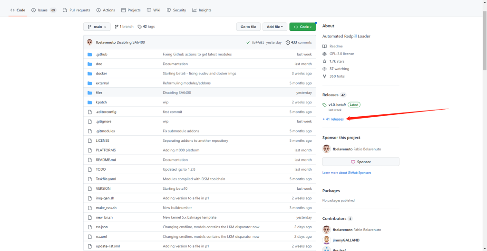

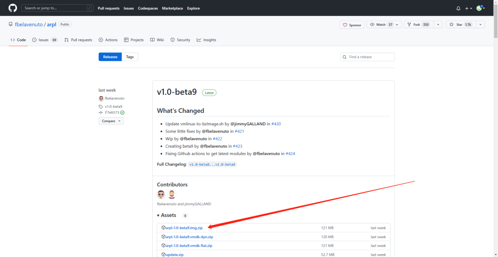

下载下来把IMG写到U盘开机启动.

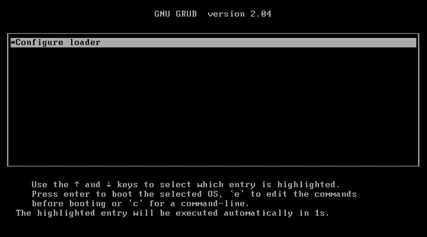

到这等待自动获取IP.在另一台浏览器打开 http://10.0.0.105:7681

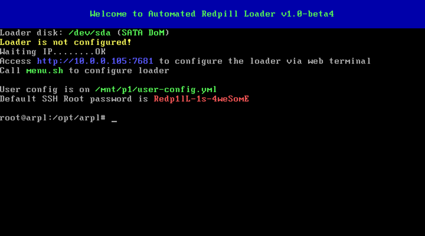

会显示这样. 默认第一个 我们选择我们喜欢的群晖模型我这选择 DS918+

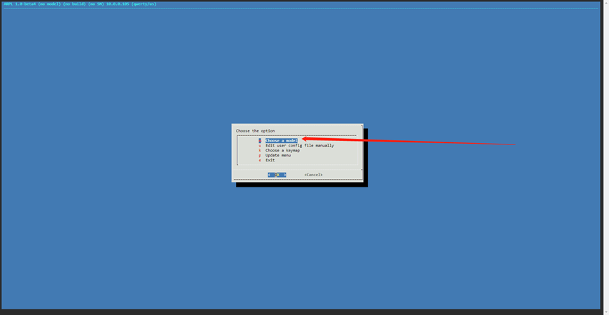

选择好直接回车

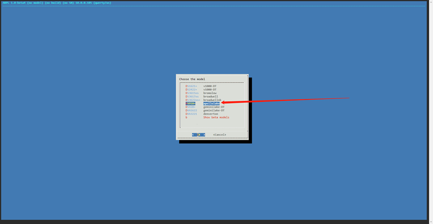

选择最新版本即可

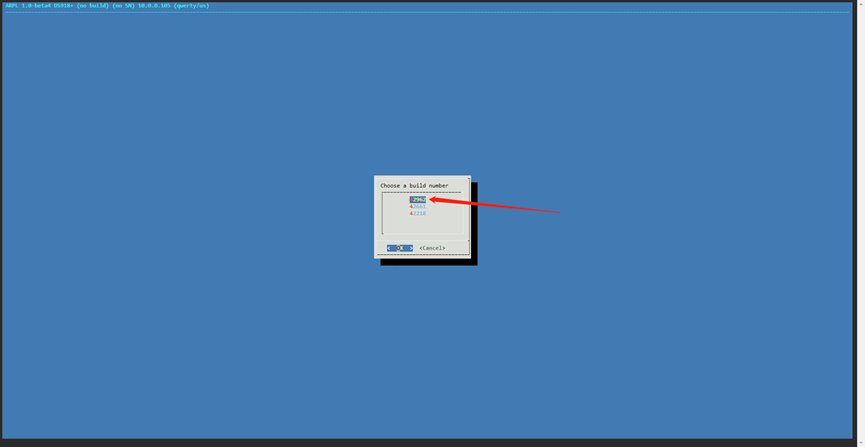

这里回车即可自动生成MAC和序号号

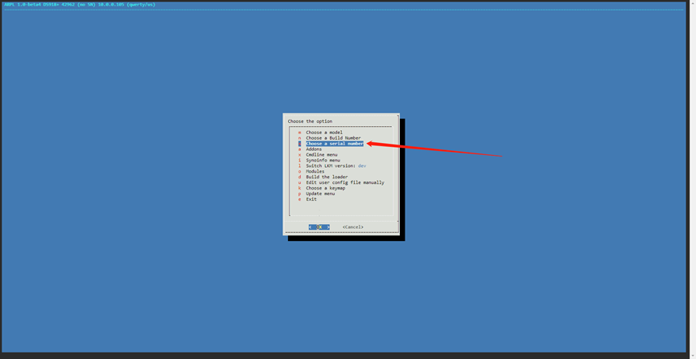

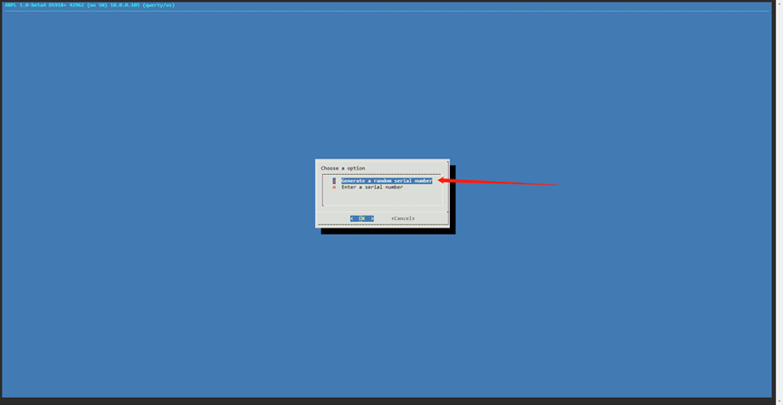

添加各种驱动.

会自动列表本机要用到的驱动.一直回车把这几个添加进入就好了

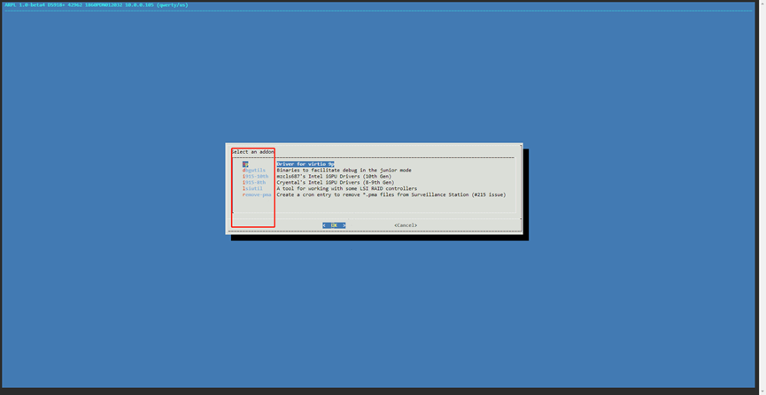

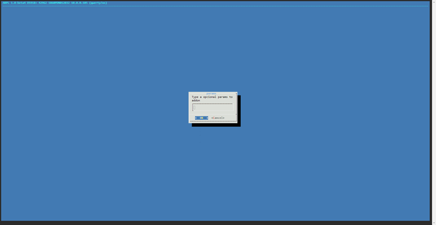

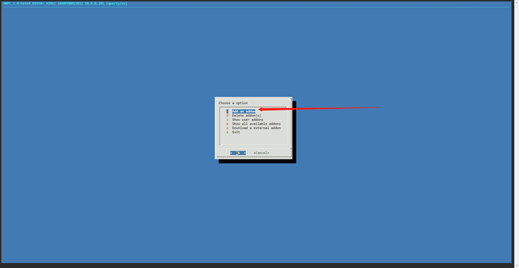

直到空白 再 Exit退出

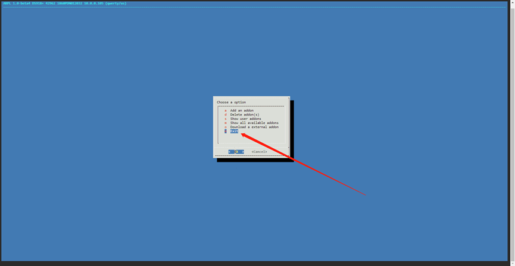

这里选择开始编译

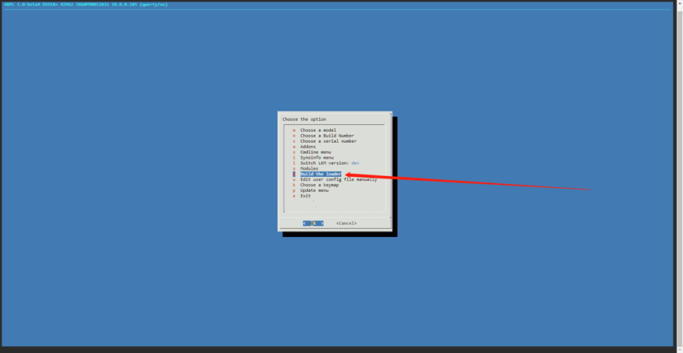

这里开始下载 快慢看你自己的网络

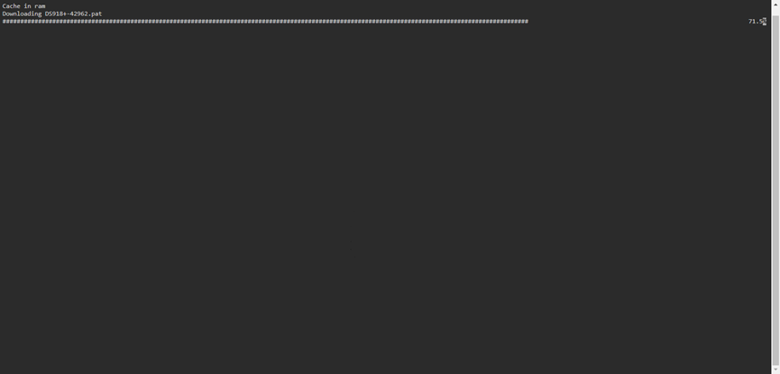

下载完成后会跳回这个介面 再选择 Boot the loder 重启

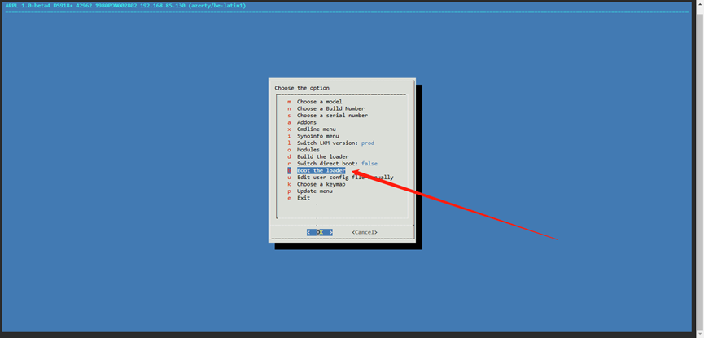

会跳这样 再等1-5分钟

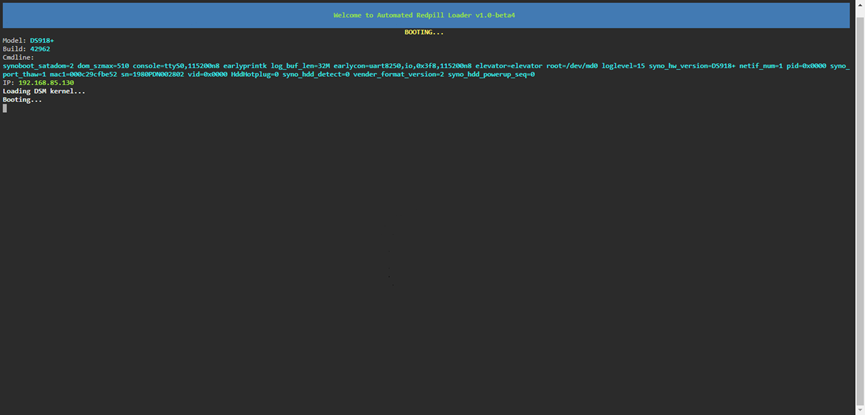

直到显示这样 再打开浏览器重新输入Ip ，不用输入端口 ，不用输入端口， 不用输入端口。

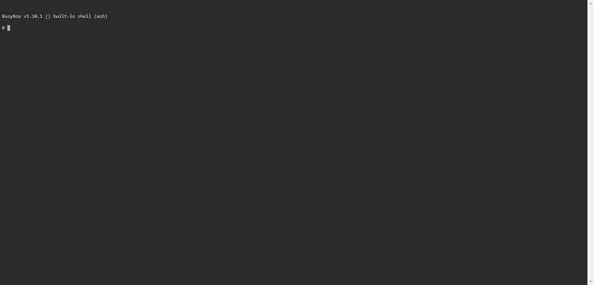

群晖引导算完成了.等待加载

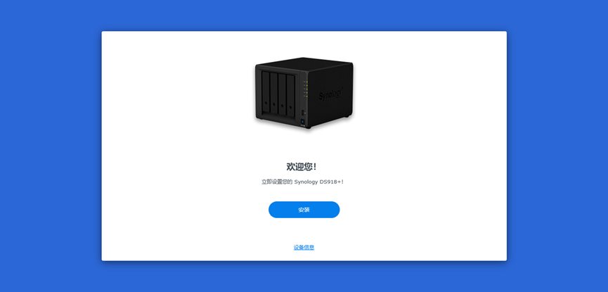