# NAS群晖Docker部署QBittorrent下载器

打开文件管理器File Station 在docker文件夹新建一个文件夹qBittorrent

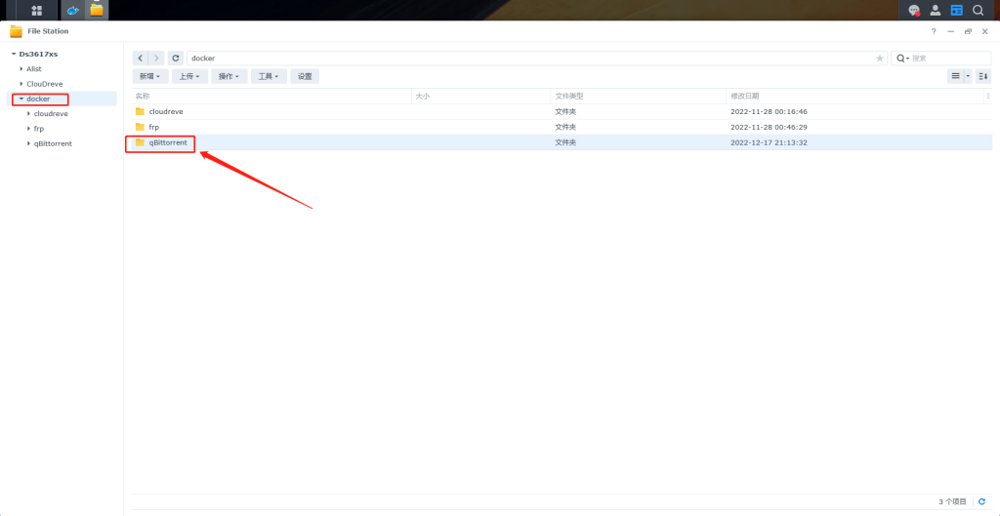

打开docker管理器-注册表 右上角搜索 qBittorrent 下载打一个

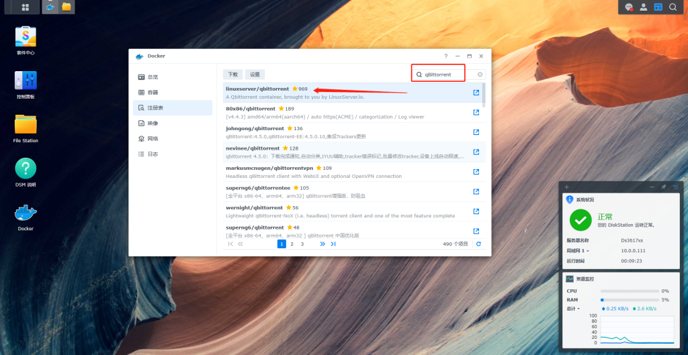

下载好 在映像中找到 linuxserver/qbittorrent 双击

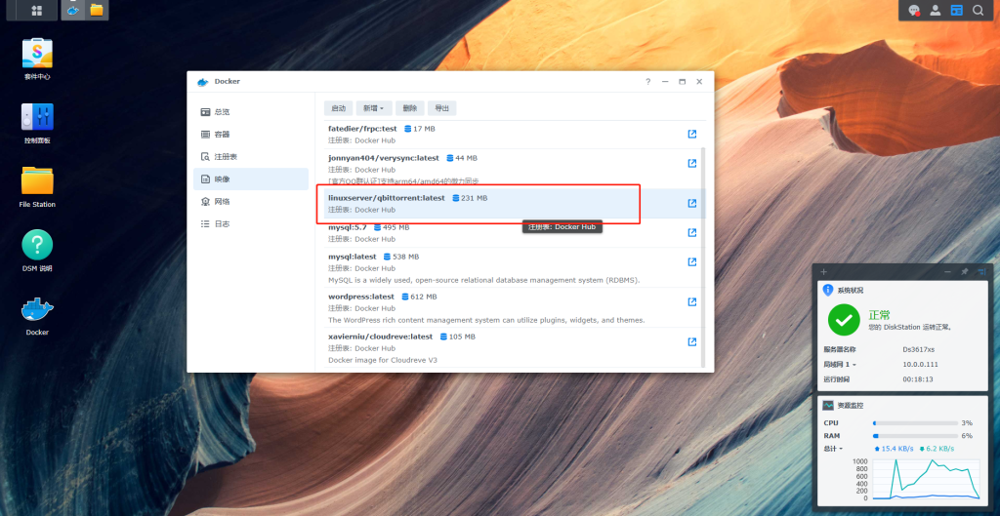

网络可以用Bridge也可以选择host都可以.我以Bridge网络设置为例

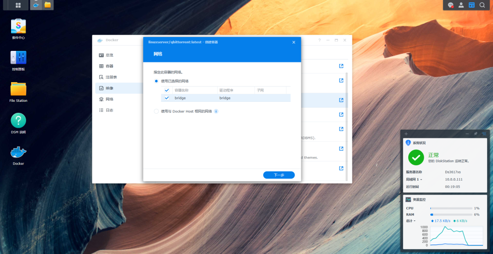

把这两个都勾选上，至于容器名称你喜欢写什么都可以

设置映射端口 只把容器8080的改为固定就行  我选择一样  容器的8080不能改 本地端口你可以改你喜欢的就可以

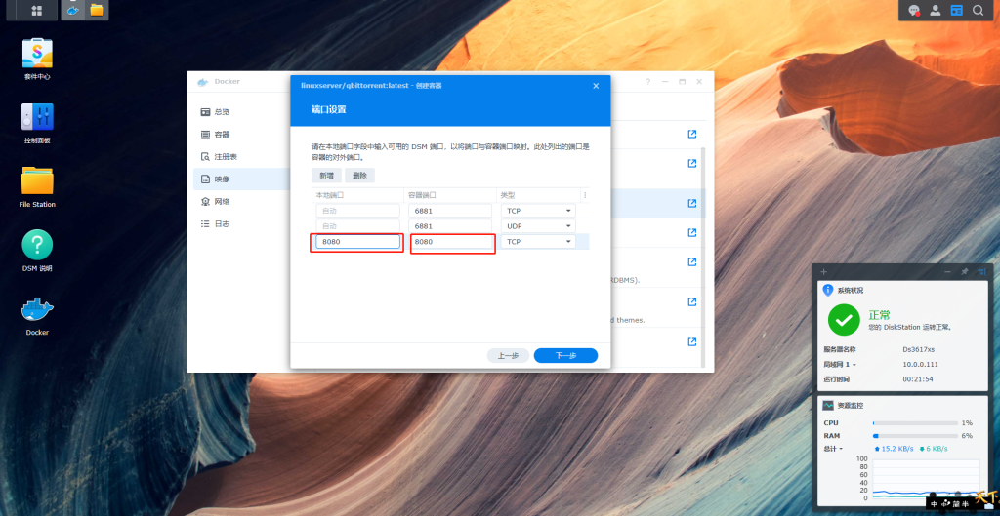

设置映射文件夹 把一开始的新建的

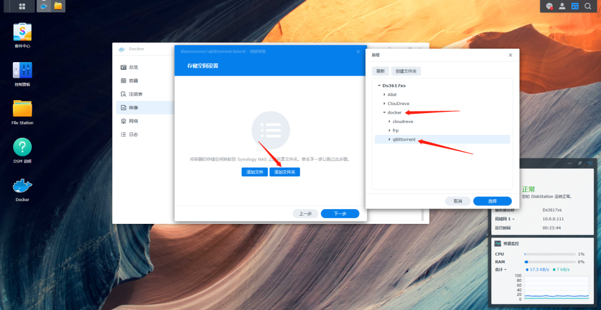

第一个配置文件夹  第二个 下载目录  qBittorrent 的下载默认 为 /downloads

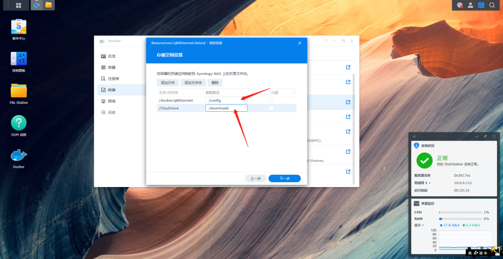

到这个就默认就行

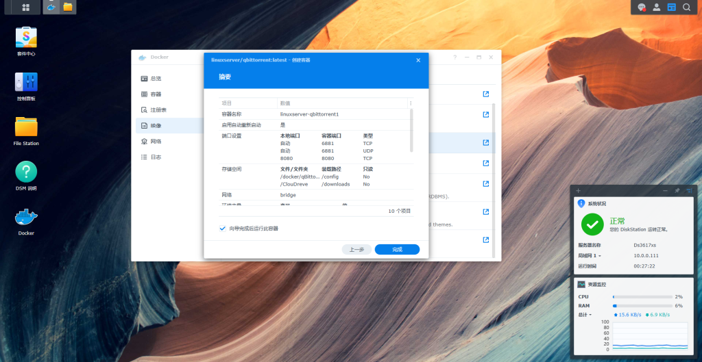

返回容器 看看是否正常运行

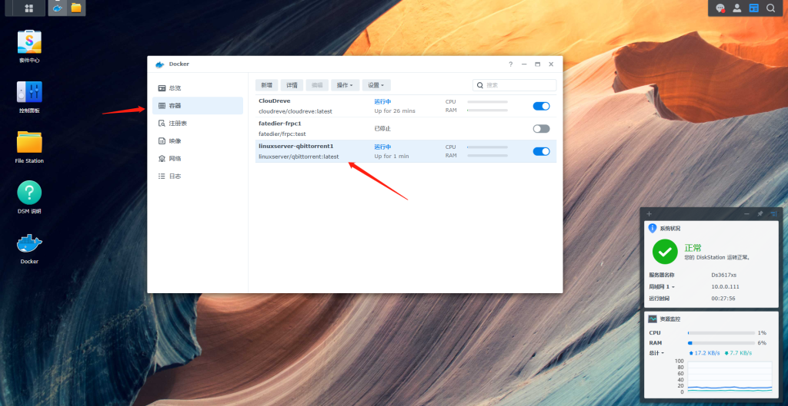

浏览器输入  群晖IP：8080  默认用户admin 密码 adminadmin

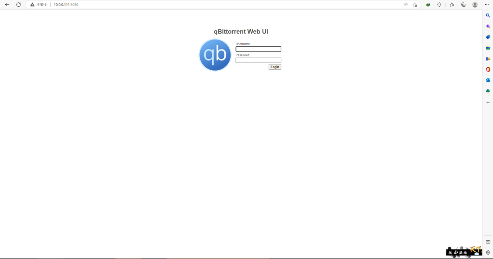

登录进去后 在这里改成中文

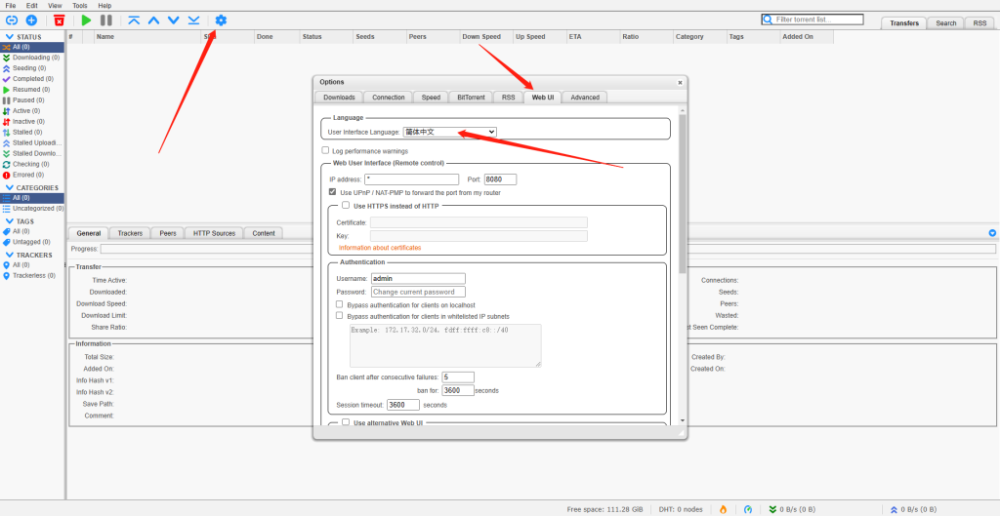

qBittorrent 就安装完成.