# VMware 安装黑群晖DS918懒人包

先到[网盘](https://pc.cklist.cn/)下载 打包好的引导文件和PAT

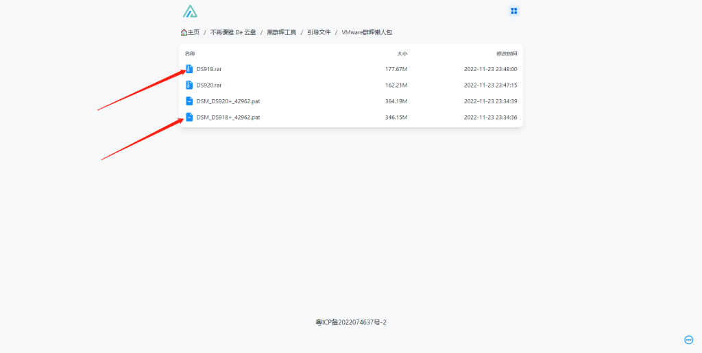

首先解压安装包，双击解压出来的DS918或者是DS918.vmx配置文件. 导入到虚拟机

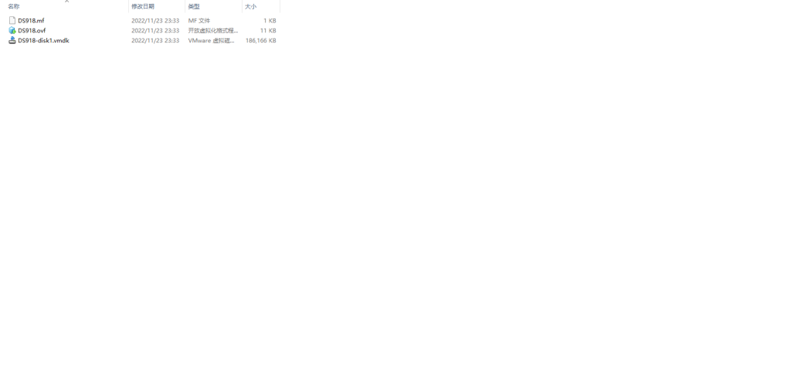

双击 DS918.ovf  第一个是虚拟机名字 第二个 保存位置 改好 点一下 导入

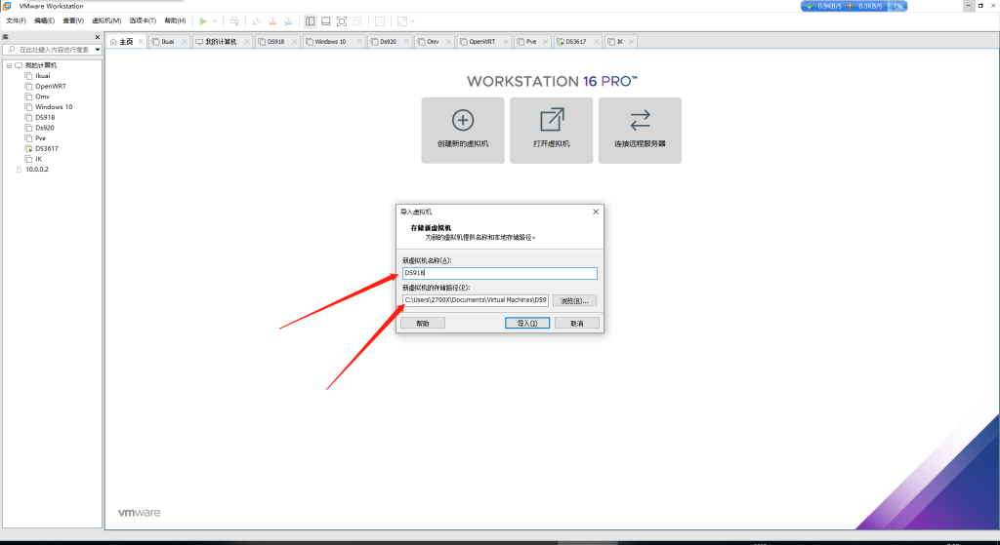

读完进度条

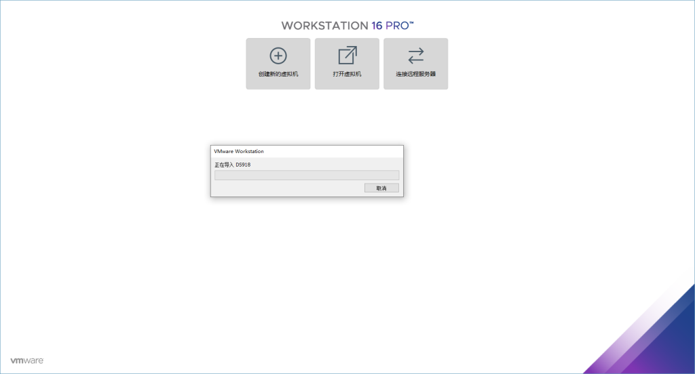

点开 编辑虚拟机设置  添加

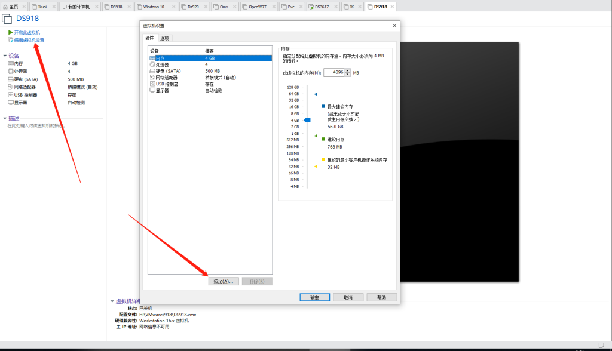

一个硬盘或者多块硬盘 我这先加一个64G硬盘

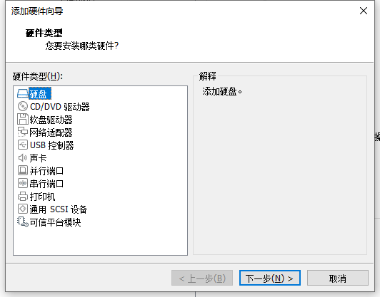

注意注意注意  一定要SATA 接口 别选错了 不然开机启动出错

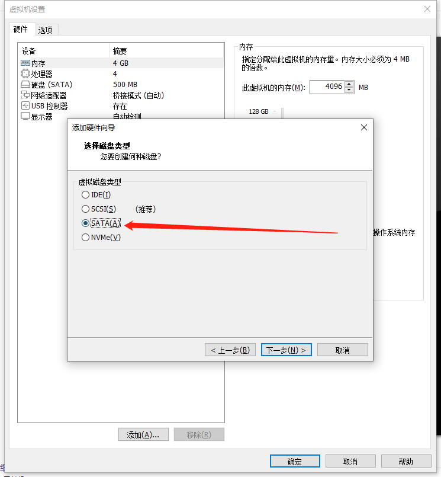

如果想直通硬盘请选择第三个，我用的虚拟硬盘选第一个

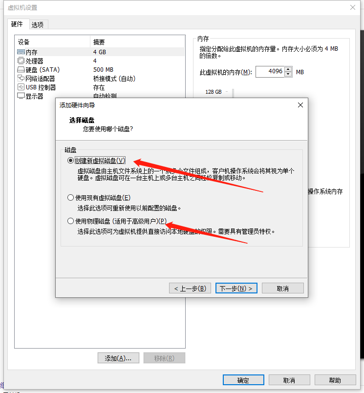

硬盘大小自定 我这先给它64G  磁盘存储要选择单个文件 以后好备份 迁移.

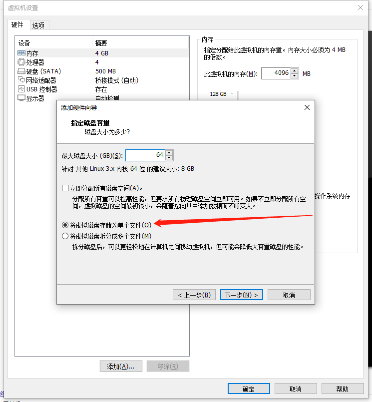

完成后是这样的  点一下 确定 开启 虚拟机

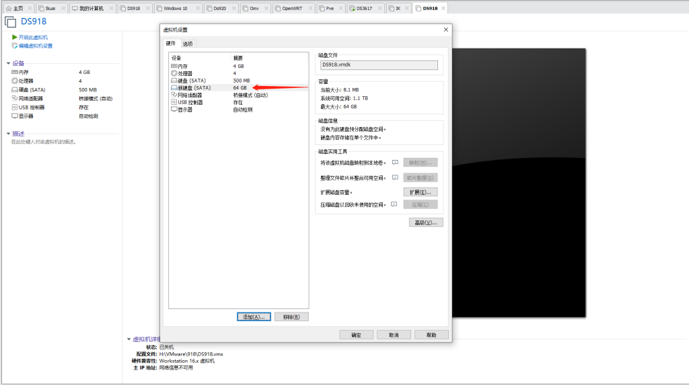

开机画面

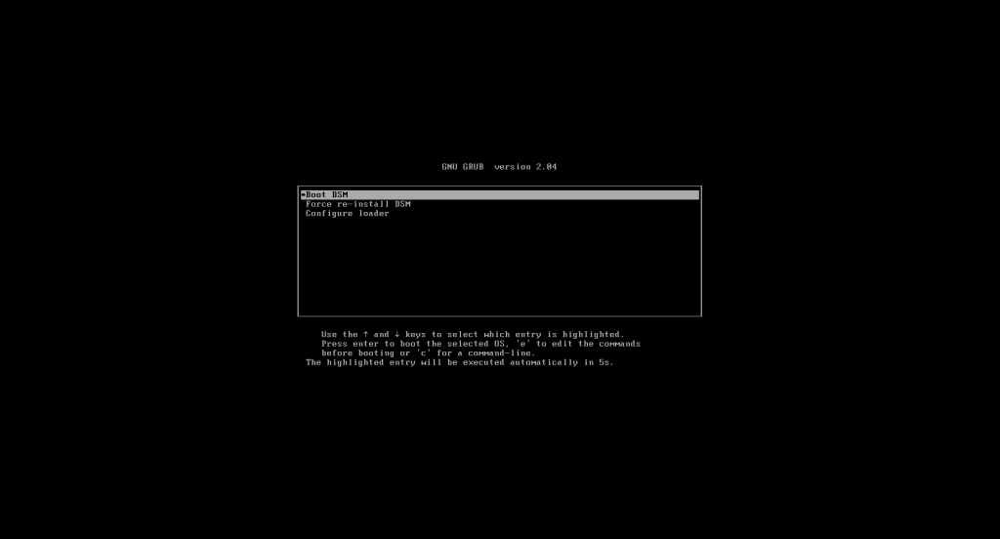

等它自动读完秒数直到显示以下画面 显示IP

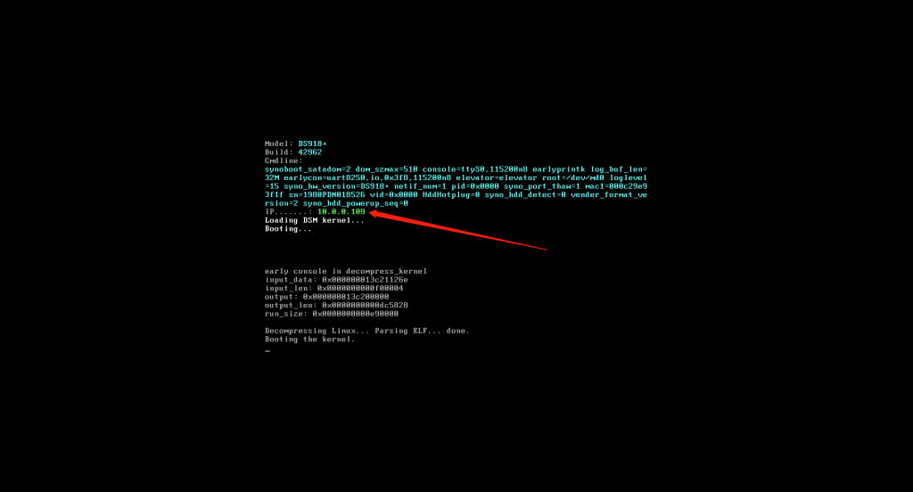

打开浏览器 直接输入上面的Ip

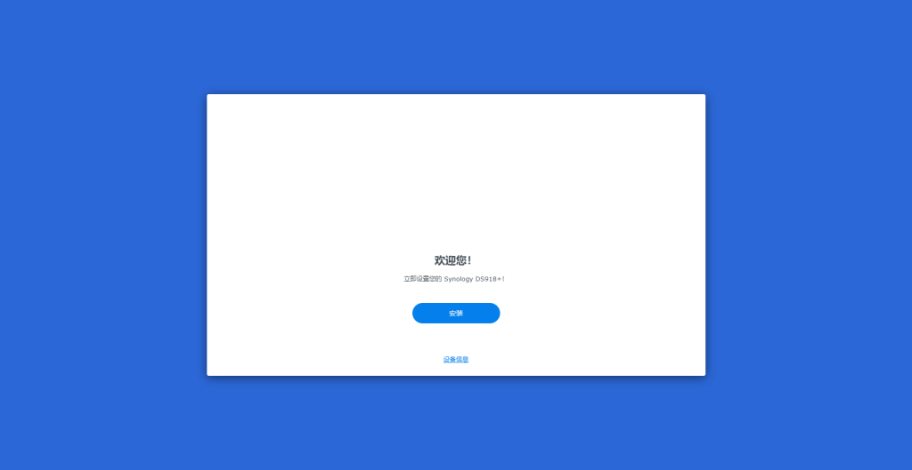

接下来就可以直接安装系统了，怎么样，是不是超级简单？后面的安装过程我就不演示了.