# 利用群晖Docker搭建Alist云盘

**简介**

一个文件列表程序，支持多个存储，并支持Web浏览和webdav，由gin和Solidjs提供支持。

官方文档 [https://alist.nn.ci/](https://alist.nn.ci/)

##### 支持存储

本地存储
  阿里云驱动
 OneDrive / Sharepoint （全球, 快递 之 家，德，我们）
 189云（个人、家庭）
 谷歌云端硬盘
 123锅
 阿利斯特
 邮票
 自来水龙
 皮克帕克
 S3
 优云仓储服务
 网络DAV
 特野心（中国，国际）
 媒体跟踪
 139云（个人、家庭）
 YandexDisk
 百度网盘
 夸克
 雷
 兰祖
 阿里云驱动分享
 谷歌照片
 Mega.nz
 百度图片
 中小企业
 115

群晖一台并安装好Docker

打开Docker 注册表 查找 Alist 并双击下载

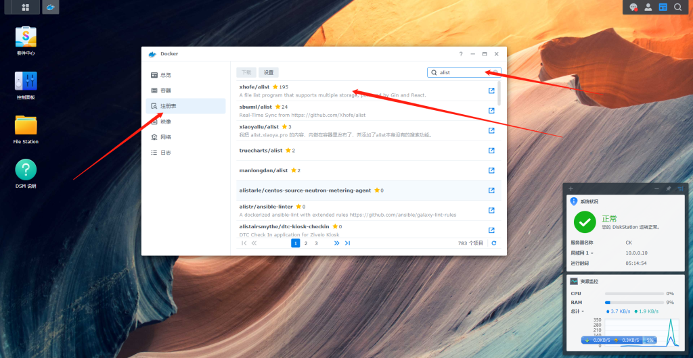

选择 默认 “latest” 确定

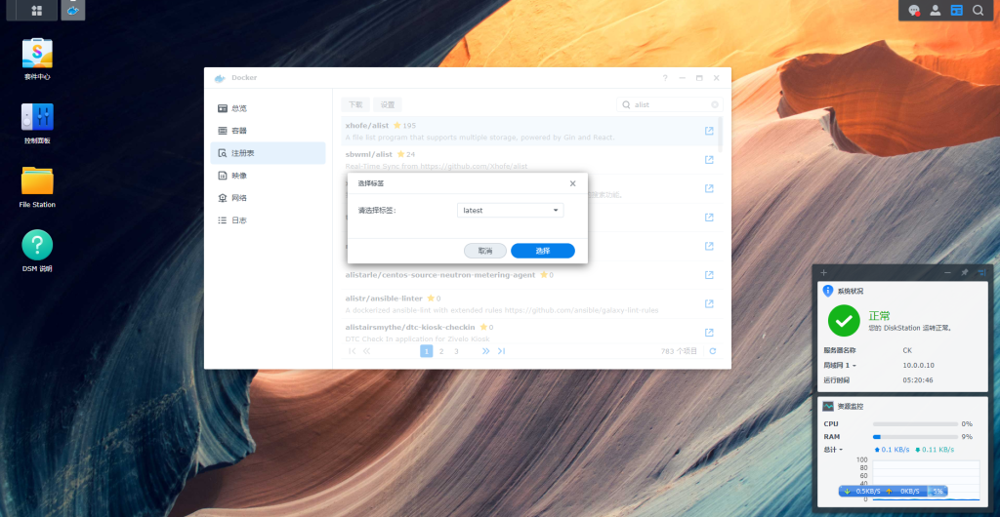

转到 映像 右边看看有没有任各在下载中

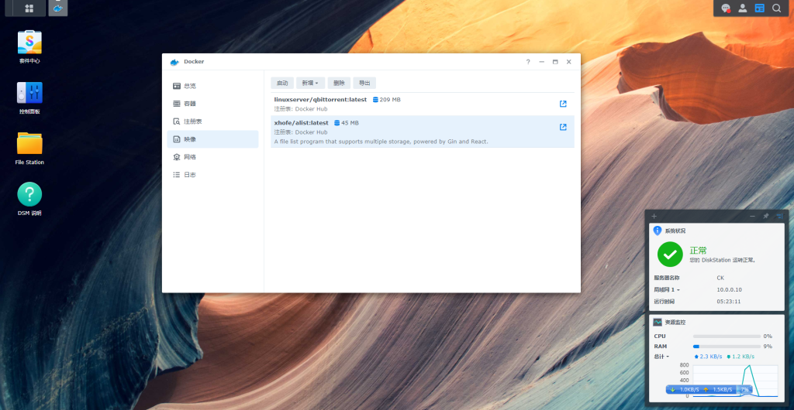

在该镜像 双击 弹出 创建 容器 网络 选择 使用与DocKer Host 相同的网络

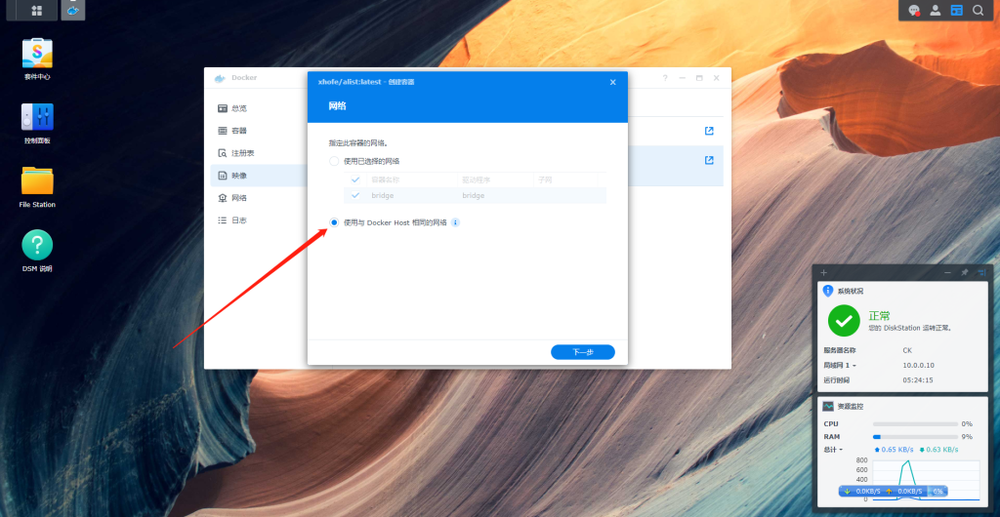

容器名称 输入 自己喜欢的 我这里 是 Alist 勾选 启用自动重新启动 这样下次 开机DSM 会自动运行该容器 点击 下一步

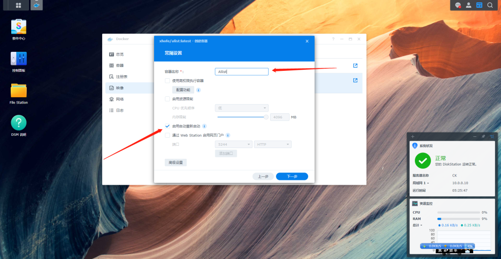

如果想挂载本地文件请把相应的文件映射到容器中.

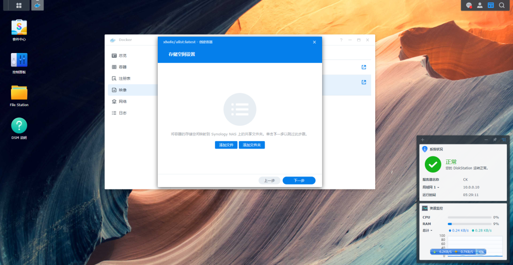

先在Docker 新建一个文件夹Alist 在存放配置文件

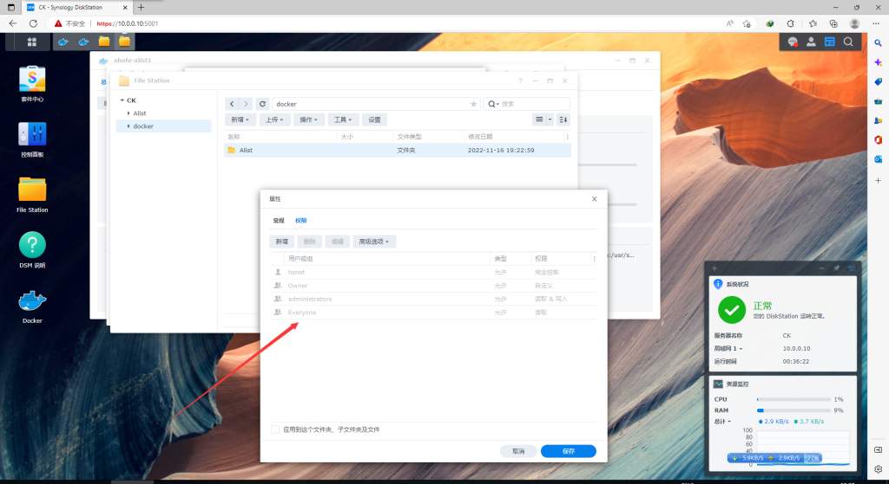

我想我文件夹 Alist 映射本地储存 先把Alist 权限设置好

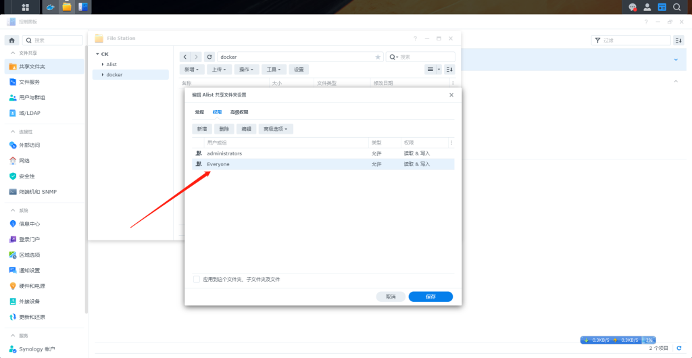

点击上方储存空间，点击添加文件夹，选择一个本地Alist配置文件位置，装载路径填 /opt/alist/data  这个是Alist配置文件

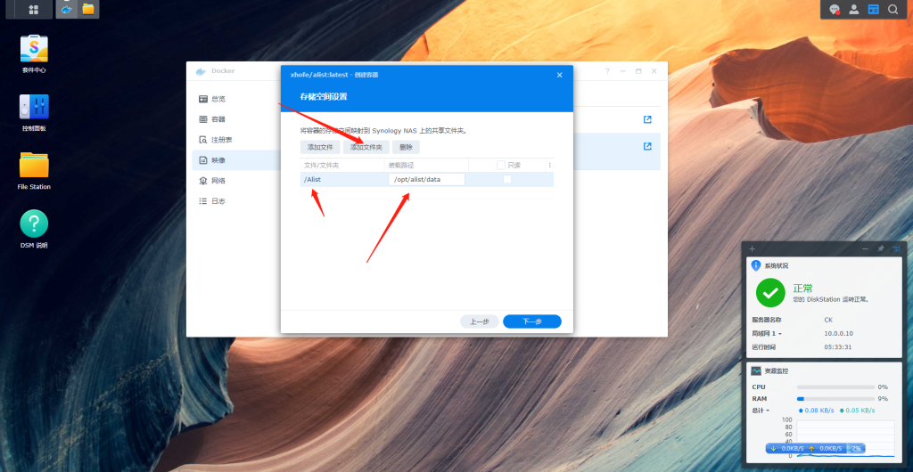

再把本地想要挂在网盘的文件侠添加上去

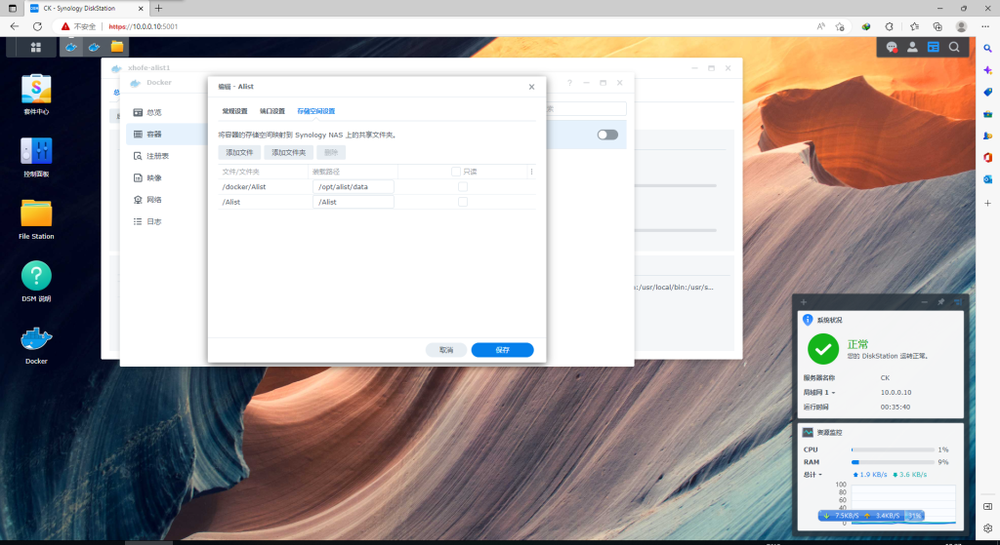

这里默认就行

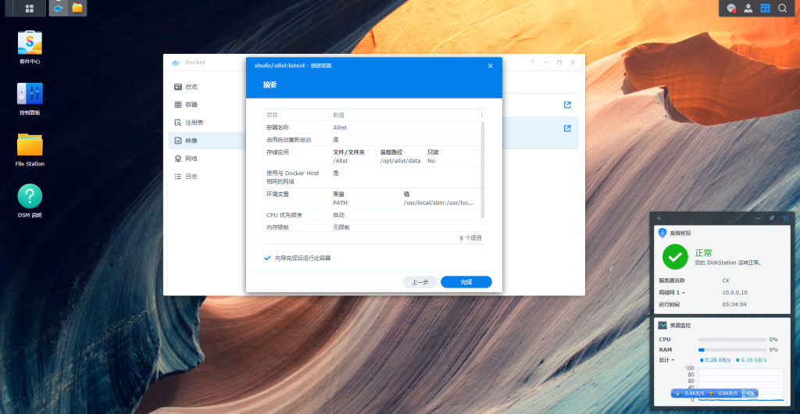

回到Docker面板 刚创建的容器 已经在运行了

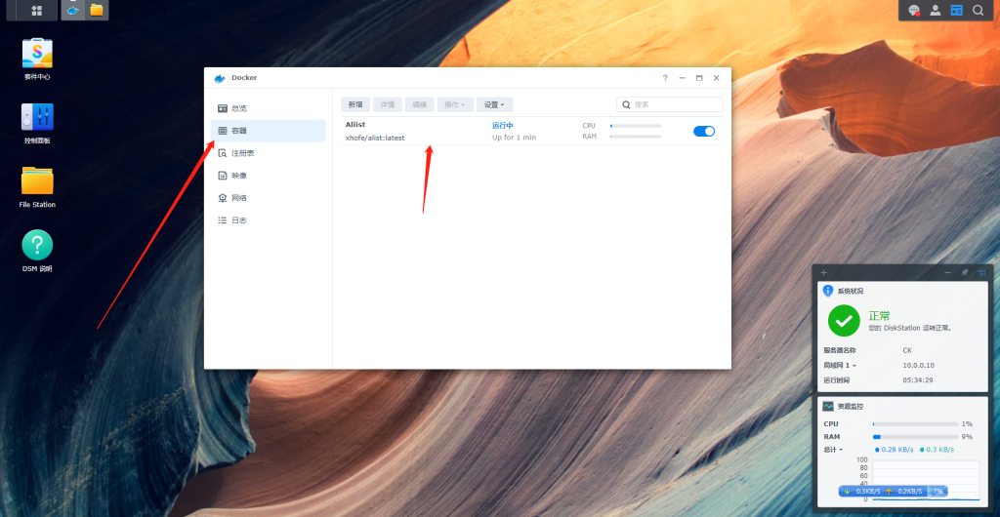

选择容器 点一下 顶部 详情 再点一下 日志 这里看刚刚创建 Alist 的随机密码 这里我们复制出来

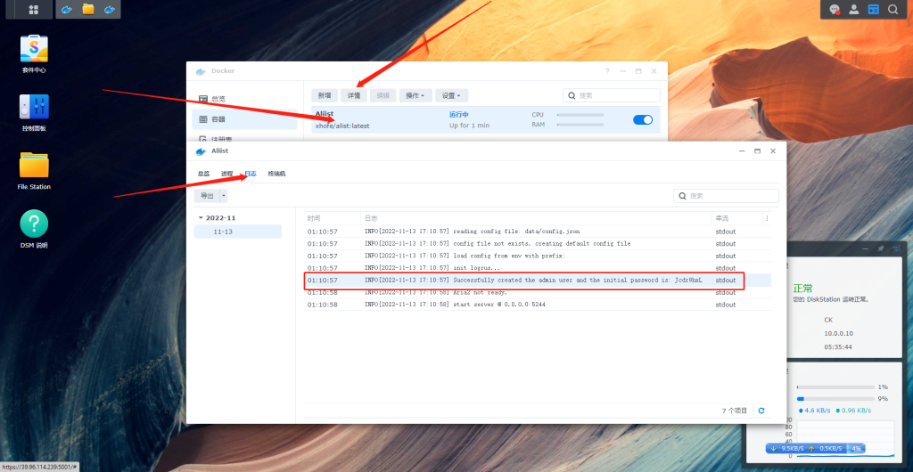

打开浏览器 输入 群晖Ip:5244 比如我这台ip 10.0.0.10:5244

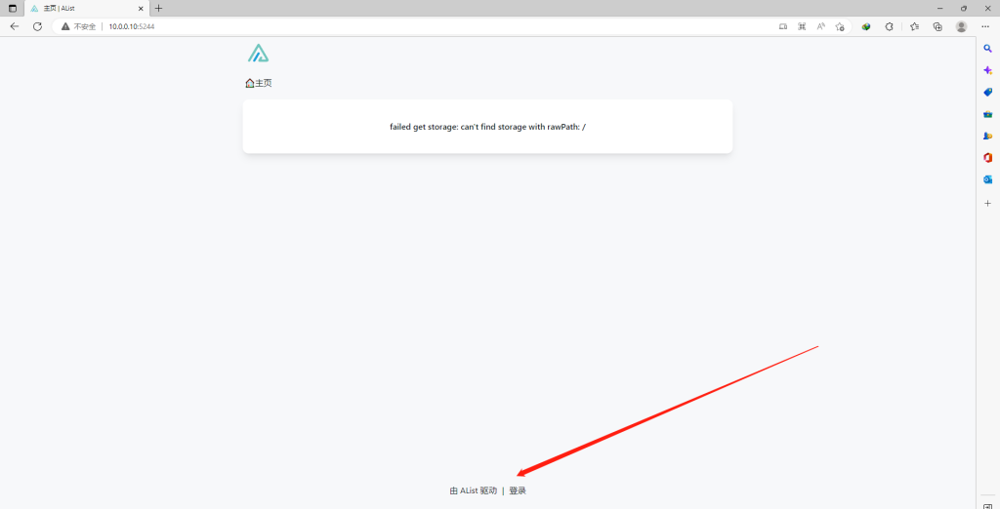

输入 用户 密码 用户名默认admin 密码刚才在日志里看到的密码

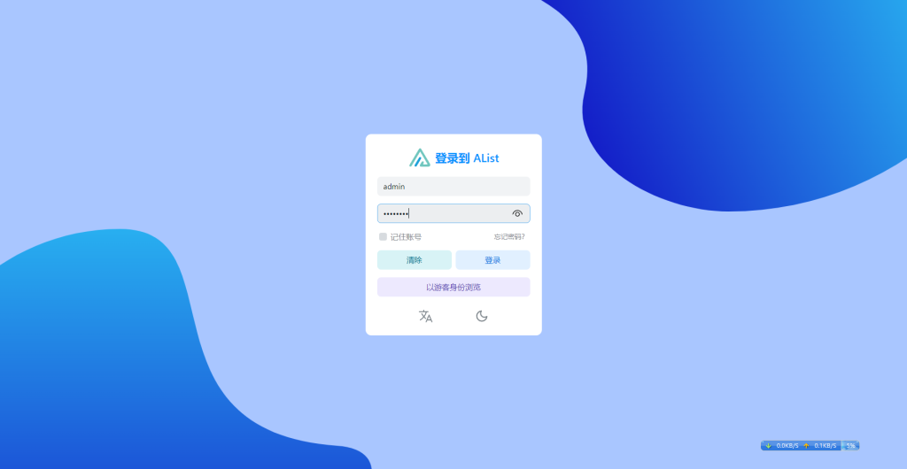

这里管理介面 自行修改用户密码

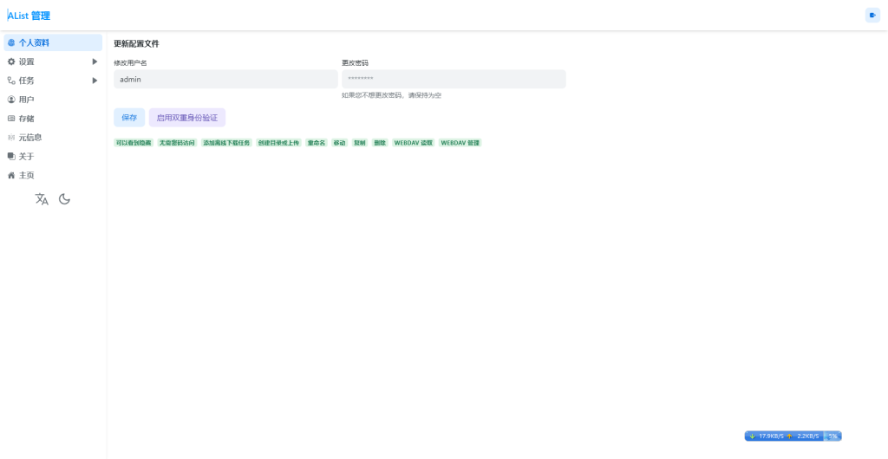

到此 Alist 部署完毕.