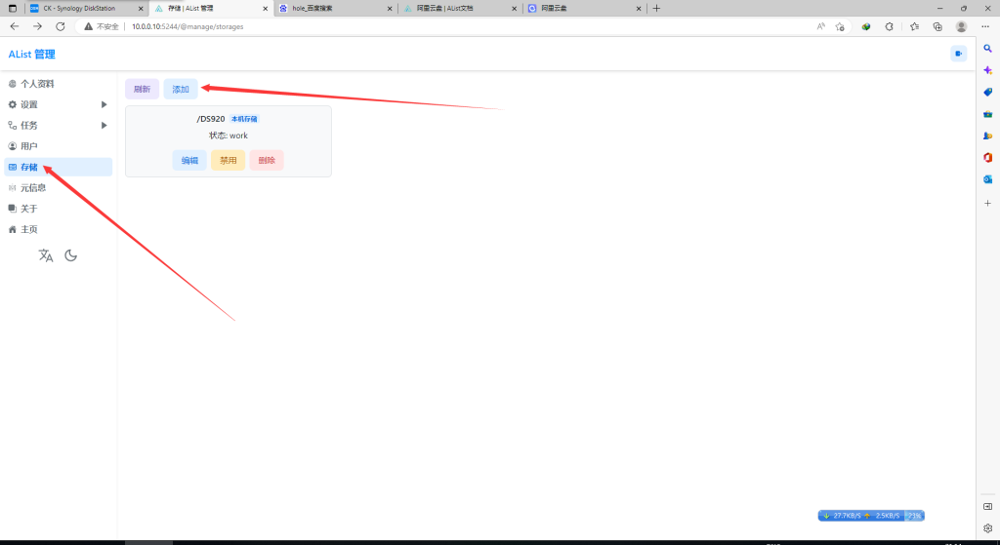
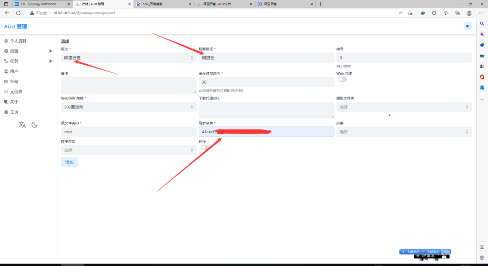
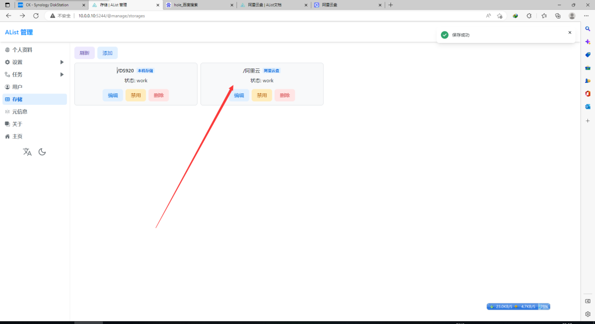
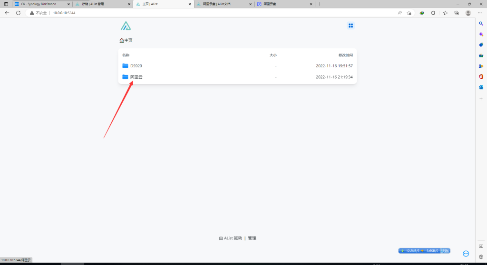

# 群晖Docker搭建Alist挂载阿里云盘

> 提示

> 由于阿里云盘 referer 的限制，必须使用移动端 token。 使用桌面 Web 令牌将导致无法下载和预览。 当然，如果你在本地使用或者带宽足够大，你也可以开启代理，让桌面 Web 的 refresh token 正常工作。

**刷新令牌**

请移至官方获取 token

> 获取 Token

**Alist 添加阿里云盘**

登录Alist 在 存储–添加

找到阿里云盘 把挂载路径=显示名称 刷新令牌=上面获取到的 token 确定 添加

显示这样就完成了

我们重新打开一下 Alist主页 已经显示阿里云盘了

到此已经设置完毕.