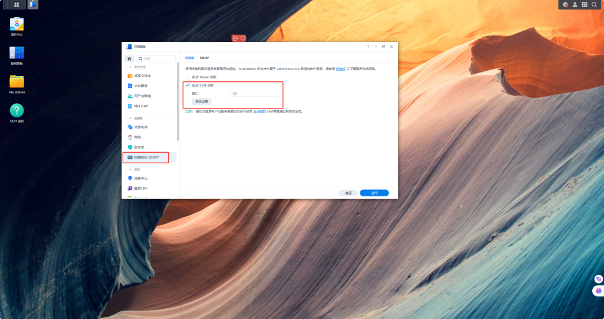
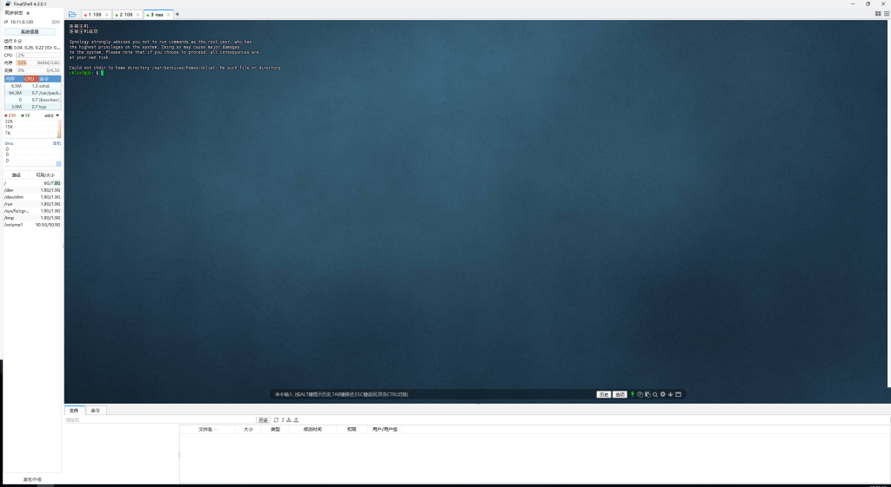
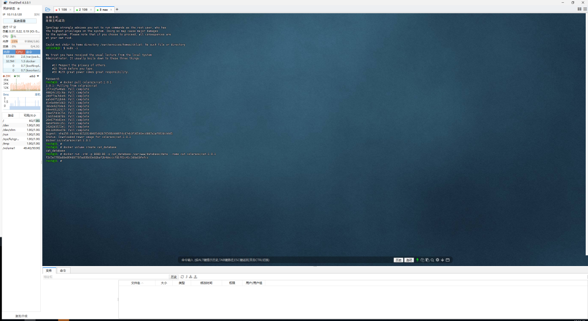
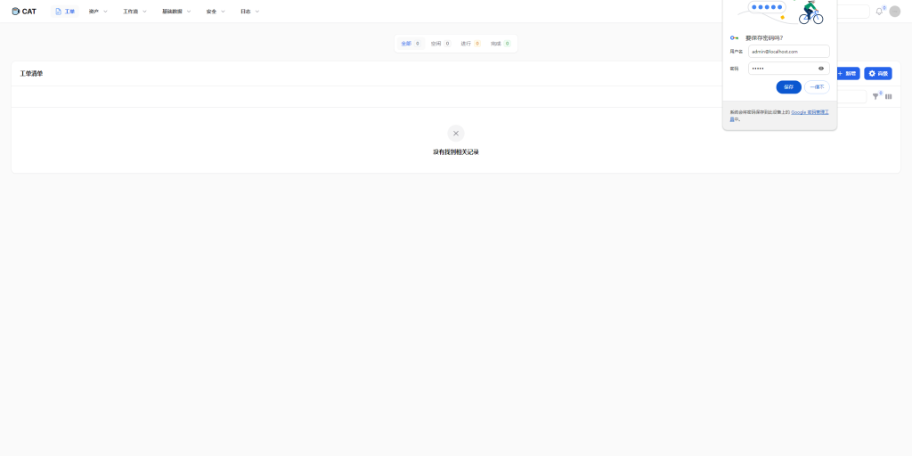
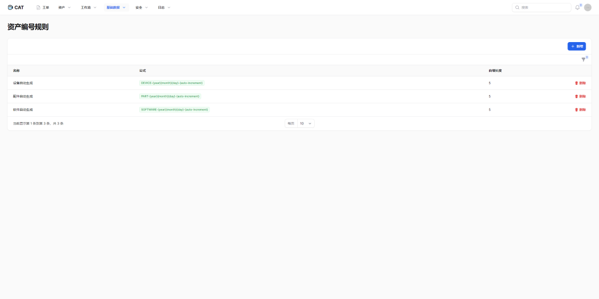

# 群晖7.1 部署 CAT一站式 IT 运维管理平台(自带数据库）

来一杯咖啡与茶，为 IT 运维从业者减轻管理负担，提升管理效率，从繁重无序的工作中解压出来，利用剩余时间多喝一杯休息一下。

这是一个专为 IT 运维从业者打造的一站式解决方案平台，包含资产管理、工单、工作流、仓储等功能模块。

❤ 感谢各位支持。CAT 提倡与各位使用者、开发者一起创建健康生态，让本项目变的更好，欢迎提供 PR 贡献。

项目地址 [celaraze/cat: ☕ CAT（Coffee And Tea）是一个开源的、开放的一站式 IT 运维管理平台。资产管理、工单、盘点以及可靠的移动端应用支持。 (github.com)](https://github.com/celaraze/cat)

打开群晖终端设置（以下称NAS）勾选 保存

打开SSH工具 并连接上NAS

切换root用户 输入 ` sudo -i ` 输入密码（密码不显示）回车

拉取镜像 后续版本更新请自行更换后面的数字

`docker pull celaraze/cat:1.0.1  `

执行` docker volume create cat_database`  创建卷用于存储Docker容器生成和使用的数据

创建容器   `docker run -itd -p 主机端口:80 -v cat_database:/var/www/database/data --name cat celaraze/cat:1.0.1`

我这里用的主机8080端口

http://localhost:端口   默认用户 admin@localhost.com  密码 admin

