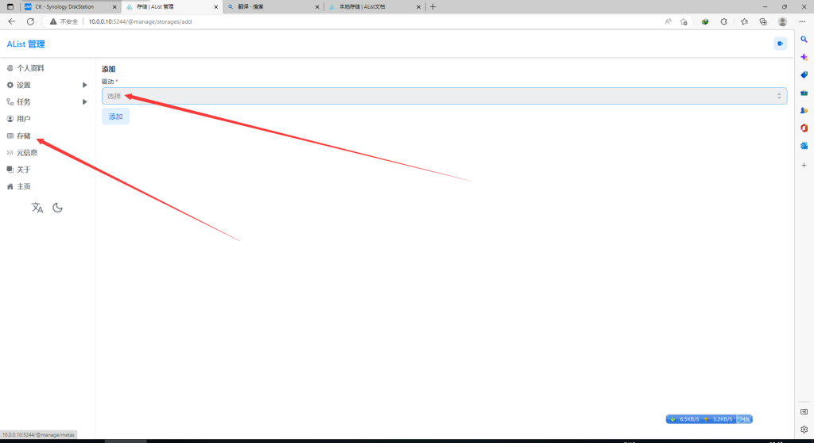
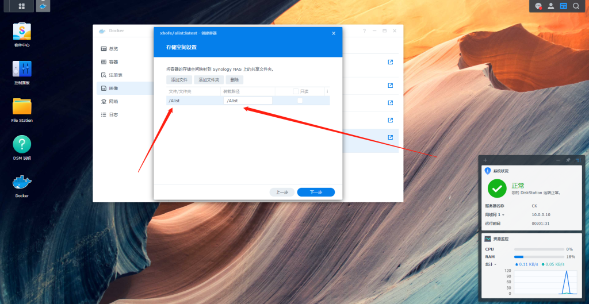
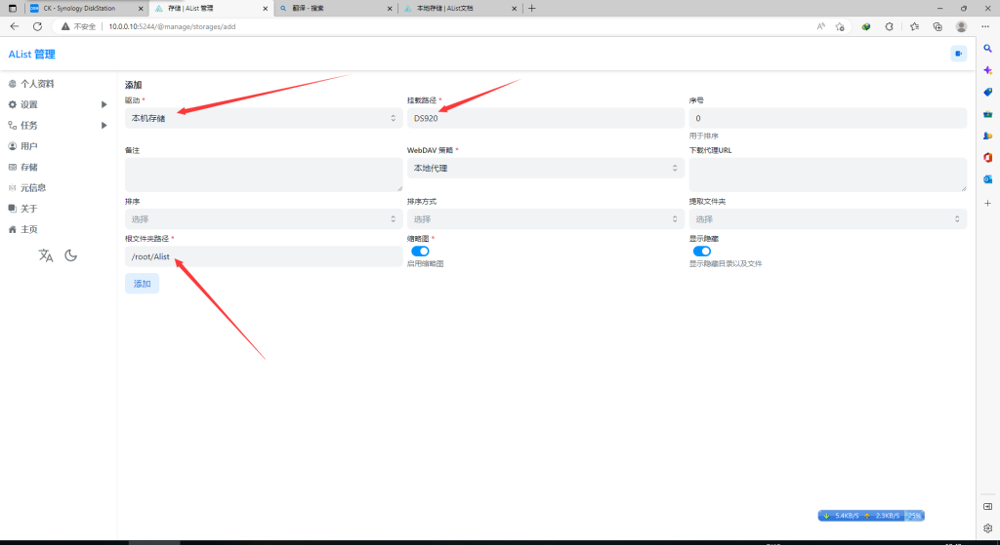
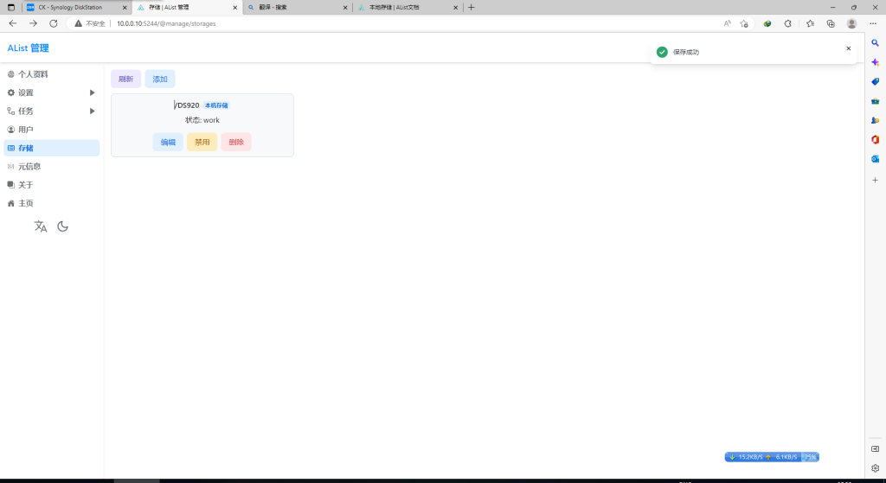
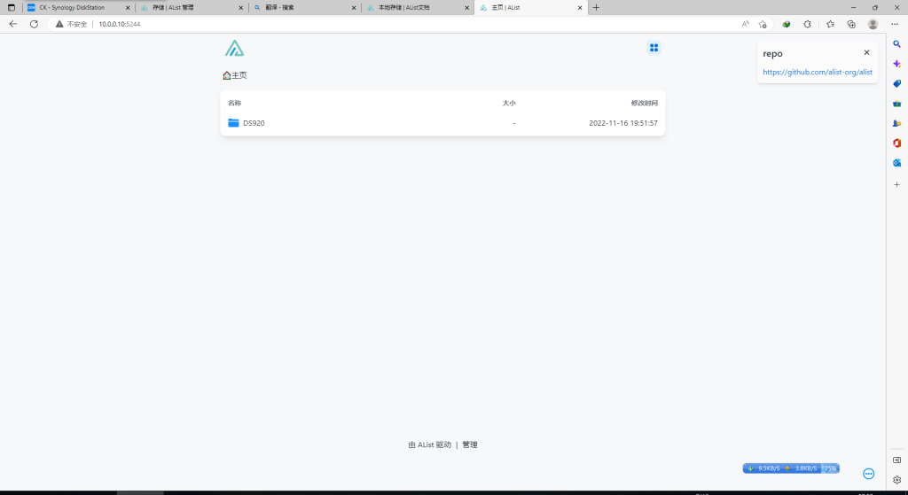
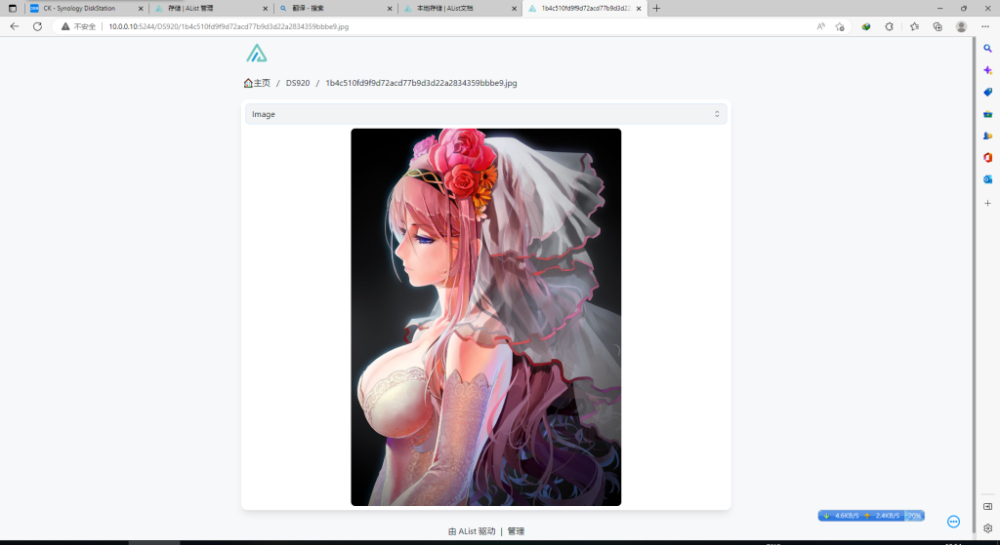

# 群晖Docker搭建Alist挂载本地文件夹

如果你不知道怎么搭建Alist 请移步到 《[利用群晖Docker搭建Alist云盘](https://www.cklist.cn/?p=33)》

首先我们登录Alist 存储 右边找到 本机存储

挂在路径就是云盘显示名称可写你喜欢的名称，根文件夹路径Docker挂载路径不知道可以查看群晖内Docker设置 点一下确定

显示这样 就完成 打开 网址查看一下

已经显示刚才DS920 标题

已经正常显示里面的内容了.

到此本地存储 设置完毕.