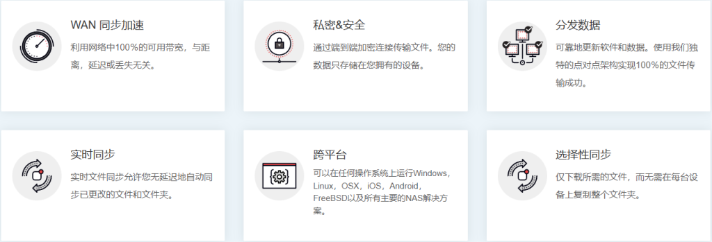
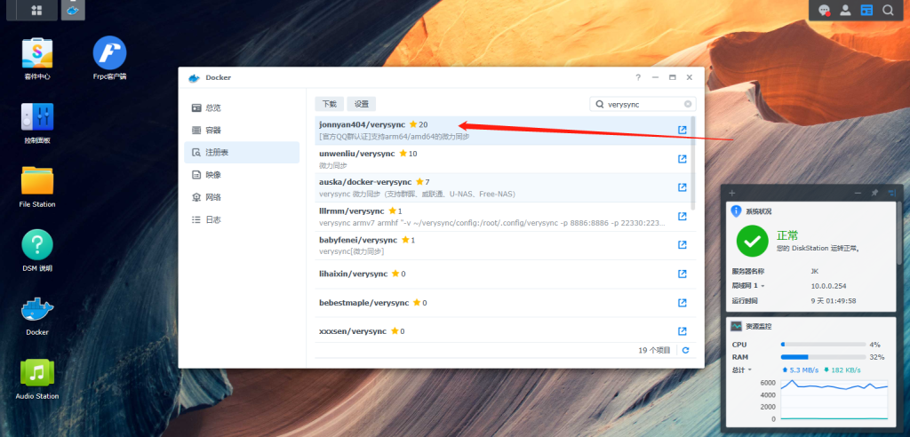
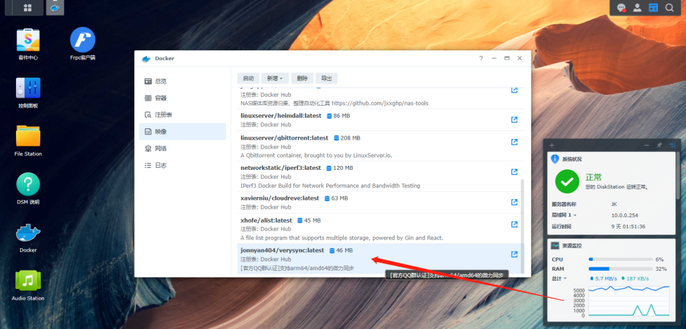
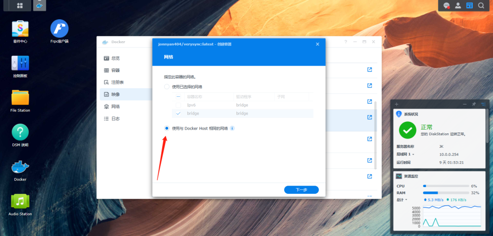
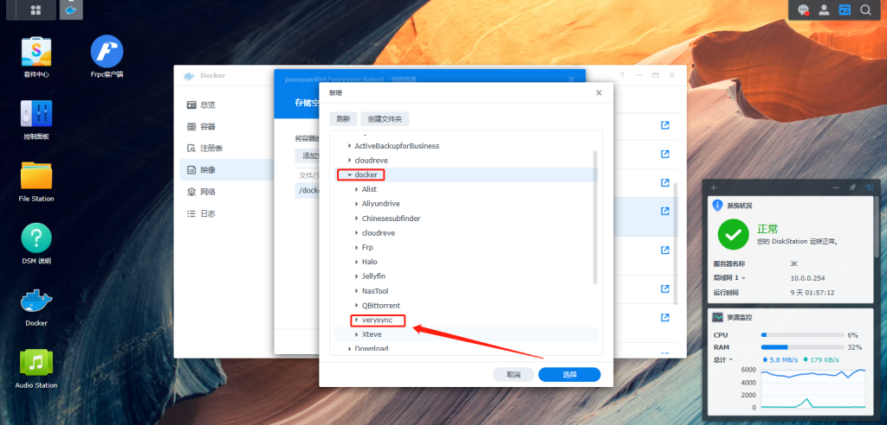
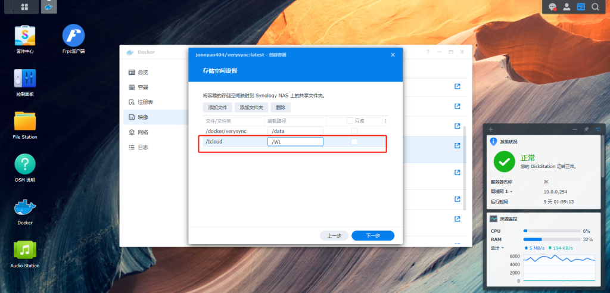
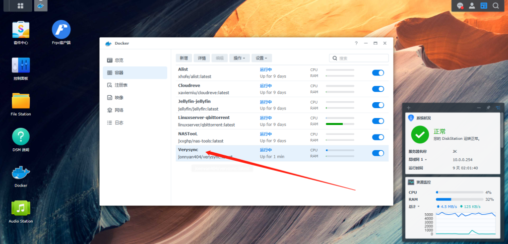
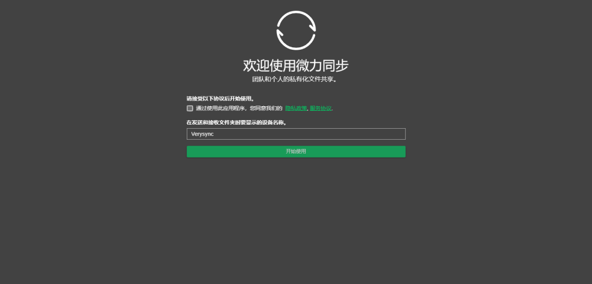

# 群晖Docker架设微力同步

## 微力同步   官网：http://www.verysync.com/

**一款高效的数据传输工具**

简单易用的多平台文件同步软件，惊人的传输速度是不同于其他产品的最大优势， 微力同步 的智能 P2P 技术加速同步，会将文件分割成若干份仅 KB 的数据同步，而文件都会进行 AES 加密处理。

告别云端网盘数据储存

使用 P2P 协议同步，分发和合并文件

凭借独特的 P2P 加速同步软件和数据，文件传送成功率高达 100%，支持数以千台的终端设备和百万级的文件规模，传送的数据量无限制。



打开Docker 注册表 搜索  verysync  双击下载



下载完成 在映像 找到 jonnyan404/verysync:latest 双击



选择使用Docker Host 相同网络



把 启用自动重新启动 勾选上


在文件管理器 docker 文件夹下新建一个 verysync



再添加一个要同步群晖上的文件夹 可以设置多个 .不添加.微力是看不到群晖上的文件的.



直接完成


已经在运行了



在浏览器打开 群晖Ip:8886



你就可以使用了

引用：如果用Docker桥接网络各端口意思

```
- 3000 为默认公共中继端口
 - 22027/22037 为内网udp发现端口
 - 22330 数据传输端口(默认22330)
 - 8886 web管理页面端口(默认8886)
```