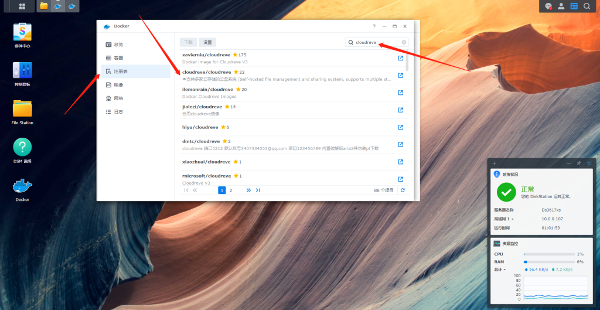
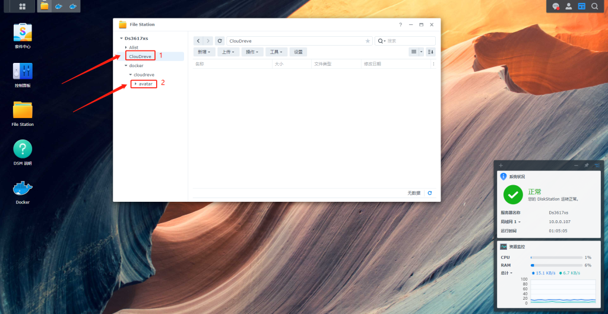
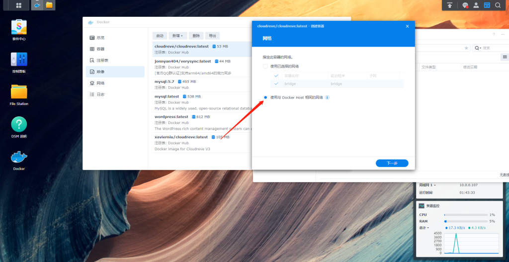
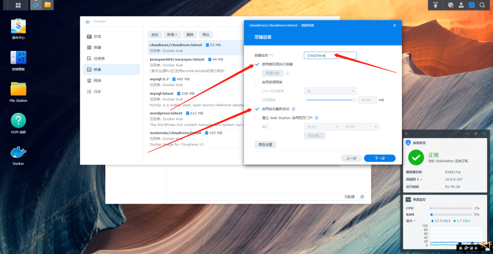
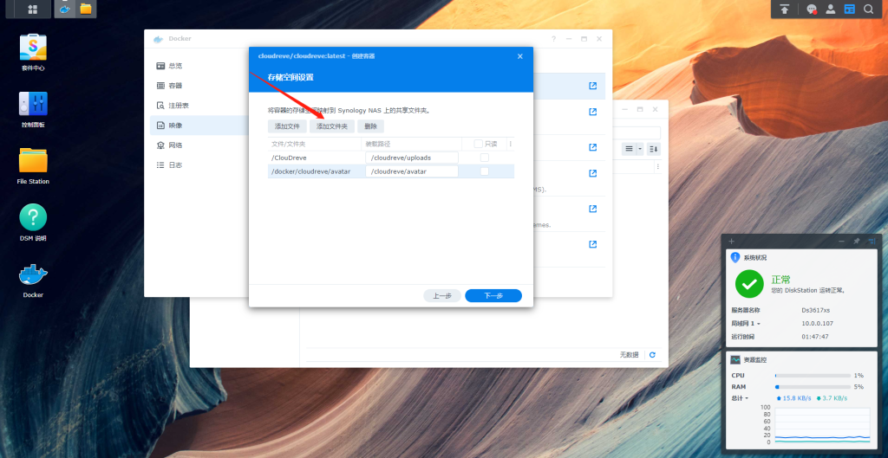
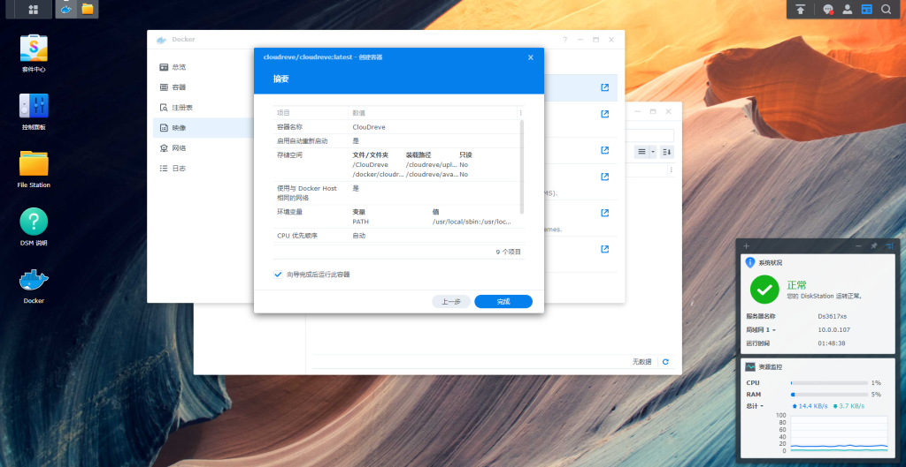
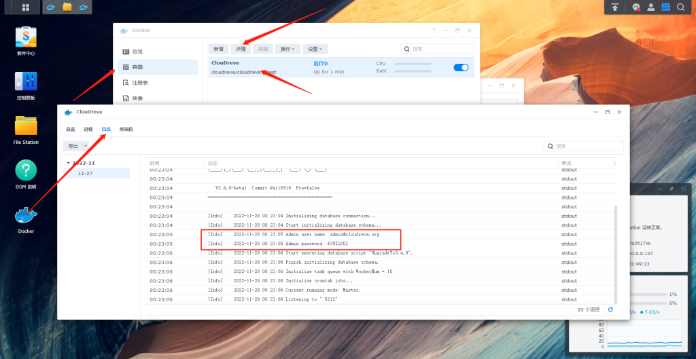
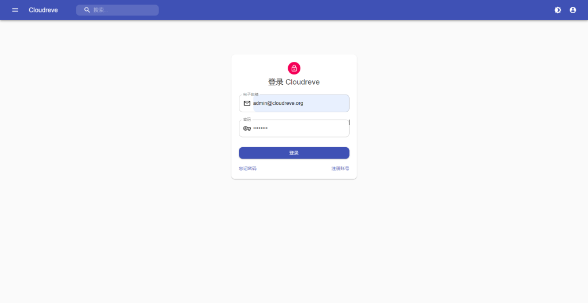
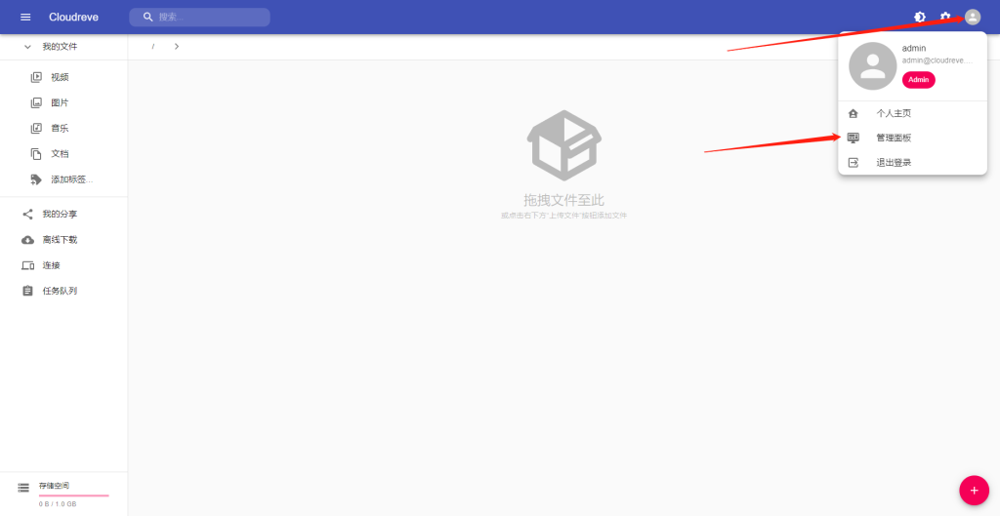

# 群晖DocKer部署ClouDreve个人网盘

Cloudreve 可以让您快速搭建起公私兼备的网盘系统。Cloudreve 在底层支持不同的云存储平台，用户在实际使用时无须关心物理存储方式。你可以使用 Cloudreve 搭建个人用网盘、文件分享系统，亦或是针对大小团体的公有云系统。

- :cloud: 支持本机、从机、七牛、阿里云 OSS、腾讯云 COS、又拍云、OneDrive (包括世纪互联版) 作为存储端

- :outbox_tray: 上传/下载 支持客户端直传，支持下载限速

- 💾 可对接 Aria2 离线下载，可使用多个从机节点分担下载任务

- 📚 在线 压缩/解压缩、多文件打包下载

- 💻 覆盖全部存储策略的 WebDAV 协议支持

- :zap: 拖拽上传、目录上传、流式上传处理

- :card_file_box: 文件拖拽管理

- :family_woman_girl_boy: 多用户、用户组

- :link: 创建文件、目录的分享链接，可设定自动过期

- :eye_speech_bubble: 视频、图像、音频、文本、Office 文档在线预览

- :art: 自定义配色、黑暗模式、PWA 应用、全站单页应用

- :rocket: All-In-One 打包，开箱即用

- 🌈 ... ...

接下来我们开始

打开群晖Docker面板在 注册表 搜索 “cloudreve” 我喜欢用第二个 你们觉得星数不高可以用第一个双击下载latest版本

下载中 我们打开File Staation手动创建目录

如图 ClouDreve 标注1 是用户上传目录 他们存放的文件都会在这里  /docker/cloudreve/avatar 标注2 是个人头像存放路径 回到Docker面板双击容器镜像

选择 使用与 docker host 相同的网络  下一步

最高权限可选可不选看人人 开机自动启勾选上，名字你喜欢写什么都行

添加2个文件夹如下图

这里默认即可

回到容器 -详情- 日志 框框内就是初始用户和密码

打开浏览器输入 群晖IP:5212  即可打开登录面板 输入刚到在日志里用户和密码

这里就是管理面板 用户密码自行修改

Cloudreve 内置了一些常用数据库脚本，可用于日常维护、版本升级等操作。您可以在启动时添加命令行参数 `--database-script ` 执行各个脚本。

如果因为系统故障、手动操作数据库记录导致用户已用空间与实际不符时，你可以运行以下数据库脚本，Cloudreve 会重新校准所有已注册用户的容量使用。

> ./cloudreve --database-script CalibrateUserStorage

以下数据库脚本可以重设初始管理员（即 UID 为 1 的用户）的密码，新密码会在命令行日志中输出，请注意保存。

./cloudreve --database-script ResetAdminPassword