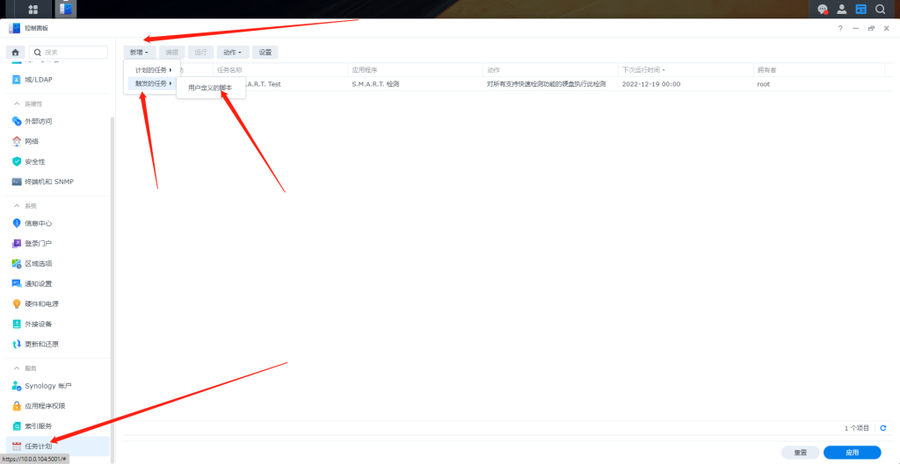
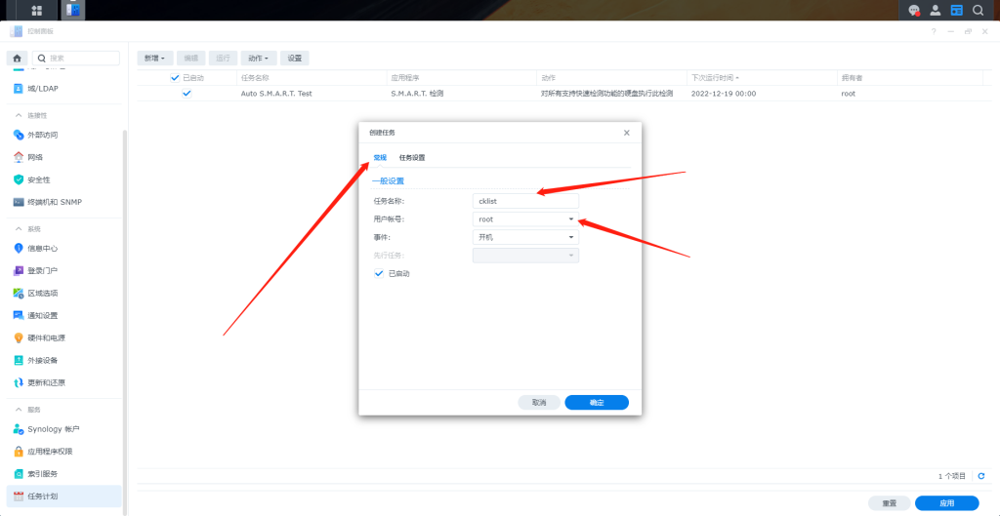
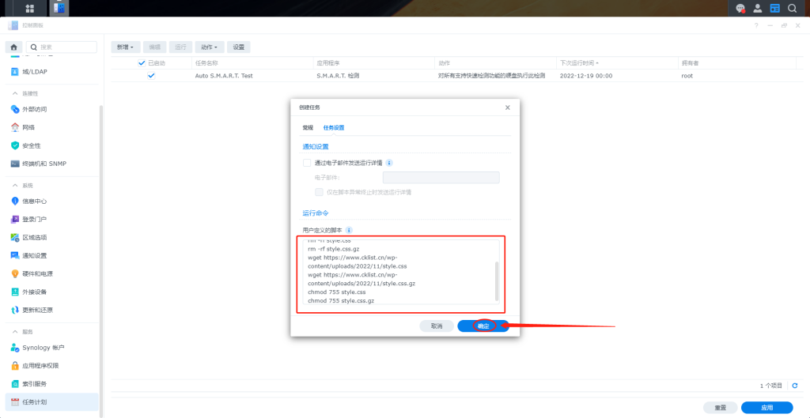
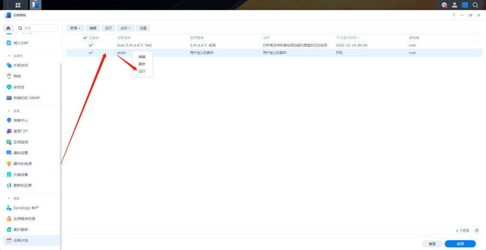
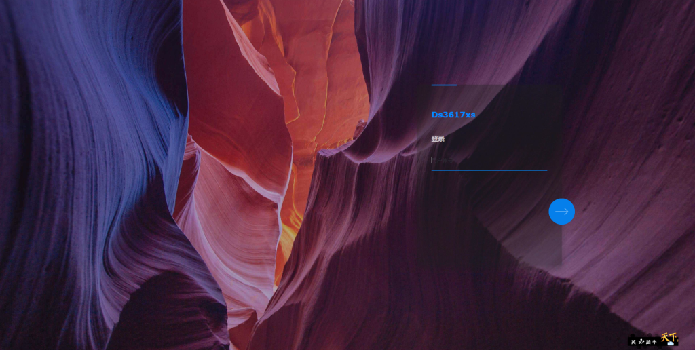

# 群晖DSM7.X的登录界面美化成半透明

群晖DSM系统登录界面做了美化，先看效果：

打开群晖控制面板，任务计划，新增，触发的任务，用户定义的脚本；

任务名称自己写一个，我写的是cklist，用户账号要改成root

根据DSM系统版本选择对应的代码，复制到“任务设置”标签的“用户定义的脚本”处粘贴，再点“确定

DSM7.1.1-42962版本系统用的代码

> cd /usr/syno/synoman/webman/login/dist/

> > cp style.css style.css-bak

> > cp style.css.gz style.css.gz-bak

> > rm -rf style.css

> > rm -rf style.css.gz

> > wget https://www.cklist.cn/wp-content/uploads/2022/11/style.css

> > wget https://www.cklist.cn/wp-content/uploads/2022/11/style.css.gz

> > chmod 755 style.css

> > chmod 755 style.css.gz

DSM7.1-42661版本系统（包括DSM7.1-42661up1到DSM7.1-42661up4版本）用的代码

> cd /usr/syno/synoman/webman/login/css/

> > cp login.css login.css-bak

> > cp login.css.gz login.css.gz-bak

> > rm -rf login.css

> > rm -rf login.css.gz

> > wget https://www.cklist.cn/wp-content/uploads/2022/11/style.css

> > wget https://www.cklist.cn/wp-content/uploads/2022/11/style.css.gz

> > chmod 755 login.css

> > chmod 755 login.css.gz

在控制面板，任务计划，找到刚刚添加的任务，右键，运行

在浏览器打开一个无痕窗口，输入群晖的登录地址再看一下效果就出来了，是不是漂亮多了

如果你觉得这个效果不喜欢，也可以恢复原来的白底

DSM7.1.1-42962版本系统恢复的代码是

> cd /usr/syno/synoman/webman/login/dist/

> rm -rf style.css

> rm -rf style.css.gz

> cp style.css-bak style.css

> cp style.css.gz-bak style.css.gz

> chmod 755 style.css

> chmod 755 style.css.gz

DSM7.1-42661版本系统（包括DSM7.1-42661up1到DSM7.1-42661up4版本）恢复的代码是

> cd /usr/syno/synoman/webman/login/css/

> rm -rf login.css

> rm -rf login.css.gz

> cp login.css-bak login.css

> cp login.css.gz-bak login.css.gz

> chmod 755 login.css

> chmod 755 login.css.gz

本文引用  [把群晖DSM7.X的登录界面美化成半透明 - GXNAS博客](https://wp.gxnas.com/12567.html)