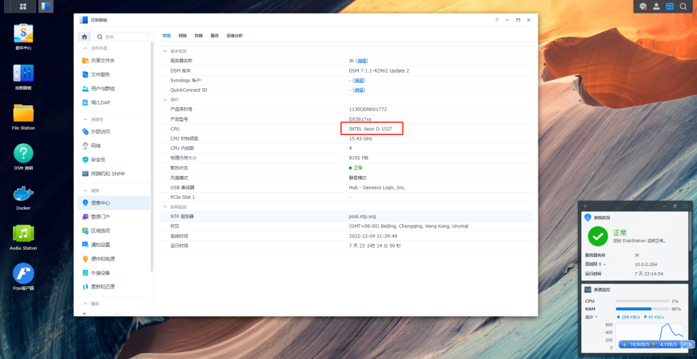
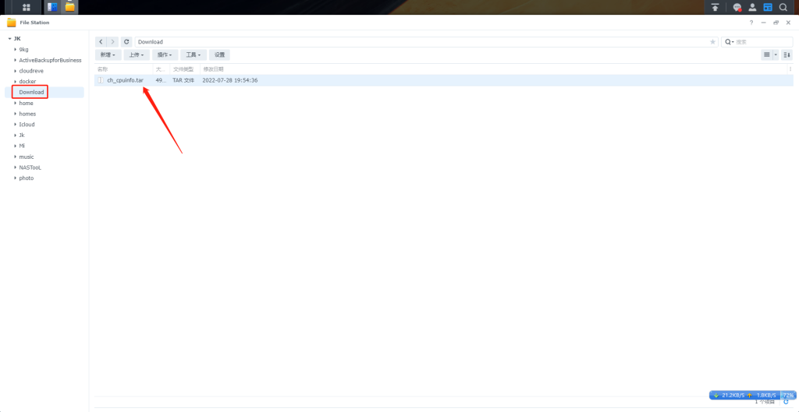
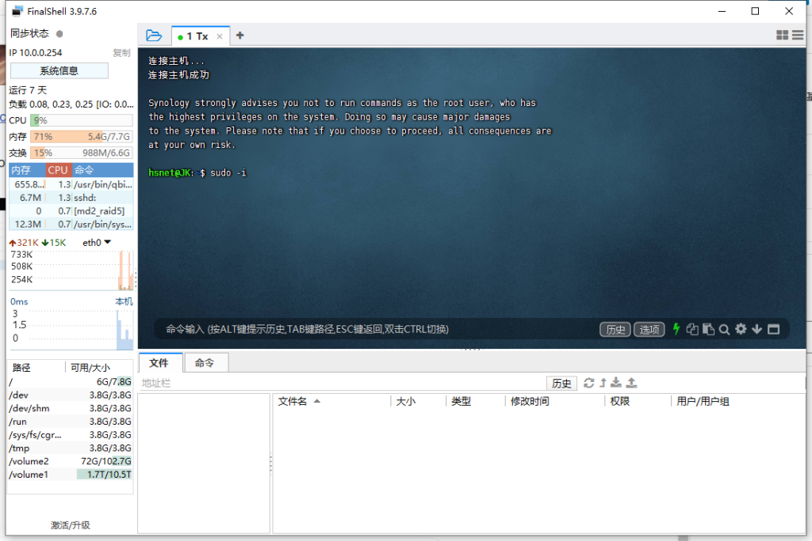
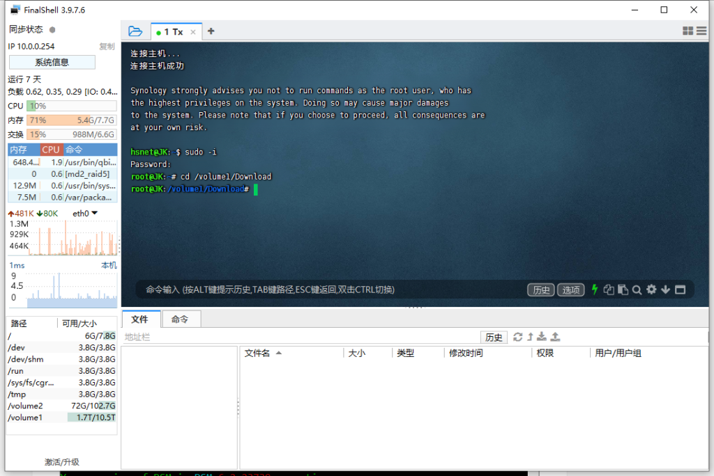
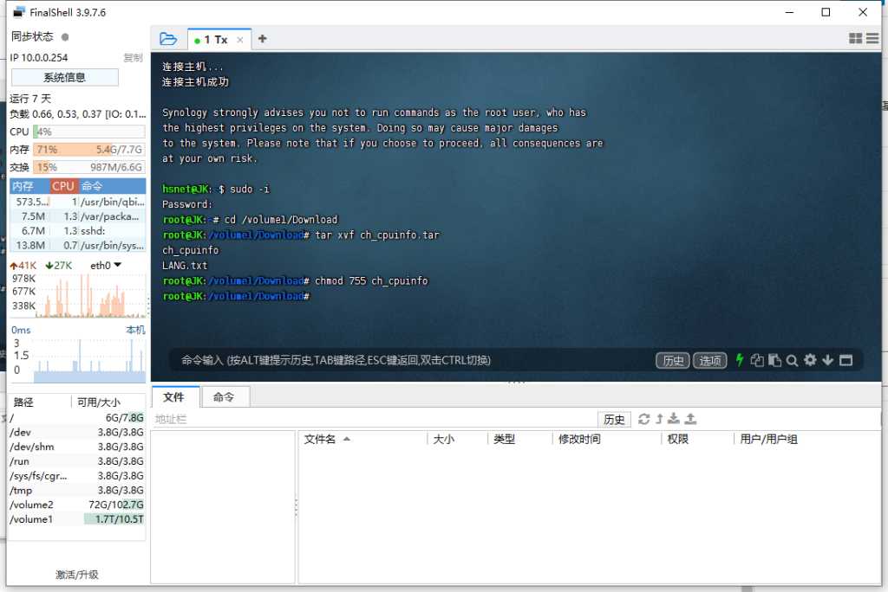
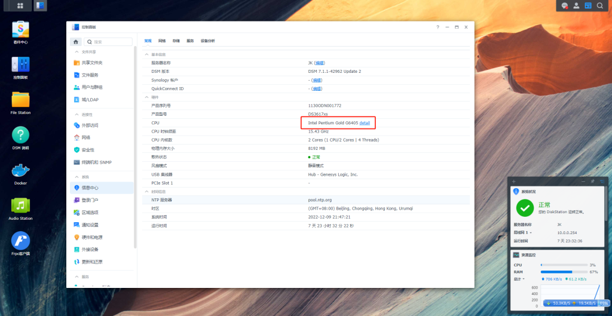

# 黑群晖显示真实CPU信息（支持7.1）

黑群晖默认显示的CPU并不是本机CPU信息.采用补丁形式可以显示真实CPU信息.

Github连接：[https://github.com/FOXBI/ch_cpuinfo](https://github.com/FOXBI/ch_cpuinfo)  [网盘下载](https://pc.cklist.cn/d/%E4%B8%8D%E5%86%8D%E5%84%AA%E9%9B%85%20De%20%E4%BA%91%E7%9B%98/%E9%BB%91%E7%BE%A4%E6%99%96%E5%B7%A5%E5%85%B7/ch_cpuinfo-%E7%BE%A4%E6%99%96%E6%98%BE%E7%A4%BA%E7%9C%9F%E5%AE%9E%E7%A1%AC%E4%BB%B6.tar)

在群晖找一个共享文件夹上传 我放到 Download 下

打开SSH工具 我用FinalShell  连接群晖 输入 sudo -i 再输入密码，提升权限为root .

运行ch_cpuinfo（Download修改为自己的目录） 注 “volume1 为存储空间”不知道自己是第几个 可以在文件夹属性看

> cd /volume1/Download

再解压包 ch_cpuinfo.tar

> tar xvf ch_cpuinfo.tar

把文件权限改为755

> chmod 755 ch_cpuinfo

运行该文件. 1.运行补丁，2是重新打补丁，3是还原. 选择1 提示按Y

> ./ch_cpuinfo

这样就好了 .关闭SSH.用浏览器重新登录一下群晖页面.

用到以下命令

> sudo -i

> cd /volume1/Download

> tar xvf ch_cpuinfo.tar

> chmod 755 ch_cpuinfo

> ./ch_cpuinfo