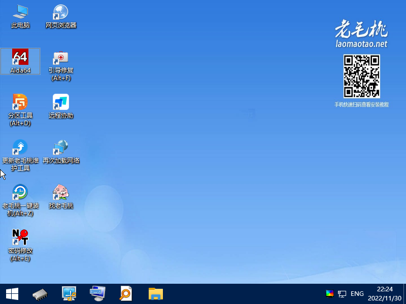
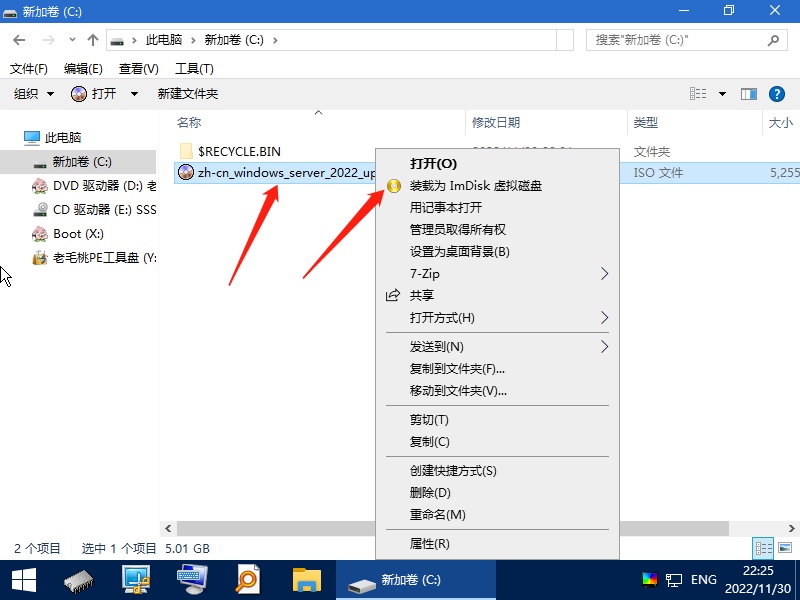
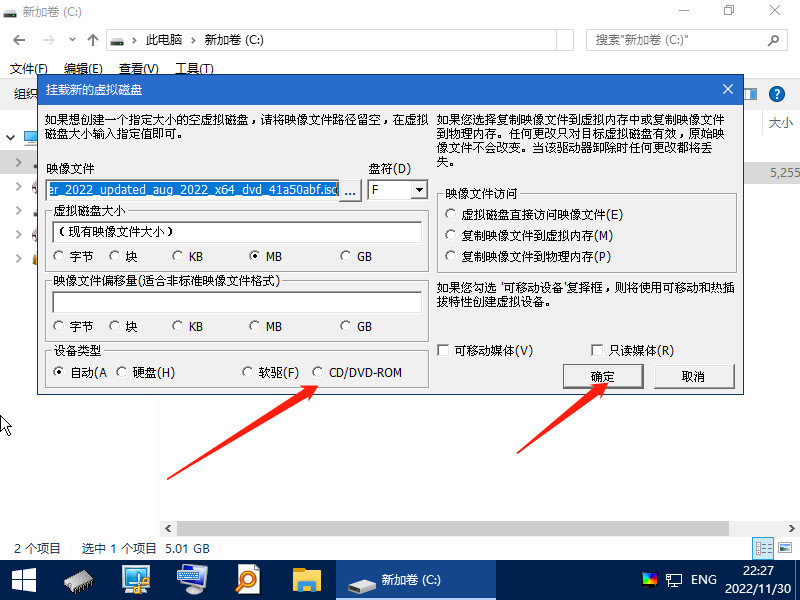
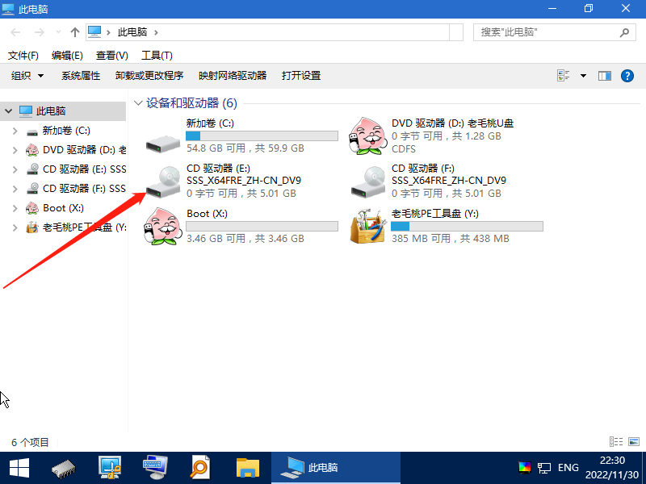
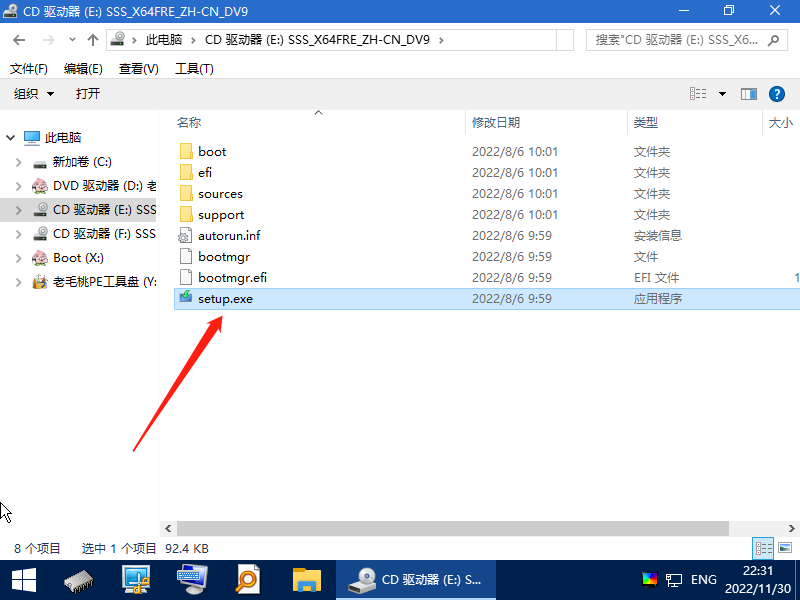

# PE下安装纯版Windows系统

Windows PE

Windows Preinstallation Environment（Windows PE），Windows预安装环境，是带有有限服务的最小Win32子系统，基于以完整Windows环境或者保护模式运行的Windows 3.x及以上内核。它包括运行Windows安装程序及脚本、连接网络共享、自动化基本过程以及执行硬件验证所需的最小功能。用于安装、部署和修复 Windows 桌面版（家庭版、专业版、企业版和教育版）、Windows Server 和其他 Windows 操作系统及恢复其完整性，而Windows PE并非为普通用户可以正常使用的操作系统，多数用于开发人员或计算机管理员维修，维护PC主系统使用。

市面上的PE有 [老毛桃](http://lmt.hebehr.cn/index.html)  [老白菜](http://laobaicai.wqinadf.top/) [驱动总裁](http://www.drvceo.com/) 我就不一一列举了  U盘制作PE各大PE官网都有教程，主要是不借助PE里的第三方安装工具来安装系统包，因为大多数安装工具都会植入广告成份。

以下以老毛桃PE为例 把系统安装包放入提前做的PE U盘里 根目录就行 启动电脑把启动设置为U盘第一启动，进桌面就以下画面，

打开Windows系统安装包右击，选择“装载为ImDisk虚拟磁盘”

在最底层选择“CD/DVD-ROM” 确定 然后关闭软件

打开我的电脑 多出一个 “CD驱动器”  双击打开

里面有个 “setup.exe” 双击打开 就可以正常安装系统了

至于怎么安装请参考[《Win10系统安装教程》](https://www.cklist.cn/?p=71)