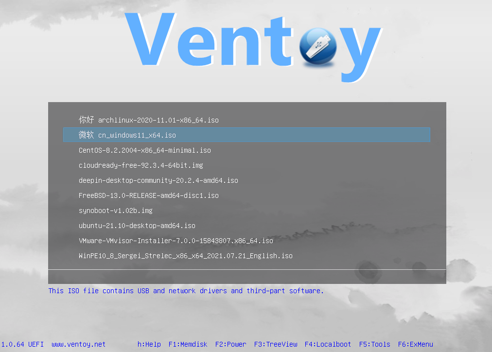
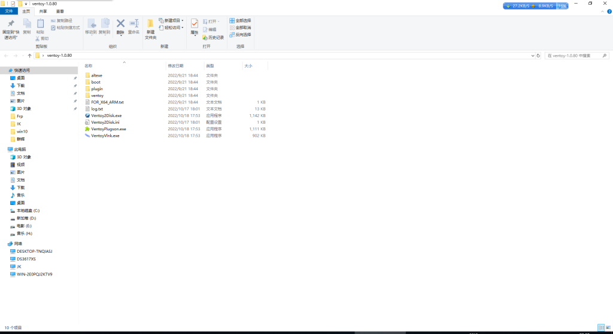
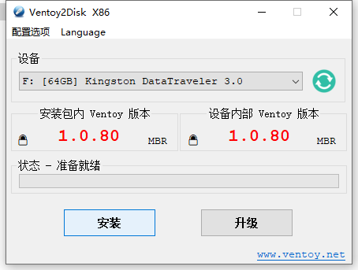
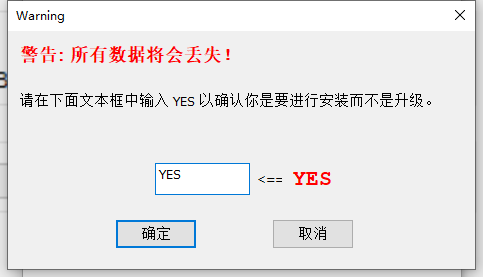
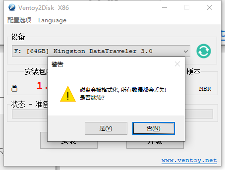
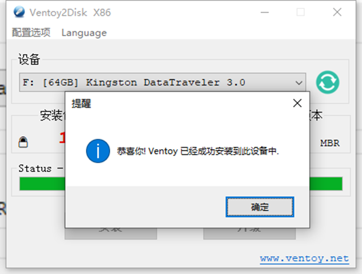
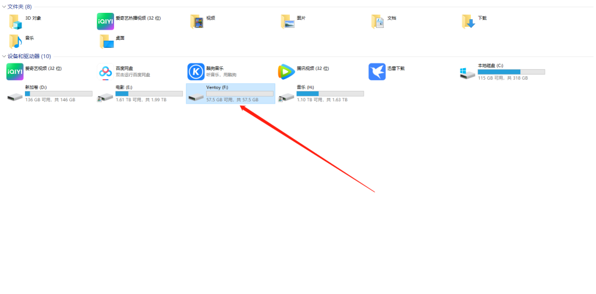
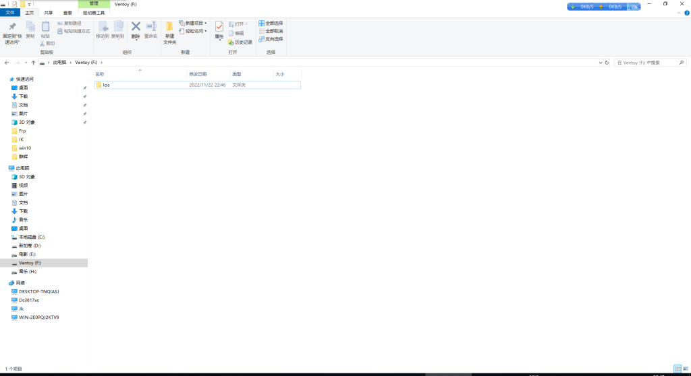
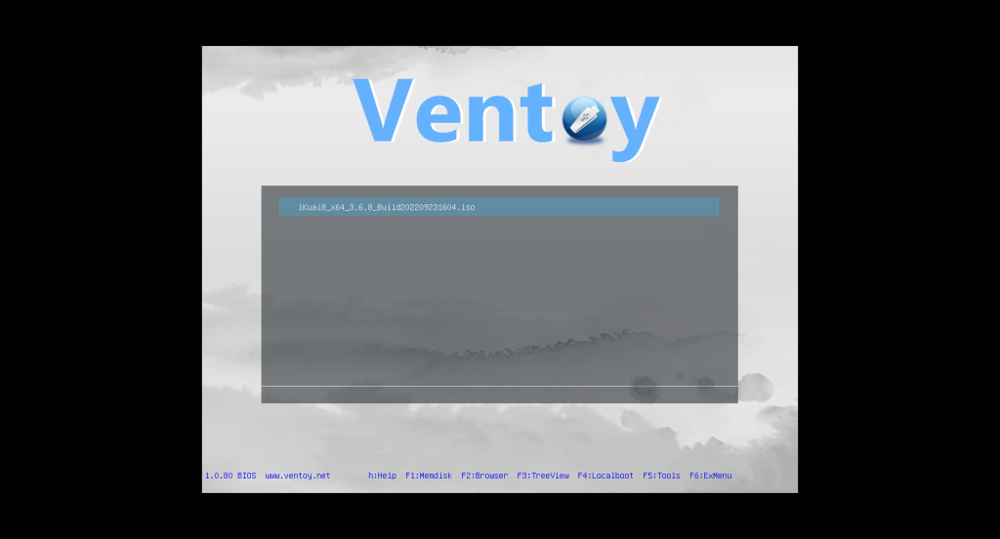
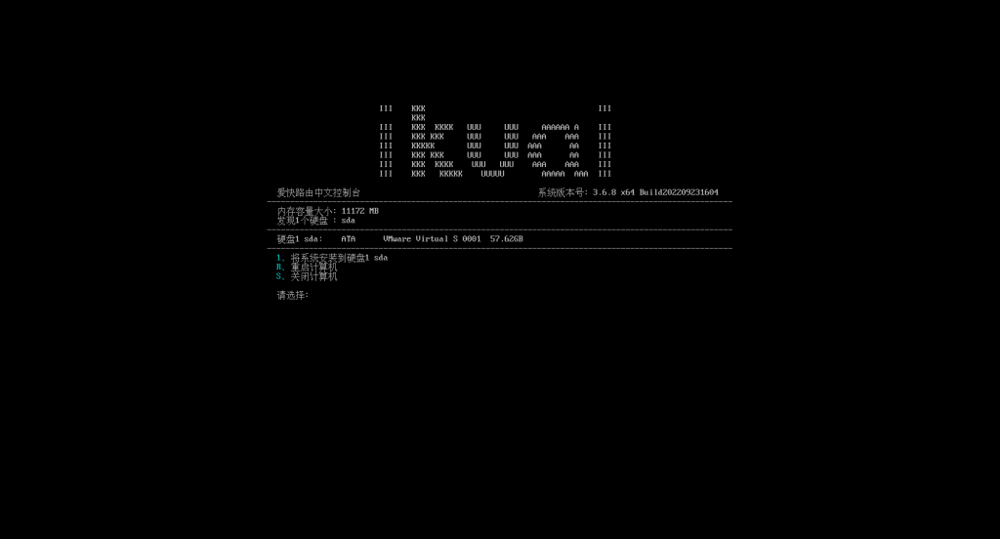

# Ventoy新一代多系统启动U盘解决方案

**Ventoy 简介**

简单来说，Ventoy是一个制作可启动U盘的开源工具。
有了Ventoy你就无需反复地格式化U盘，你只需要把 ISO/WIM/IMG/VHD(x)/EFI 等类型的文件直接拷贝到U盘里面就可以启动了，无需其他操作。
你可以一次性拷贝很多个不同类型的镜像文件，Ventoy 会在启动时显示一个菜单来供你进行选择 (参见 [截图](https://www.ventoy.net/cn/screenshot.html))。
你还可以在 Ventoy 的界面中直接浏览并启动本地硬盘中的 ISO/WIM/IMG/VHD(x)/EFI 等类型的文件。
Ventoy 安装之后，同一个U盘可以同时支持 x86 Legacy BIOS、IA32 UEFI、x86_64 UEFI、ARM64 UEFI 和 MIPS64EL UEFI 模式，同时还不影响U盘的日常使用。
Ventoy 支持大部分常见类型的操作系统 （Windows/WinPE/Linux/ChromeOS/Unix/VMware/Xen ...）
目前已经测试了各类超过** 1000+** 个镜像文件([列表](https://www.ventoy.net/cn/isolist.html))。 支持 [distrowatch.com](http://distrowatch.com/dwres.php?resource=popularity) 网站上收录的 **90%+** 的操作系统([列表](https://www.ventoy.net/cn/distrowatch.html))。

官方主页   [Ventoy](https://www.ventoy.net/cn/index.html) 请到官方下载最新版.

下载解压 把U盘插在电脑上 打开 Ventoy2Disk.exe 点一下 安装

如果U盘有数据请及时备份 因为会自动格式U盘

注意 要大写 YES

会提示格式化 要点两次.

看到这个 Ventoy安装成功了.

打开U盘 新建一个文件夹改名为Ios 可以把Ios 的windows 各种版本放进去 就可以启动IOS文件了.

我放了个爱快系统在里面 设置好U盘启动

就显示爱快的IOS了 直接 回车 启动

正常启动，还可以放各种系统包只要你U盘够大.安装完成