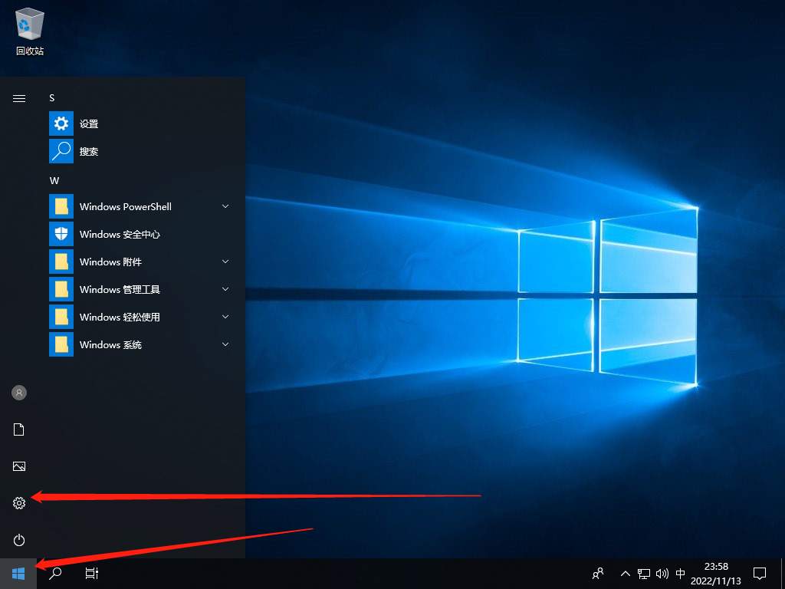
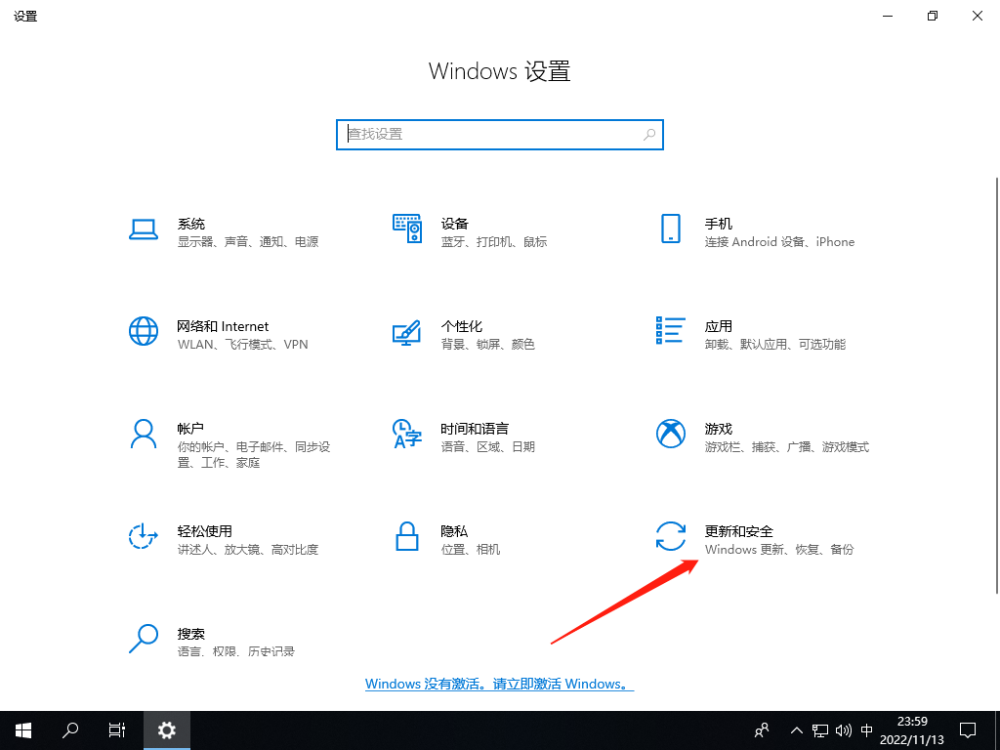
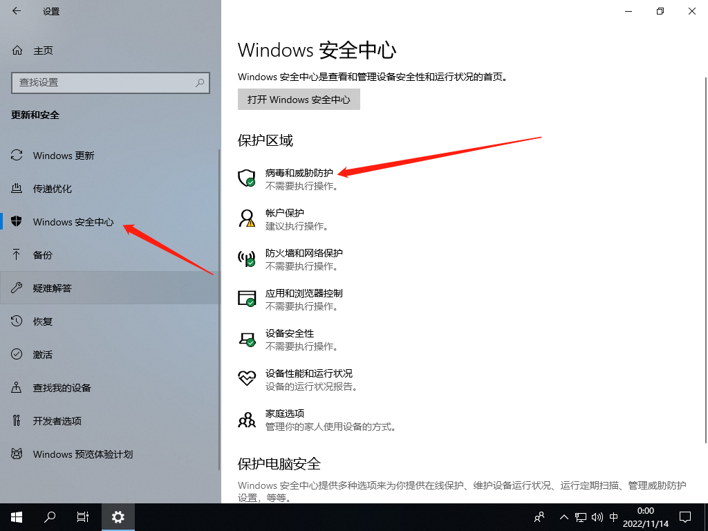
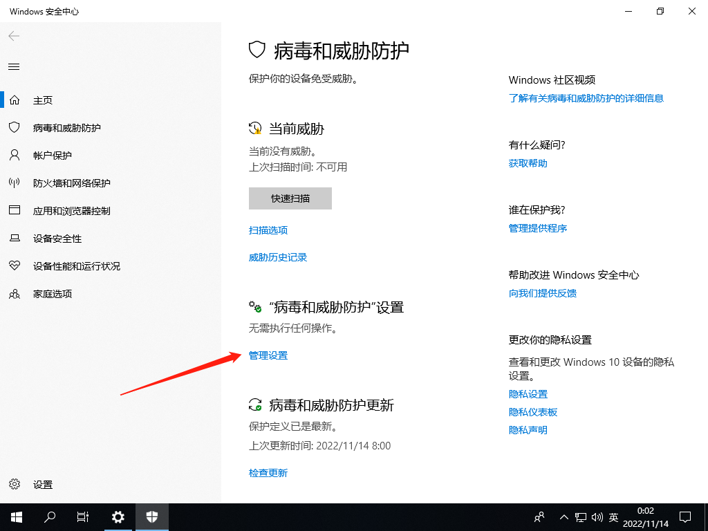
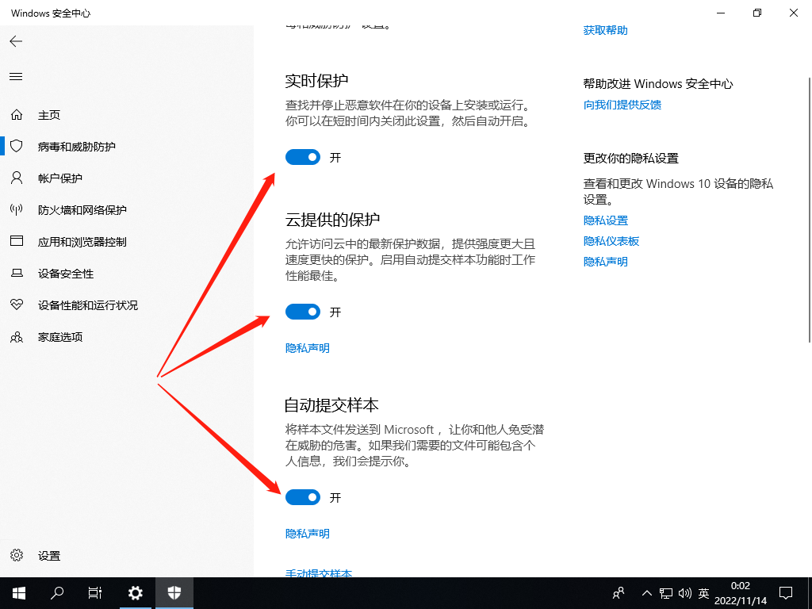
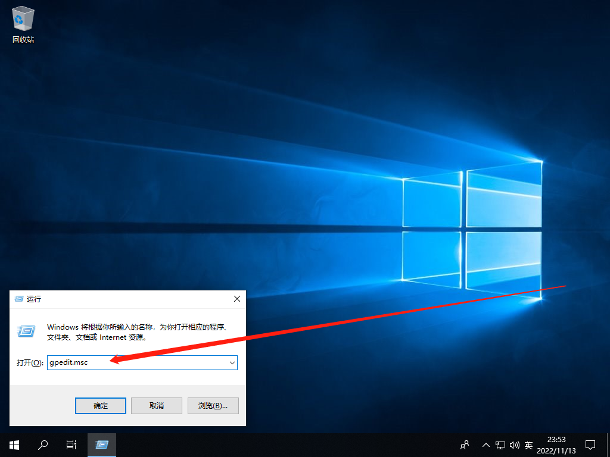
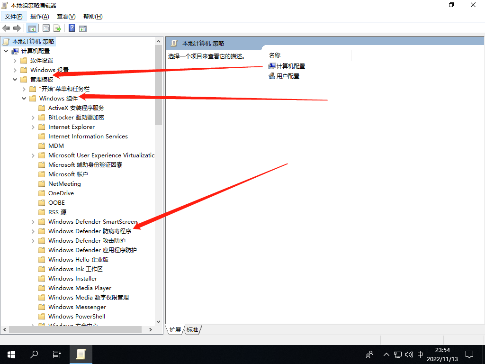
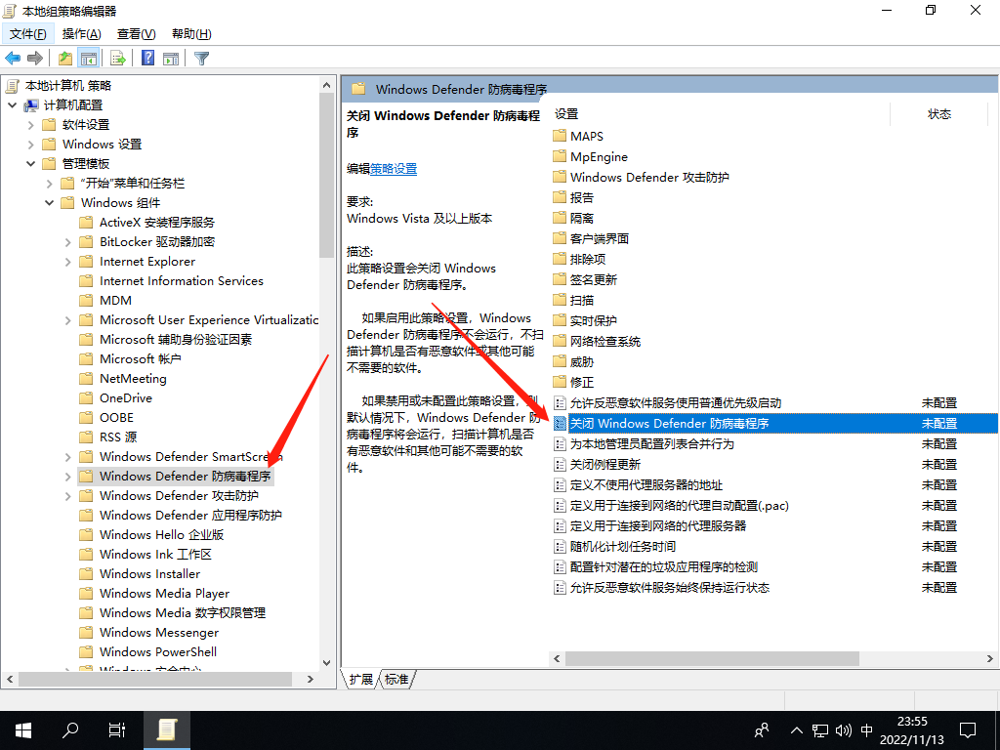
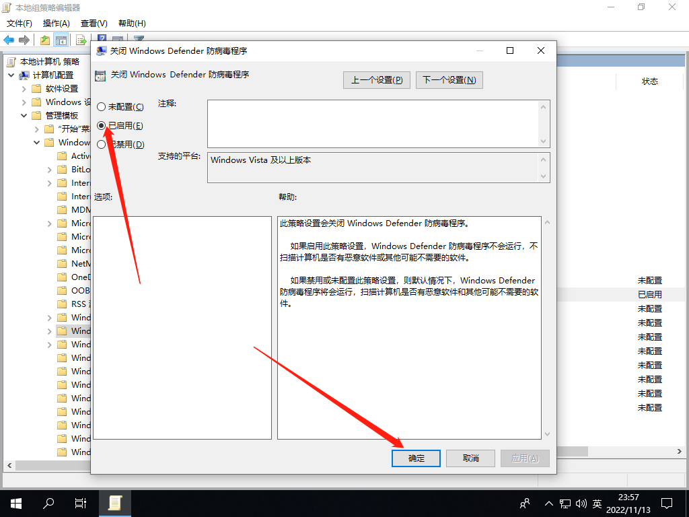

# Win10如何关闭Defende

首先点一下"开始" ”设置"

找到 “更新和安全”

左边找到“Windows安全中心” 右边 “病毒和威胁防护“

找到 “管理设置”

找到这三个 全部关闭 然后退回 桌面

打开“运行”工具，输入“gpedit.msc”，点击“确定”

“计算机配置”下“管理模板” -"Windows组件“-Windows Defender防病毒程序

双击“关闭Windows Defender防病毒程财塑序”选项，弹出窗口中勾选“已启用”选项，点击“确定”。

关闭所以窗口 重启一下 到此 就可以关闭 Windows Defender.