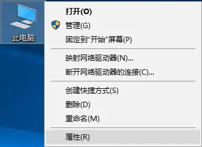
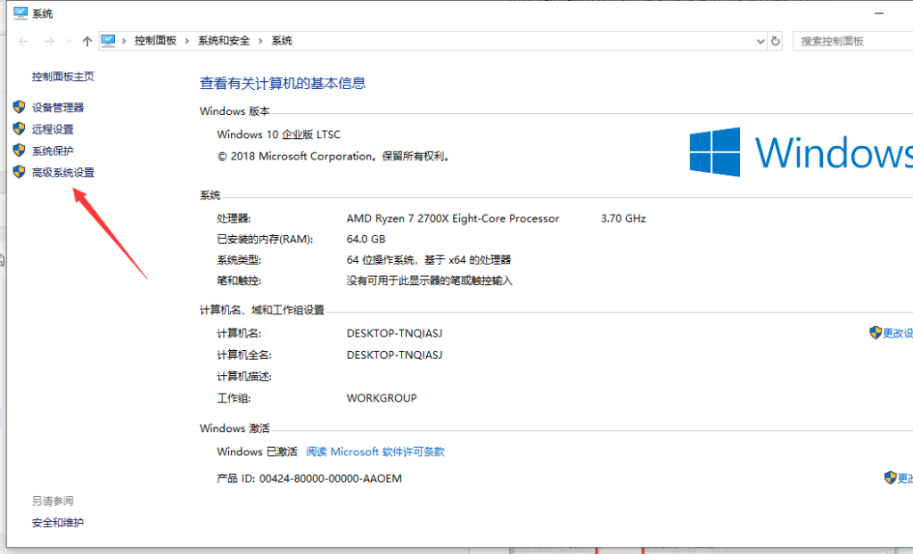
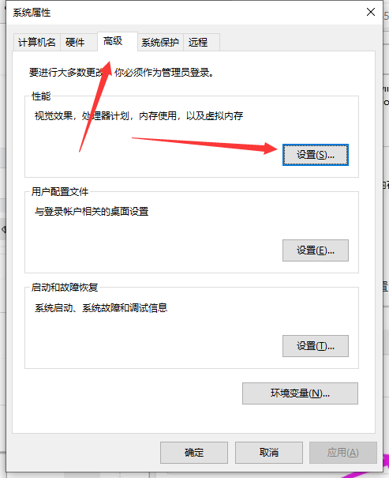
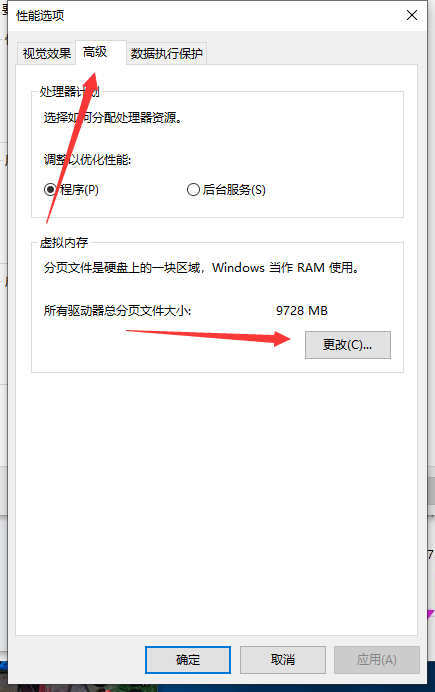
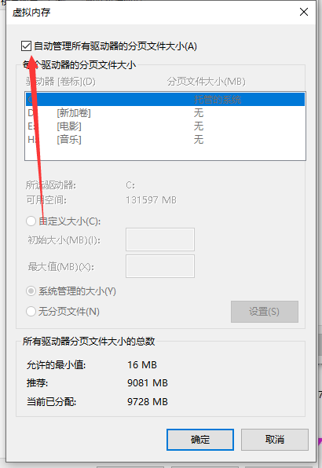
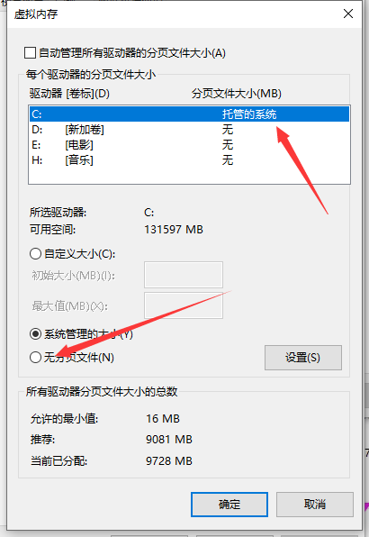
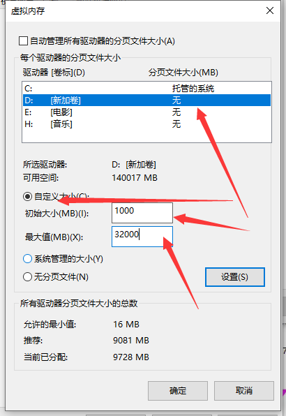

# Win10电脑设置虚拟内存

鼠标右击“此电脑”，点击“属性"

在系统窗口中，选择“高级系统设置

在高级选项卡，点击性能下面的“设置”

点击“高级”菜单，找到“虚拟内存”，点击“更改”

把自动管理所有驱动器的分页文小 取消

把C盘设置 无分页文件 点下 设置

在D盘 设置自定义大小 最小值 1000 最大值 最好是实际内存的1.5倍 比如32G内存 最大值 48000

然后确定 提示重启 下系统 就好了.