# Win10系统安装教程

> 进入BIOS调整开机顺序

> **** 非常重要！！！说三遍！！！****

> 开电脑之后，出现主板logo，狂按几次DEL或者F12键盘（不同电脑不一样，屏幕有显示，没有的话看主板说明书，台式机大部分都是小键盘DEL，笔记本有的是F2，有的是F12）

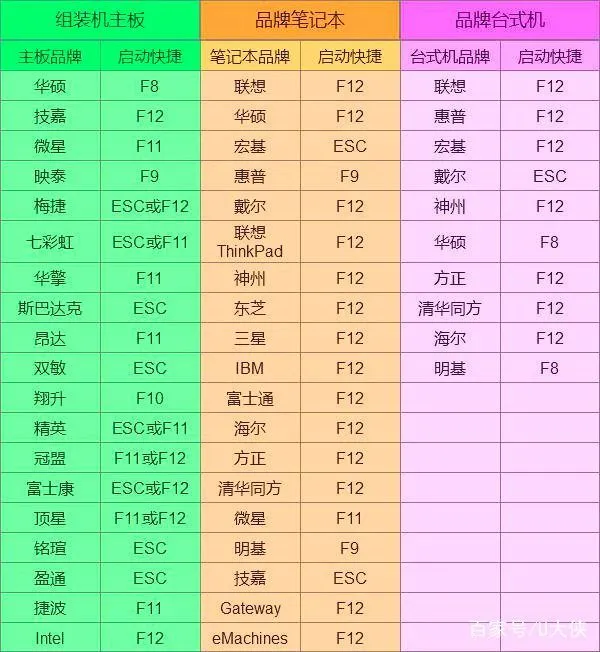

电脑会读取 U盘进行启动，界面如下：我们直接点下一步

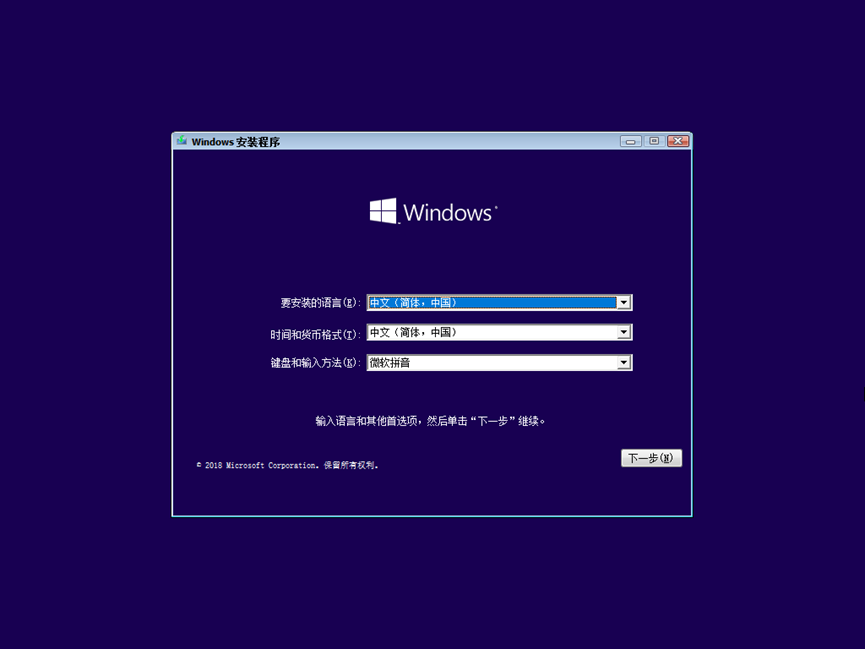

直接点击：直接安装

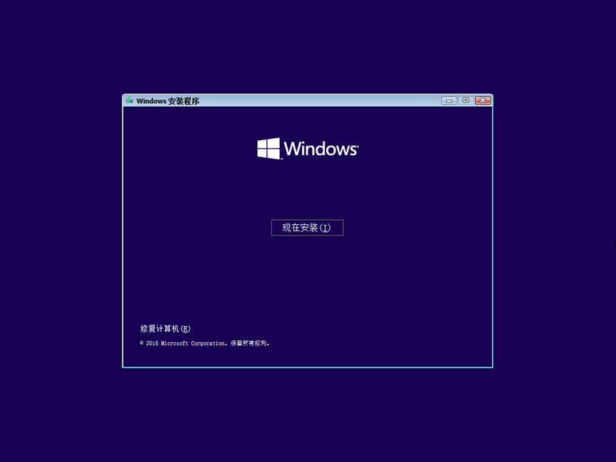

勾选许可 下一步

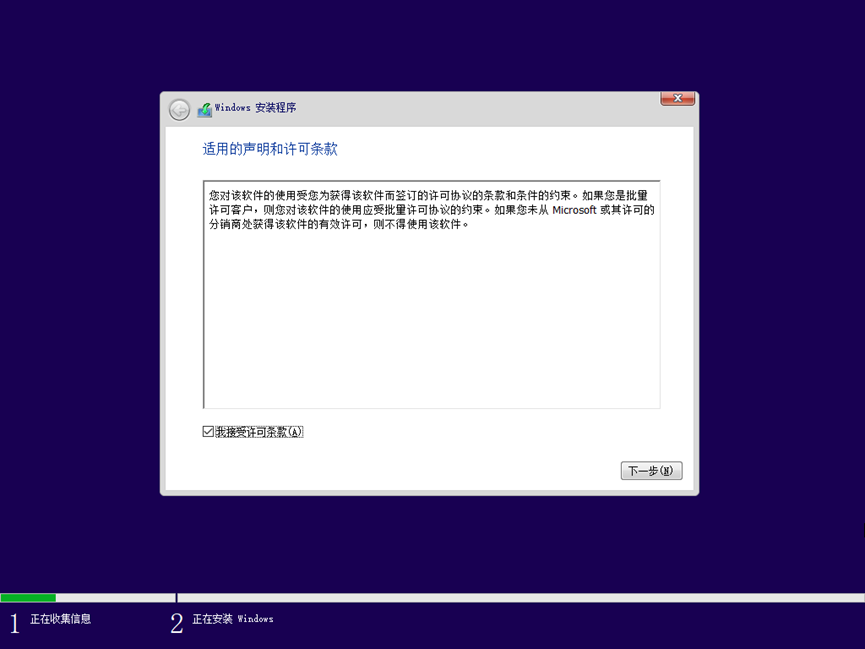

> 重点！！！重点！！！重点！！！

选择自定义：仅安装Windows (高级)（C）

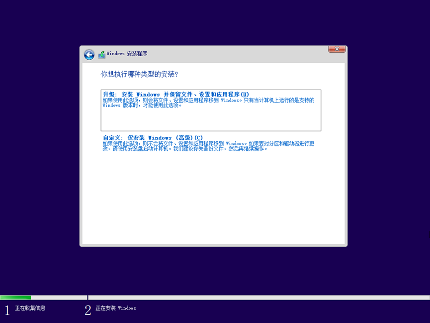

如果只有一个新硬盘 直接下一步
如果是重装请找到系统硬盘 比如我这个驱动器0 下的分区全全删除了 然后选驱动器0 再点一下 下一步

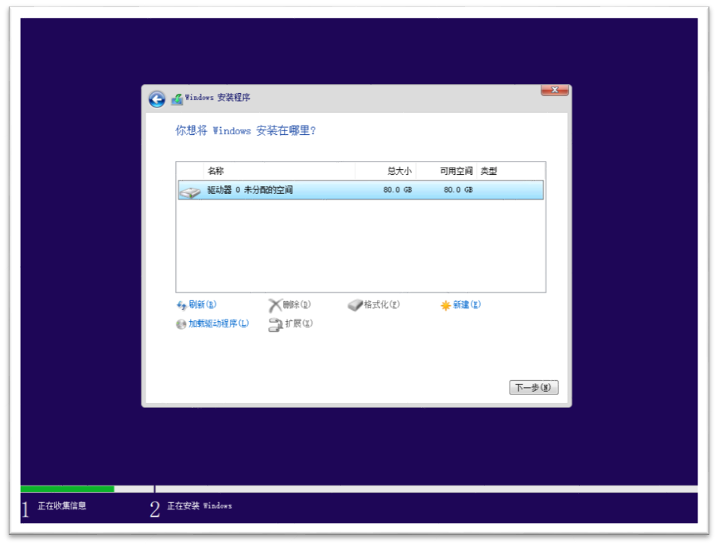

我们等待读取数据… 然后自动重启

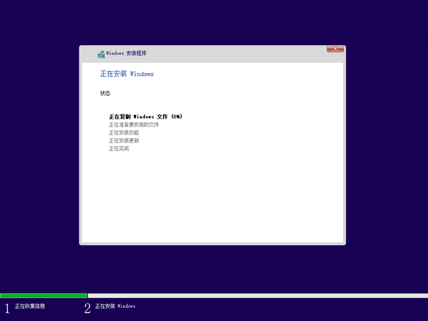

自动重启后会出现 设置Windwos 现在开始设置windwos

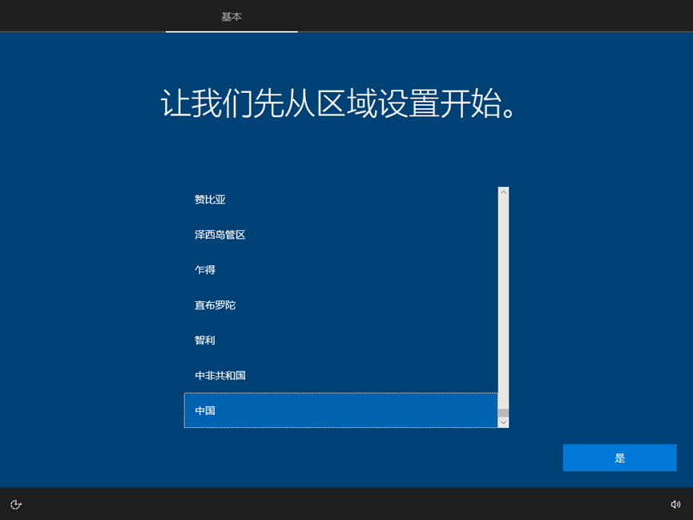

输入法 随便点一个 反正都要删除的- -

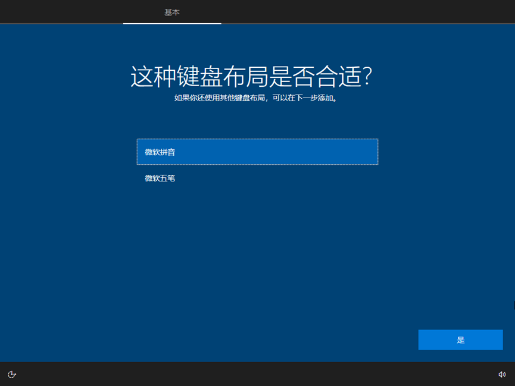

我们直接跳过 键盘布局

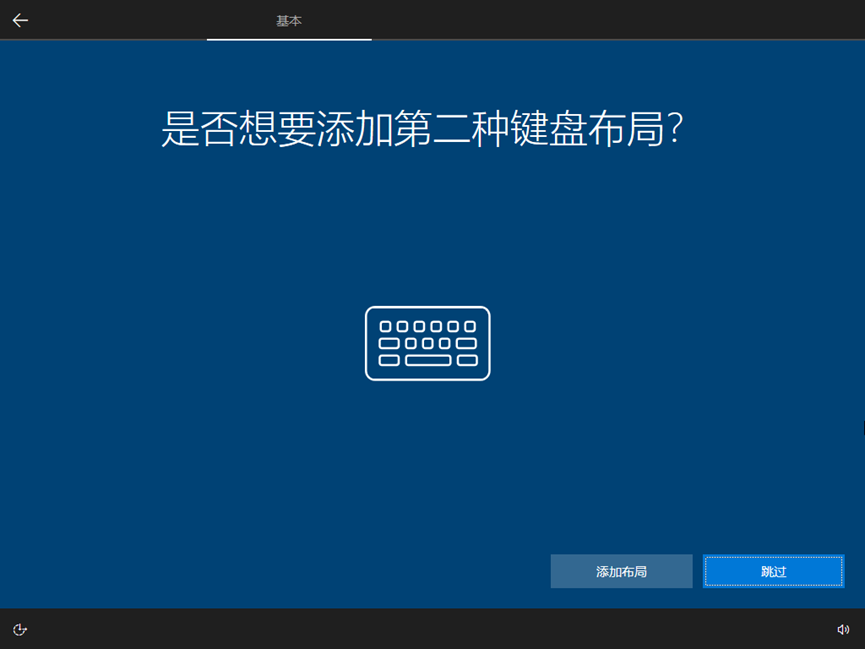

看清左下角 点一下 改为域加入

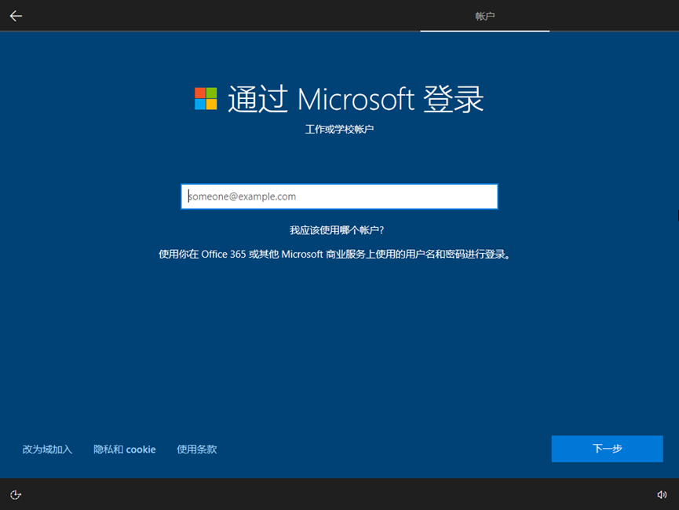

到这个之后 傻瓜式一直点 是 确定 接受

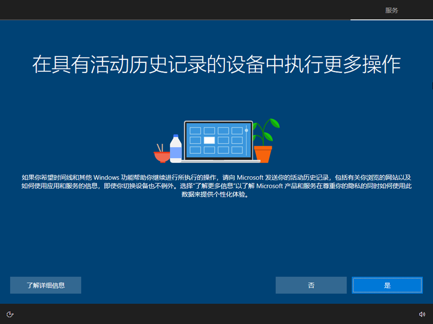

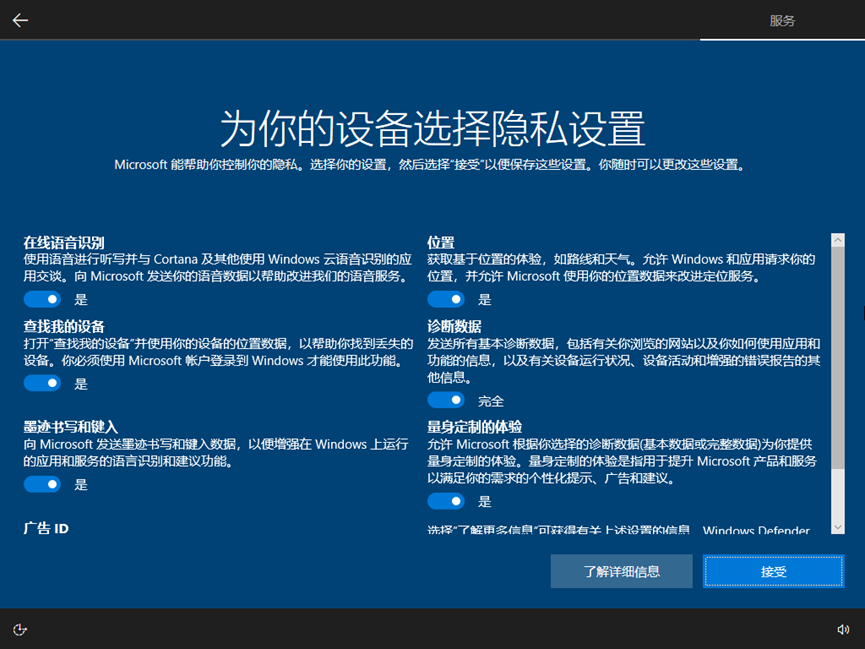

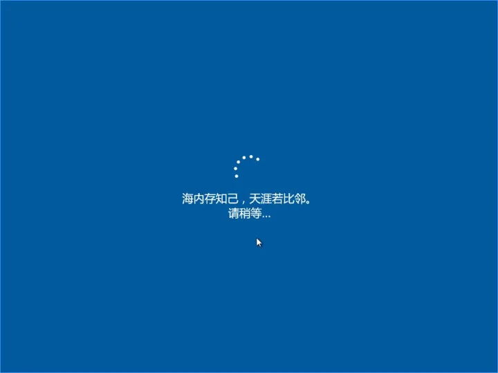

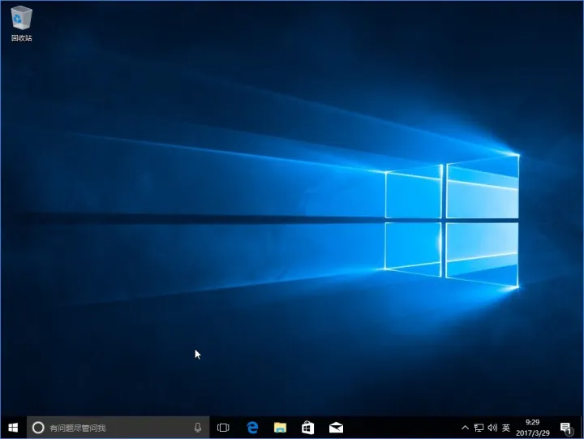

系统安装结束！