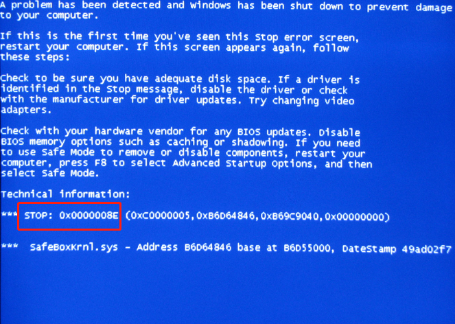

# Win10蓝屏代码大全

蓝屏的出现是可能是由于软件冲突，病毒木马，硬件错误等都可导致的，但是到底是什么原因呢？遇到了蓝屏却又无法解决的朋友，蓝屏代码可以告诉你，Win10蓝屏代码大全都代表什么错误原因？小编这就给大家讲讲常见的电脑蓝屏代码吧。

0X0000000 操作完成。

0X0000001 不正确的函数。

0X0000002 系统找不到指定的文件。

0X0000003 系统找不到指定的路径。

0X0000004 系统无法打开文件。

0X0000005 拒绝存取。

0X0000006 无效的代码。

0X0000007 内存控制模块已损坏。

0X0000008 内存空间不足，无法处理这个指令。

0X0000009 内存控制模块位址无效。

0X000000A 环境不正确。

0X000000B 尝试载入一个格式错误的程序。

0X000000C 存取码错误。

0X000000D 资料错误。

0X000000E 内存空间不够，无法完成这项操作。

0X000000F 系统找不到指定的硬盘。

0X0000010 无法移除目录。

0X0000011 系统无法将文件移到其他的硬盘。

0X0000012 没有任何文件。

0X0000019 找不到指定扇区或磁道。

0X000001A 指定的磁盘或磁片无法存取。

0X000001B 磁盘找不到要求的装置。

0X000001C 打印机没有纸。

0X000001D 系统无法将资料写入指定的磁盘。

0X000001E 系统无法读取指定的装置。

0X000001F 连接到系统的某个装置没有作用。

0X0000021文件的一部分被锁定，现在无法存取。

0X0000024 开启的分享文件数量太多。

0X0000026 到达文件结尾。

0X0000027 磁盘已满。

0X0000036 网络繁忙。

0X000003B 网络发生意外的错误。

0X0000043 网络名称找不到。

0X0000050 文件已经存在。

0X0000052 无法建立目录或文件。

0X0000053 INT24失败（什麼意思？还请高手指点站长一二）。

0X000006B 因为代用的磁盘尚未插入，所以程序已经停止。

0X000006C 磁盘正在使用中或被锁定。

0X000006F 文件名太长。

0X0000070 硬盘空间不足。

0X000007F 找不到指定的程序。

0X000045B 系统正在关机。

0X000045C 无法中止系统关机，因为没有关机的动作在进行中。

0X000046A 可用服务器储存空间不足。

0X0000475 系统BIOS无法变更系统电源状态。

0X000047E 指定的程序需要新的windows版本。

0X000047F 指定的程序不是windwos或ms-dos程序。

0X0000480 指定的程序已经启动，无法再启动一次。

0X0000481 指定的程序是为旧版的 windows所写的。

0X0000482 执行此应用程序所需的程序库文件之一被损。

0X0000483 没有应用程序与此项操作的指定文件建立关联。

0X0000484 传送指令到应用程序无效。

0X00005A2 指定的装置名称无效。

0X00005AA 系统资源不足，无法完成所要求的服务。

0X00005AB系统资源不足，无法完成所要求的服务。

0X00005AC系统资源不足，无法完成所要求的服务。

110 0x006E 系统无法开启指定的 装置或档案。

111 0x006F 档名太长。

112 0x0070 磁碟空间不足。

113 0x0071 没有可用的内部档案识别字。

114 0x0072 目标内部档案识别字不正确。

117 0x0075 由应用程式所执行的 IOCTL 呼叫 不正确。

118 0x0076 写入验证参数值不正确。

119 0x0077 系统不支援所要求的指令。

120 0x0078 此项功能仅在 Win32 模式有效。

121 0x0079 semaphore 超过逾时期间。

122 0x007A 传到系统呼叫的资料区域 太小。

123 0x007B 档名、目录名称或储存体标？***语法错？***。

124 0x007C 系统呼叫层次不正确。

125 0x007D 磁碟没有设定标？***。

126 0x007E 找不到指定的模组。

127 0x007F 找不到指定的程序。

128 0x0080 没有子行程可供等待。

129 0x0081 %1 这个应用程式无法在 Win32 模式下执行。

130 0x0082 Attempt to use a file handle to an open disk partition for an

operation other than raw disk I/O。

131 0x0083 尝试将档案指标移至档案开头之前。

132 0x0084 无法在指定的装置或档案，设定档案指标。

133 0x0085 JOIN 或 SUBST 指令 无法用於 内含事先结合过的磁碟机。

134 0x0086 尝试在已经结合的磁碟机，使用 JOIN 或 SUBST 指令。

135 0x0087 尝试在已经替换的磁碟机，使 用 JOIN 或 SUBST 指令。

136 0x0088 系统尝试删除 未连结过的磁碟机的连结关系。

137 0x0089 系统尝试删除 未替换过的磁碟机的替换关系。

138 0x008A 系统尝试将磁碟机结合到已经结合过之磁碟机的目录。

139 0x008B 系统尝试将磁碟机替换成已经替换过之磁碟机的目录。

140 0x008C 系统尝试将磁碟机替换成已经替换过之磁碟机的目录。

141 0x008D 系统尝试将磁碟机 SUBST 成已结合的磁碟机 目录。

142 0x008E 系统此刻无法执行 JOIN 或 SUBST。

143 0x008F 系统无法将磁碟机结合或替换同一磁碟机下目录。

144 0x0090 这个目录不是根目录的子目录。

145 0x0091 目录仍有资料。

146 0x0092 指定的路恕w经被替换过。

147 0x0093 资源不足，无法处理这项 指令。

148 0x0094 指定的路拿o时候无法使用。

149 0x0095 尝试要结合或替换的磁碟机目录，是已经替换过的的目标。

150 0x0096 CONFIG.SYS 档未指定系统追踪资讯，或是追踪功能被取消。

151 0x0097 指定的 semaphore事件 DosMuxSemWait 数目不正确。

152 0x0098 DosMuxSemWait 没有执行；设定太多的 semaphore。

153 0x0099 DosMuxSemWait 清单不正确。

154 0x009A 您所输入的储存媒体标 元长度限制。

155 0x009B 无法建立其他的执行绪。

156 0x009C 接收行程拒绝接受信号。

157 0x009D 区段已经被舍弃，无法被锁定。

158 0x009E 区段已经解除锁定。

159 0x009F 执行绪识别码的位址不正确。

160 0x00A0 传到 DosExecPgm 的引数字串不正确。

161 0x00A1 指定的路恕ㄔ萧T。

162 0x00A2 信号等候处理。

164 0x00A4 系统无法建立执行绪。

167 0x00A7 无法锁定档案的部份范围。

170 0x00AA 所要求的资源正在使用中。

173 0x00AD 取消范围的锁定要求不明显。

174 0x00AE 档案系统不支援自动变更锁定类型。

180 0x00B4 系统发现不正确的区段号码。

182 0x00B6 作业系统无法执行 %1。

183 0x00B7 档案已存在，无法建立同一档案。

186 0x00BA 传送的旗号错？***。

187 0x00BB 指定的系统旗号找不到。

188 0x00BC 作业系统无法执行 %1。

189 0x00BD 作业系统无法执行 %1。

190 0x00BE 作业系统无法执行 %1。

191 0x00BF 无法在 Win32 模式下执行 %1。

192 0x00C0 作业系统无法执行 %1。

193 0x00C1 %1 不是正确的 Win32 应用程式。

194 0x00C2 作业系统无法执行 %1。

195 0x00C3 作业系统无法执行 %1。

196 0x00C4 作业系统无法执行 这个应用程式。

197 0x00C5 作业系统目前无法执行 这个应用程式。

198 0x00C6 作业系统无法执行 %1。

199 0x00C7 作业系统无法执行 这个应用程式。

200 0x00C8 程式码的区段不可以大於或等於 64KB。

201 0x00C9 作业系统无法执行 %1。

202 0x00CA 作业系统无法执行 %1。

203 0x00CB 系统找不到输入的环境选项。

205 0x00CD 在指令子目录下，没有任何行程有信号副处理程式。

206 0x00CE 档案名称或副档名太长。

207 0x00CF ring 2 堆衬洏峇丑C

208 0x00D0 输入的通用档名字元 * 或 ？ 不正确， 或指定太多的通用档名字元。

209 0x00D1 所传送的信号不正确。

210 0x00D2 无法设定信号处理程式。

212 0x00D4 区段被锁定，而且无法重新配置。

214 0x00D6 附加到此程式或动态连结模组的动态连结模组太多。

215 0x00D7 Can‘t nest calls to LoadModule.

230 0x00E6 The pipe state is invalid.

231 0x00E7 所有的 pipe instances 都在忙碌中。

232 0x00E8 The pipe is being closed.

233 0x00E9 No process is on the other end of the pipe.

234 0x00EA 有更多可用的资料。

240 0x00F0 作业阶段被取消。

254 0x00FE 指定的延伸属性名称无效。

255 0x00FF 延伸的属性不一致。

259 0x0103 没有可用的资料。

266 0x010A 无法使用 Copy API。

267 0x010B 目录名称错？***。

275 0x0113 延伸属性不适用於缓冲区。

276 0x0114 在外挂的档案系统上的延伸属性档案已经毁损。

277 0x0115 延伸属性表格档满。

278 0x0116 指定的延伸属性代码无效。

282 0x011A 外挂的这个档案系统不支援延伸属性。

288 0x0120 意图释放不属於叫用者的 mutex。

298 0x012A semaphore 传送次数过多。

299 0x012B 只完成 Read/WriteProcessMemory 的部份要求。

317 0x013D 系统找不到位於讯息档 %2 中编号为 0x%1 的讯息。

487 0x01E7 尝试存取无效的位址。

534 0x0216 运算结果超过 32 位元。

535 0x0217 通道的另一端有一个行程在接送资料。

536 0x0218 等候行程来开启通道的另一端。

994 0x03E2 存取延伸的属性被拒。

995 0x03E3 由於执行绪结束或应用程式要求，而异常终止 I/O 作业。

996 0x03E4 重读？I/O 事件不是设定成通知状态。

997 0x03E5 正在处理重读？I/O 作业。

998 0x03E6 对记忆体位置的无效存取。

999 0x03E7 执行 inpage 作业发生错？***。

1001 0x03E9 递归太深，堆栈满溢。

1002 0x03EA 窗口无法用来传送讯息。

1003 0x03EB 无法完成这项功能。

1004 0x03EC 旗号无效。

1005 0x03ED 储存媒体未含任何可辨识的档案系统。 请确定以加载所需的系统驱动程序，而且该储存媒体并未毁损。

1006 0x03EE 储存该档案的外部媒体发出警告，表示该已开启档案已经无效。

1007 0x03EF 所要求的作业无法在全屏幕模式下执行。

1008 0x03F0 An attempt was made to reference a token that does not exist。

1009 0x03F1 组态系统登录数据库毁损。

1010 0x03F2 组态系统登录机码无效。

1011 0x03F3 无法开启组态系统登录机码。

1012 0x03F4 无法读取组态系统登录机码。

1013 0x03F5 无法写入组态系统登录机码。

1014 0x03F6 系统登录数据库中的一个档案必须使用记录或其它备份还原。 已经还原成功。

1015 0x03F7 系统登录毁损。其中某个档案毁损、或者该档案的 系统应对内存内容毁损、会是档案无法复原。

1016 0x03F8 系统登录起始的 I/O 作业发生无法复原的错误。 系统登录无法读入、写出或更新，其中的一个档案 内含系统登录在内存中的内容。

1017 0x03F9 系统尝试将档案加载系统登录或将档案还原到系统登录中，但是，指定档案的格式不是系统登录文件的格式。

1018 0x03FA 尝试在标示为删除的系统登录机码，执行不合法的操作。

1018 0x03FA 尝试在标示为删除的系统登录机码，执行不合法的操作。

1019 0x03FB 系统无法配置系统登录记录所需的空间。

1020 0x03FC 无法在已经有子机码或数值的系统登录机码建立符号连结。

1021 0x03FD 无法在临时机码下建立永久的子机码。

1022 0x03FE 变更要求的通知完成，但信息 并未透过呼叫者的缓冲区传回。呼叫者现在需要自行列举档案，找出变更的地方。

1051 0x041B 停止控制已经传送给其它服务 所依峙的一个服务。

1052 0x041C 要求的控制对此服务无效

1016 0x03F8 系统登录起始的 I/O 作业发生无法复原的错误。 系统登录无法读入、写出或更新，其中的一个档案 内含系统登录在内存中的内容。

1017 0x03F9 系统尝试将档案加载系统登录或将档案还原到系统登录中，但是，指定档案的格式不是系统登录文件的格式。

1018 0x03FA 尝试在标示为删除的系统登录机码，执行不合法的操作。

1018 0x03FA 尝试在标示为删除的系统登录机码，执行不合法的操作。

1019 0x03FB 系统无法配置系统登录记录所需的空间。

1020 0x03FC 无法在已经有子机码或数值的系统登录机码建立符号连结。

1021 0x03FD 无法在临时机码下建立永久的子机码。

1022 0x03FE 变更要求的通知完成，但信息 并未透过呼叫者的缓冲区传回。呼叫者现在需要自行列举档案，找出变更的地方。

1051 0x041B 停止控制已经传送给其它服务 所依峙的一个服务。

1052 0x041C 要求的控制对此服务无效

1052 0x041C 要求的控制对此服务无效

1053 0x041D The service did not respond to the start or controlrequest in a timely fashion。

1054 0x041E 无法建立服务的执行绪。

1055 0x041F 服务数据库被锁定。

1056 0x0420 这种服务已经在执行。

1057 0x0421 账户名称错误或者不存在。

1058 0x0422 指定的服务暂停作用，无法激活。

1059 0x0423 指定循环服务从属关系。

1060 0x0424 指定的服务不是安装进来的服务。

1061 0x0425 该服务项目此时无法接收控制讯息。

1062 0x0426 服务尚未激活。

1063 0x0427 无法联机到服务控制程序。

1064 0x0428 处理控制要求时，发生意外状况。

1065 0x0429 指定的数据库不存在。

1066 0x042A 服务传回专属于服务的错误码。

1067 0x042B The process terminated unexpectedly。

1068 0x042C 从属服务或群组无法激活。

1069 0x042D 因为登入失败，所以没有激活服务。

1070 0x042E 在激活之后，服务在激活状态时当机。

1071 0x042F 指定服务数据库锁定无效。

1072 0x0430 指定的服务已经标示为删除。

1073 0x0431 指定的服务已经存在。

1074 0x0432 系统目前正以上一次执行成功的组态执行。

1075 0x0433 从属服务不存在，或已经标示为删除。

1076 0x0434 目前的激活已经接受上一次执行成功的 控制设定。

1118 0x045E 序列装置起始失败，会取消加载序列驱动程序。

1119 0x045F 无法开启装置。这个装置与其它装置共享岔断要求 （IRQ）。至少已经有一个使用同一IRQ 的其它装置已经开启。

1120 0x0460 A serial I/O operation was completed by anotherwrite to the serial port。 （The IOCTL_SERIAL_XOFF_COUNTER reached zero。）

1121 0x0461 因为已经过了逾时时间，所以序列 I/O 作业完成。（IOCTL_SERIAL_XOFF_COUNTER 不是零。）

1122 0x0462 在磁盘找不到任何的 ID 地址标示。

1123 0x0463 磁盘扇区 ID 字段与磁盘控制卡追踪地址 不符。

1124 0x0464 软式磁盘驱动器控制卡回报了一个软式磁盘驱动器驱动程序无法识别的错误。

1125 0x0465 软式磁盘驱动器控制卡传回与缓存器中不一致的结果。

1126 0x0466 存取硬盘失败，重试后也无法作业。

1127 0x0467 存取硬盘失败，重试后也无法作业。

1128 0x0468 存取硬盘时，必须重设磁盘控制卡，但是 连重设的动作也失败。

1129 0x0469 到了磁盘的最后。

1130 0x046A 可用服务器储存空间不足，无法处理这项指令。

1131 0x046B 发现潜在的死锁条件。

1132 0x046C 指定的基本地址或档案位移没有适当 对齐。

1140 0x0474 尝试变更系统电源状态，但其它的应用程序或驱动程序拒绝。

1141 0x0475 系统 BIOS 无法变更系统电源状态。

1150 0x047E 指定的程序需要新的 Windows 版本。

1151 0x047F 指定的程序不是 Windows 或 MS-DOS 程序。

1152 0x0480 指定的程序已经激活，无法再激活一次。

1153 0x0481 指定的程序是为旧版的 Windows 所写的。

1154 0x0482 执行此应用程序所需的链接库档案之一毁损。

1155 0x0483 没有应用程序与此项作业的指定档案建立关联

1077 0x0435 上一次激活之后，就没有再激活服务。

1078 0x0436 指定的名称已经用于服务名称或服务显示名称。

1100 0x044C 已经到了磁盘的最后。

1101 0x044D 到了档案标示。

1102 0x044E 遇到磁盘的开头或分割区。

1100 0x044C 已经到了磁盘的最后。

1101 0x044D 到了档案标示。

1102 0x044E 遇到磁盘的开头或分割区。

1103 0x044F 到了档案组的结尾。

1104 0x0450 磁盘没有任何资料。

1105 0x0451 磁盘无法制作分割区。

1106 0x0452 存取多重熔体的新磁盘时，发现目前 区块大小错误。

1107 0x0453 加载磁盘时，找不到磁盘分割区信息。

1108 0x0454 无法锁住储存媒体退带功能。

1109 0x0455 无法解除加载储存媒体。

1110 0x0456 磁盘驱动器中的储存媒体已经变更。

1111 0x0457 已经重设 I/O 总线。

1112 0x0458 磁盘驱动器没有任何储存媒体。

1113 0x0459 目标 multi-byte code page，没有对应 Unicode 字符。

1114 0x045A 动态链接库 （DLL） 起始例程失败。

1115 0x045B 系统正在关机。

1116 0x045C 无法中止系统关机，因为没有关机的动作在进行中。

1117 0x045D 因为 I/O 装置发生错误，所以无法执行要求。

1156 0x0484 传送指令到应用程序发生错误。

1157 0x0485 找不到执行此应用程序所需的链接库档案。

1200 0x04B0 指定的装置名称无效。

1201 0x04B1 装置现在虽然未联机，但是它是一个记忆联机。

1202 0x04B2 尝试记忆已经记住的装置。

1203 0x04B3 提供的网络路径找不到任何网络提供程序。

1203 0x04B3 提供的网络路径找不到任何网络提供程序。

1204 0x04B4 指定的网络提供程序名称错误。

1205 0x04B5 无法开启网络联机设定文件。

1206 0x04B6 网络联机设定文件坏掉。

1207 0x04B7 无法列举非容器。

1208 0x04B8 发生延伸的错误。

1209 0x04B9 指定的群组名称错误。

1210 0x04BA 指定的计算机名称错误。

1211 0x04BB 指定的事件名称错误。

1212 0x04BC 指定的网络名称错误。

1213 0x04BD 指定的服务名称错误。

1214 0x04BE 指定的网络名称错误。

1215 0x04BF 指定的资源共享名称错误。

1216 0x04C0 指定的密码错误。

1217 0x04C1 指定的讯息名称错误。

1218 0x04C2 指定的讯息目的地错误。

1219 0x04C3 所提供的条件与现有的条件组发生冲突。

1220 0x04C4 尝试与网络服务器联机，但是与该服务器的联机已经太多。

1221 0x04C5 其它网络计算机已经在使用这个工作群组或网域名称