# Windows 11右键菜单改成Windows 10一 样

首看下新Win11的菜单 是不是多难操作 多不习惯

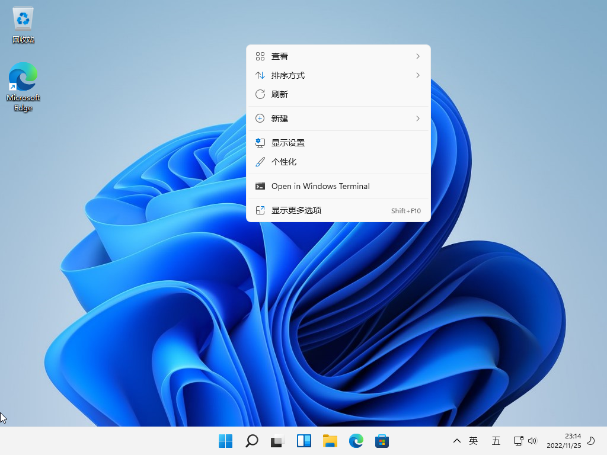

接下来开始设置 在 开始 鼠标右击 选择 Windows 终端（管理员）

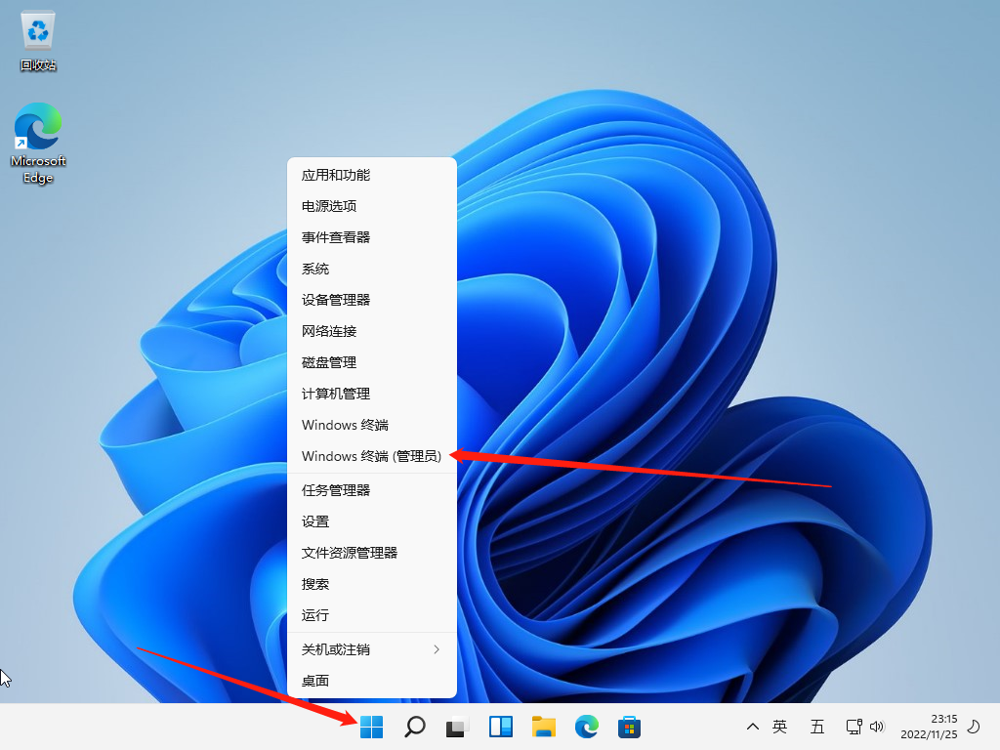

然后在下面复制粘贴以下代码 后车

> reg.exe add “HKCU\Software\Classes\CLSID\{86ca1aa0-34aa-4e8b-a509-50c905bae2a2}\InprocServer32” /f /ve

如果出现以下情况  我们就要先改一下注册表了

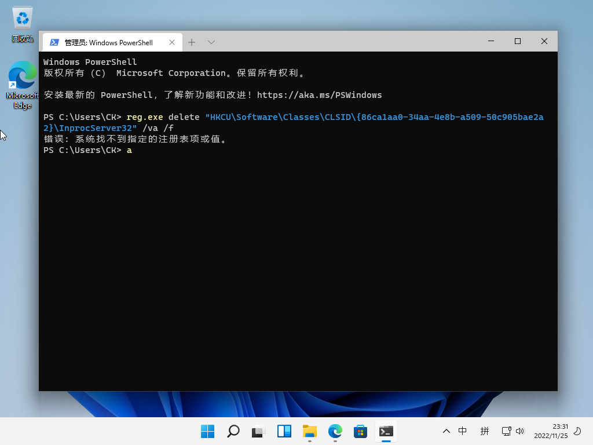

Win+R  在运行输入 Regedit 回车

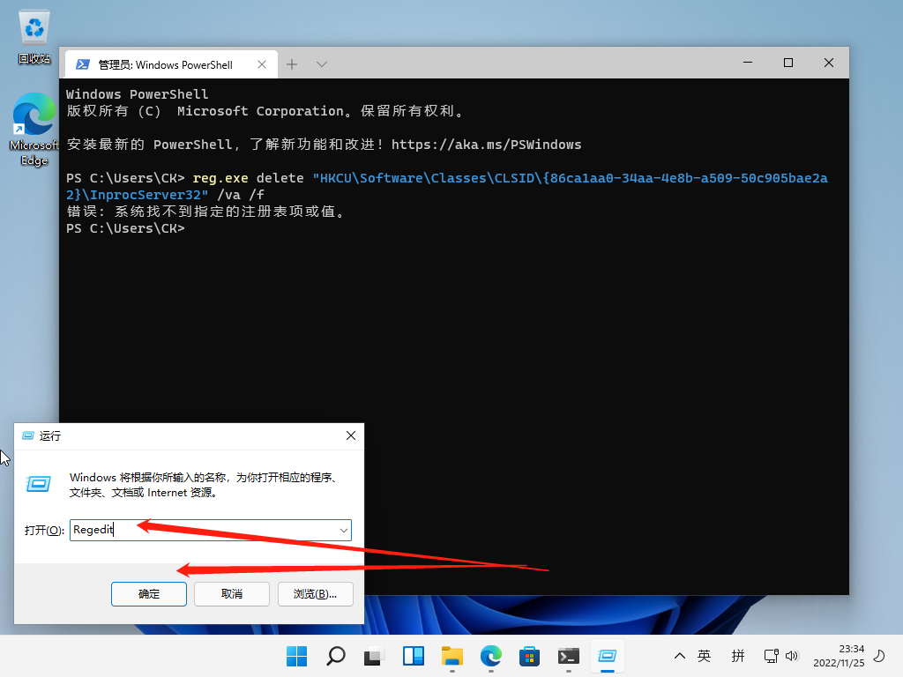

在这里输入以下代码后回车

> HKCU\Software\Classes\CLSID

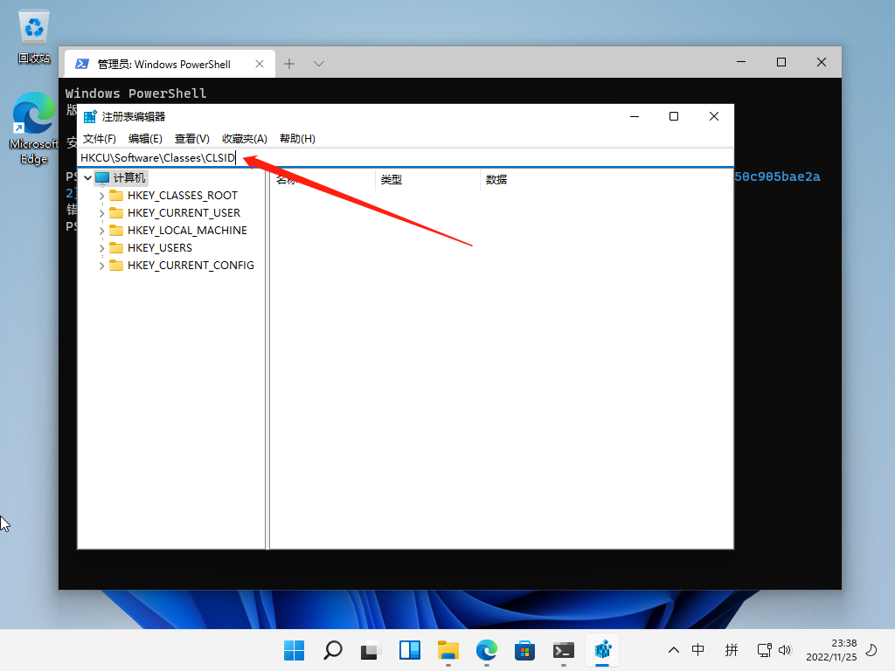

在这CLSID 右击  新建--项  重命名下面的一串数字

> {86ca1aa0-34aa-4e8b-a509-50c905bae2a2}

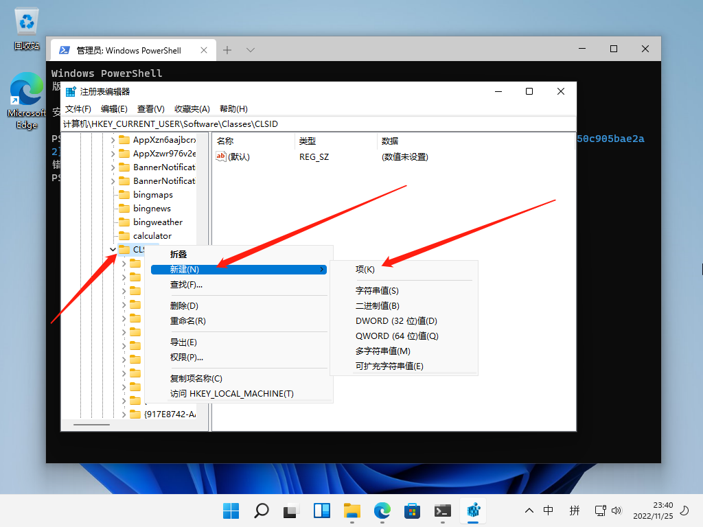

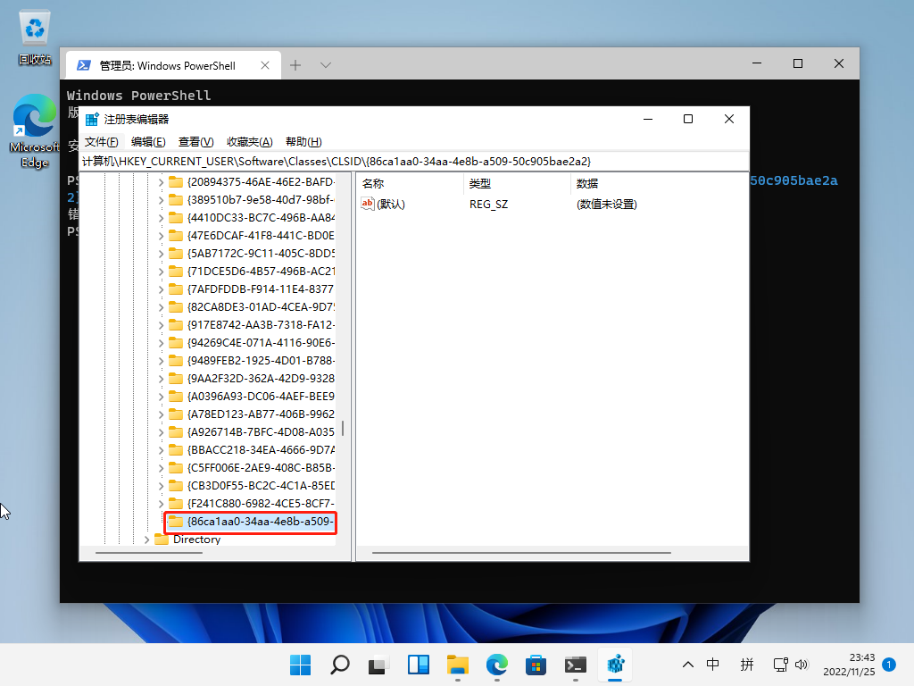

再从这个表项右击新建项

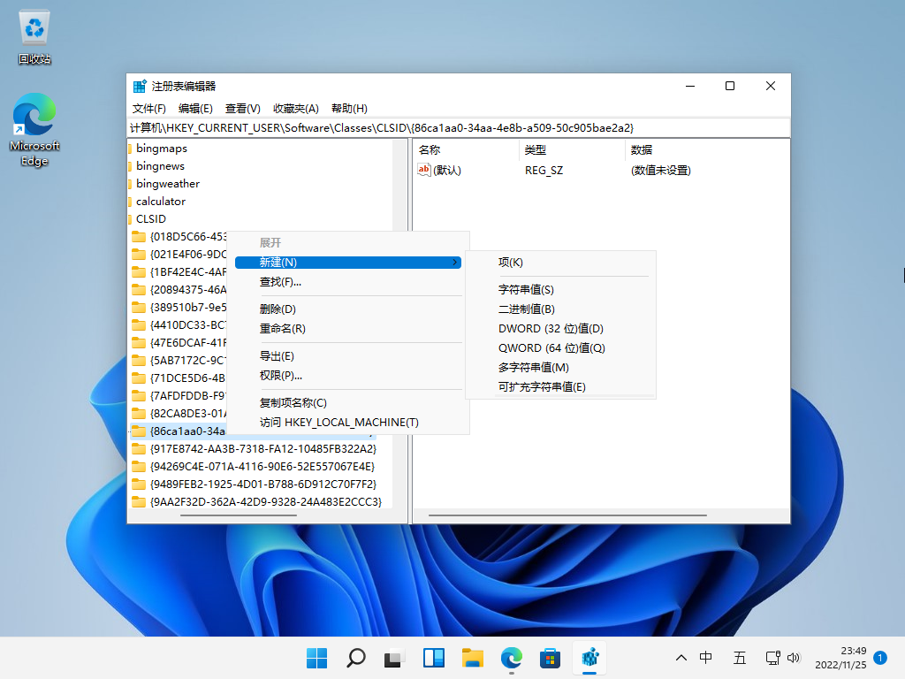

重命名为 InprocServer32  点一下 InprocServer32 右边默认 双击 编辑字符串 数据值不要写任何数据留空 直接点确定

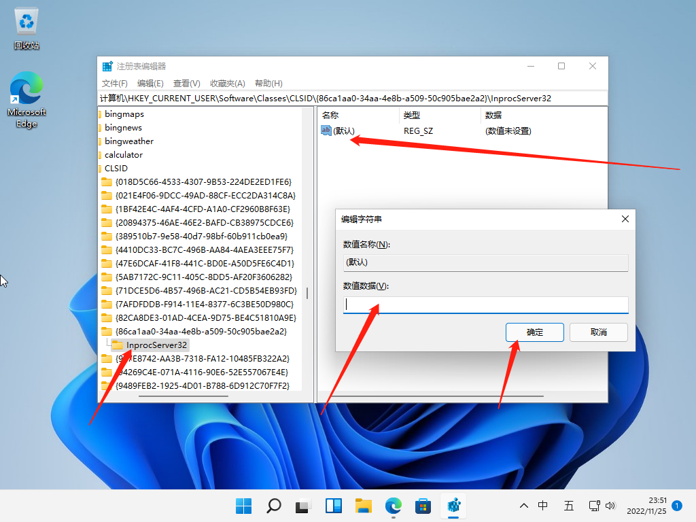

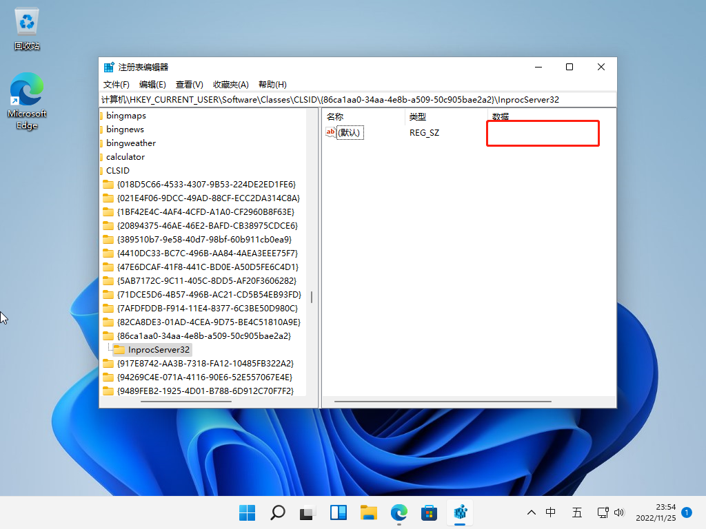

关闭注册表 打开任务管理器  进程  下拉找到 Windows 资源管理器  右击 重新启动

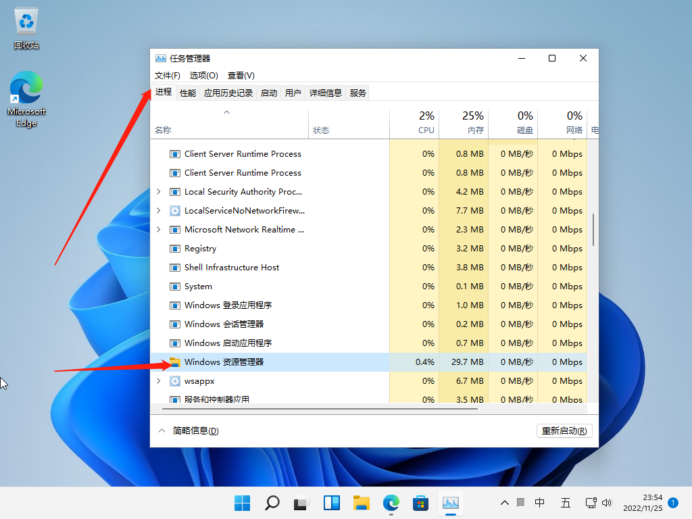

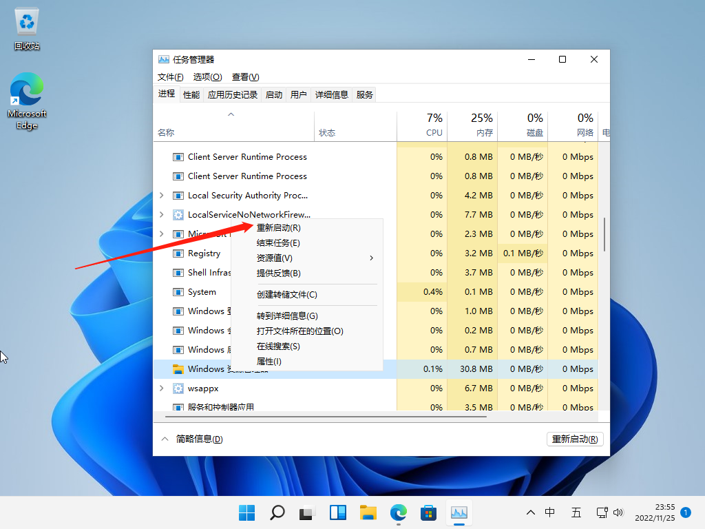

关闭任务管理器 回到桌面 鼠标右击 看看就回Windows 10一样菜单了

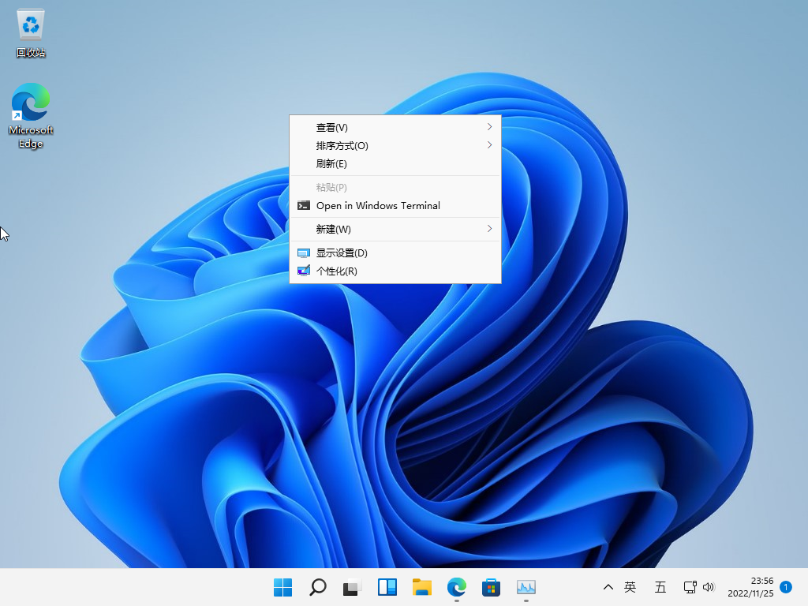

还是经典的用着比较顺手 对不对