# 爱快路由器IPV6解析阿里云域名

首先先在阿里云注册一个域名 [阿里云-为了无法计算的价值 (aliyun.com)](https://www.aliyun.com/) 并登录进去点一上右上角 " 控制台 "

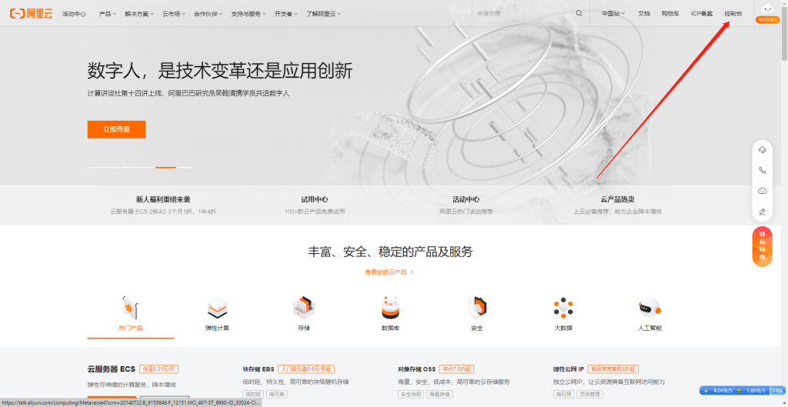

再点一下右上角个人头像 AccessKey管理

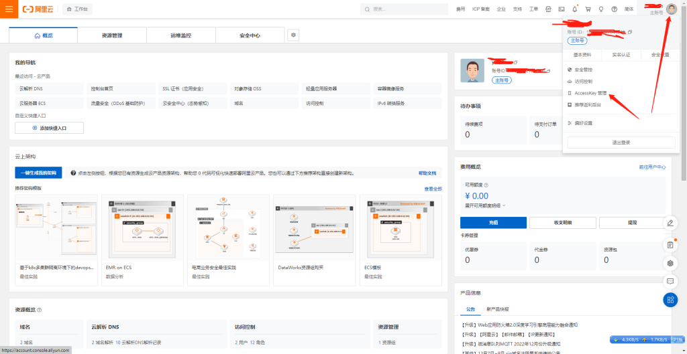

选择 继续使用 AccessKey

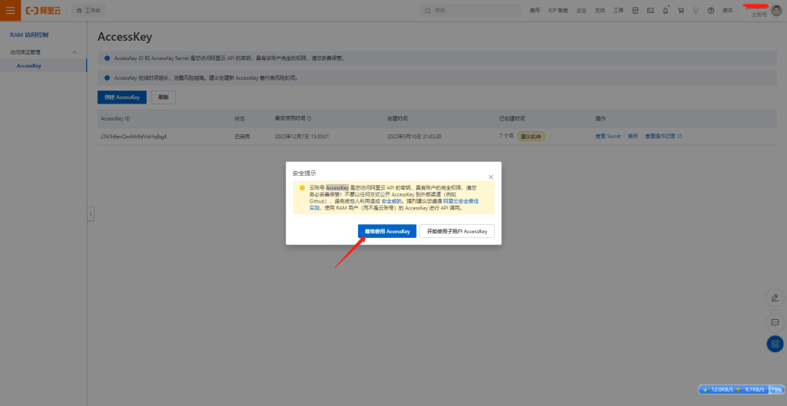

找到  创建AccessKey 第一次要验证一下手机号码 创建完请另保存下来 他可以当作账号和密码用 还可以重复使用

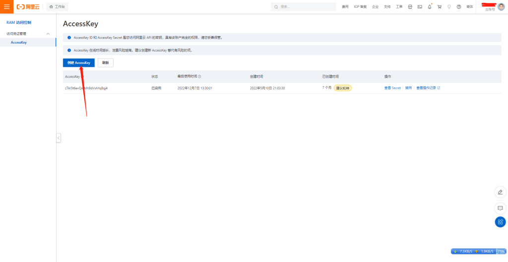

在顶搜索 云解析DNS

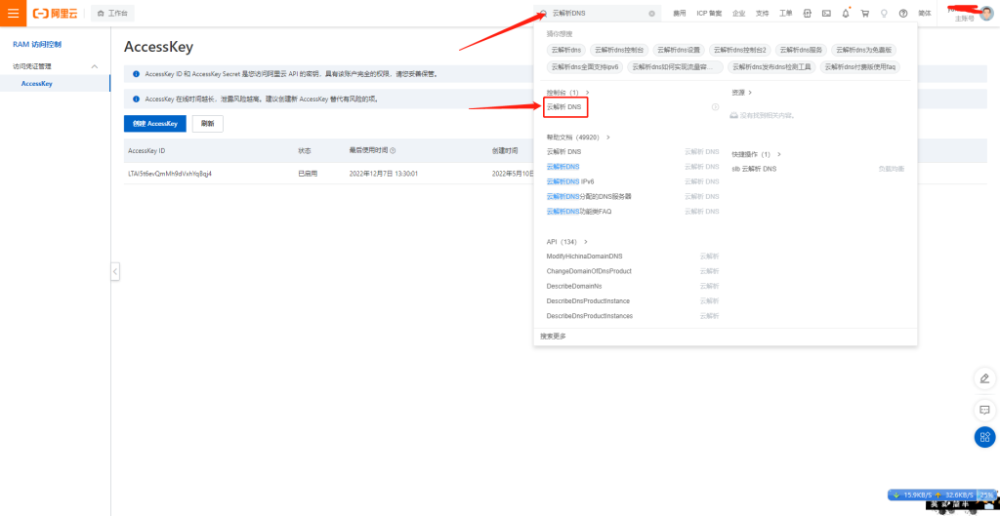

这里有你名下所有有域名 点一下右边解析设置

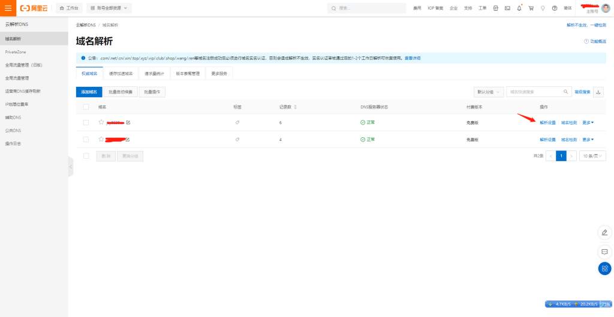

添加一条记录

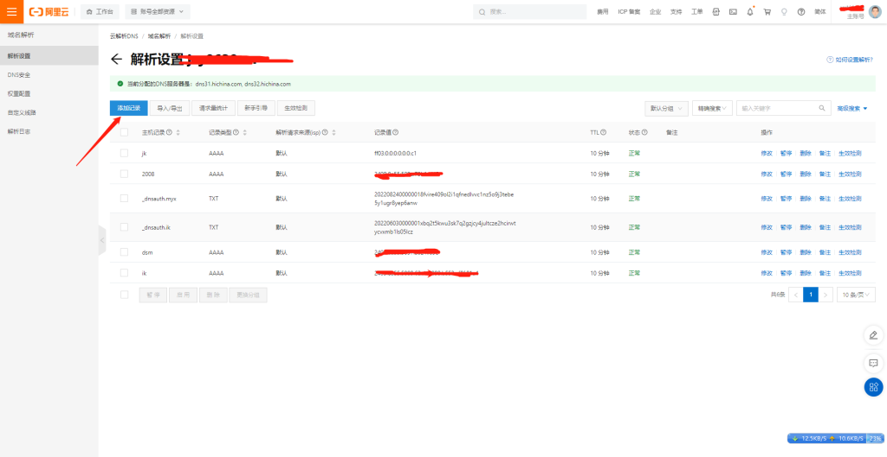

选择 AAAA-将域名指向一个IPV6地址 主机记录为二级域名  因为ipv6不存在NAT，DDNS为一条记录为一个设备.最好用二级域名来代替. 记录值 随便写一个 ff03:0:0:0:0:0:0:c1 就可以 后期会自动更新.

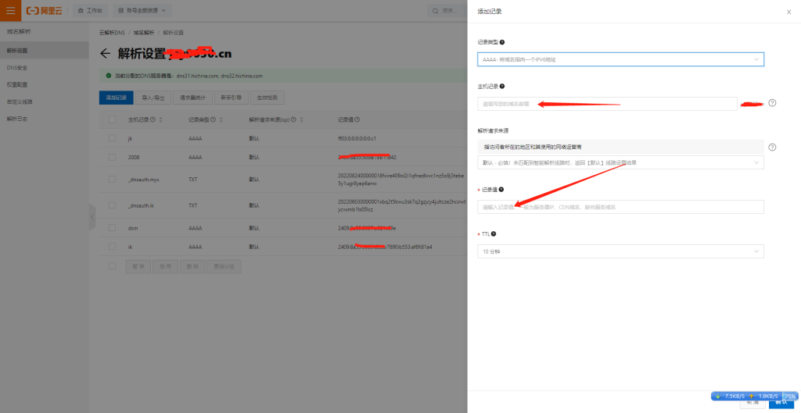

登录爱快 网络设置-IPV6-DHCPv6终端 群晖DUID(DHCP唯一标识）

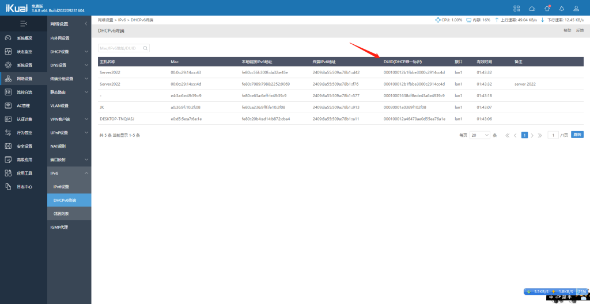

高级应用-动态域名

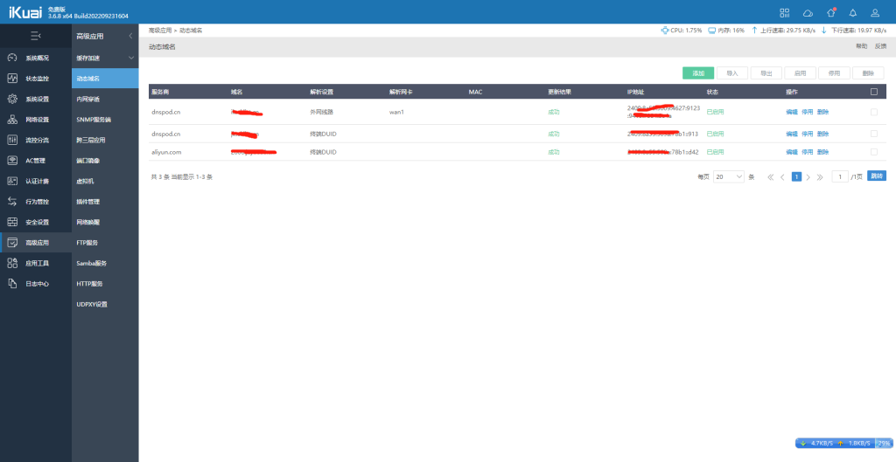

看图

> 服务商 - aliyun.com

> 域名 - 刚才在阿里解析设置的二级域名

> 主域名 - 空

> Access Key ID -  刚才创建的Key

> Access Key Secret - 刚才创建的Key

> 解析设置  -  终端DUID  注 “外网线路-爱快网关  终端MAC-这个不太准跟DUID一样”

> 终端DUID -  网络设置-IPV6-DHCPv6终端 群晖DUID(DHCP唯一标识）查看

> 记录类型 - AAAA记录（IPV6）

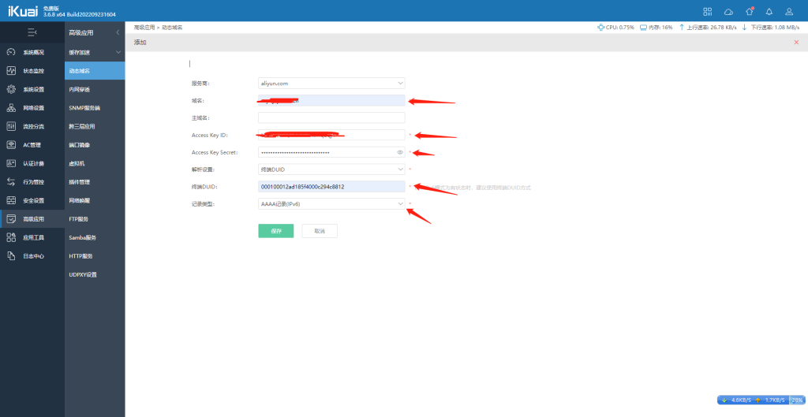

点一下保存 刷新一下 显示成功  就可以

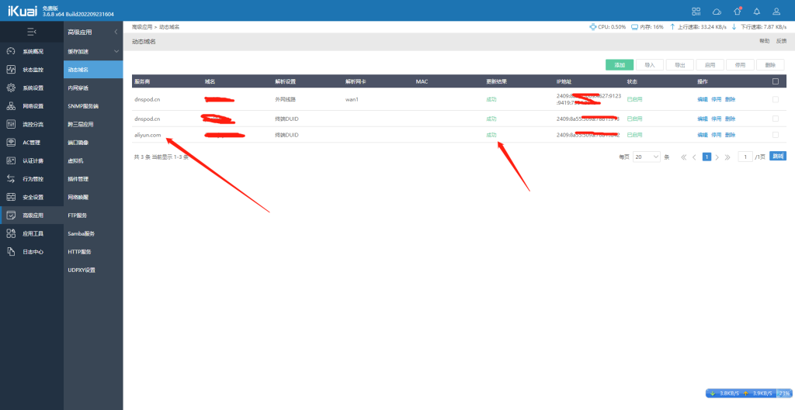