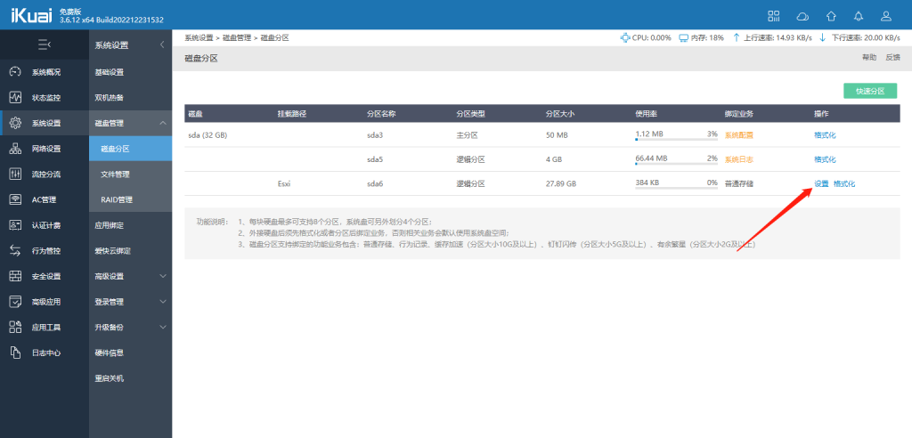
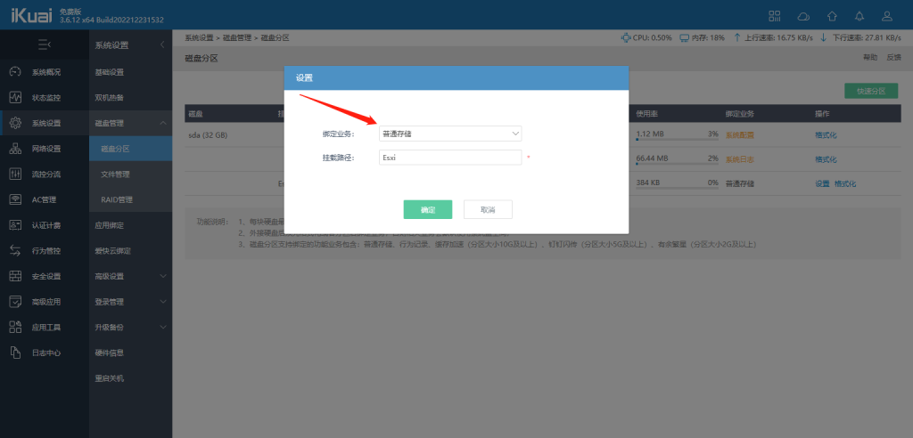
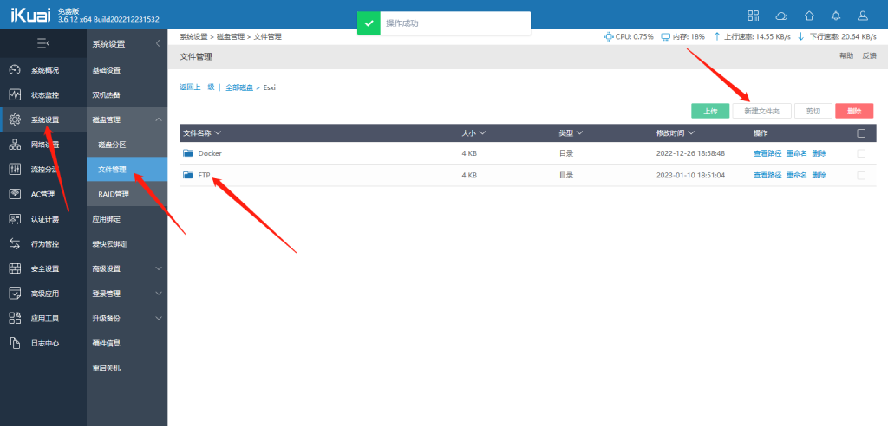
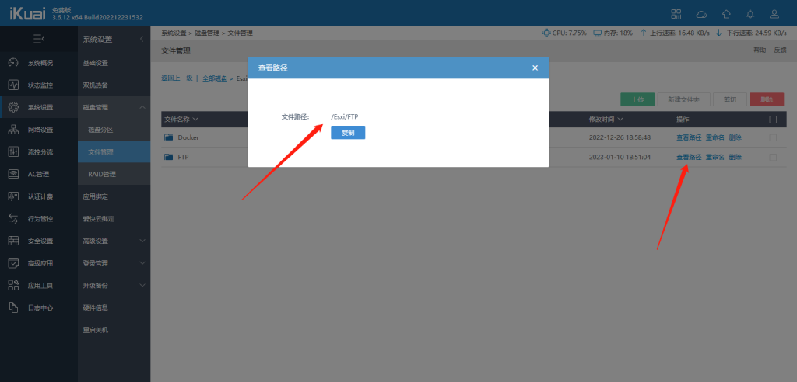
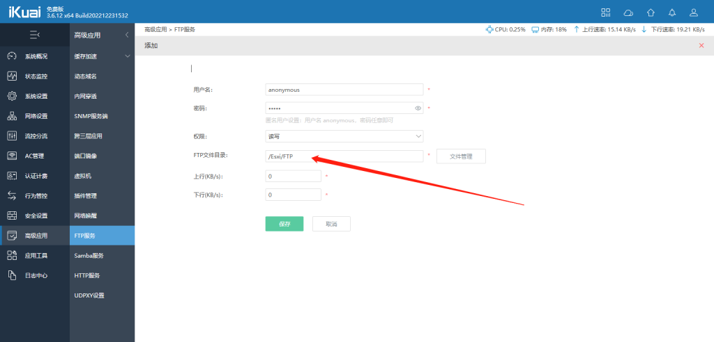
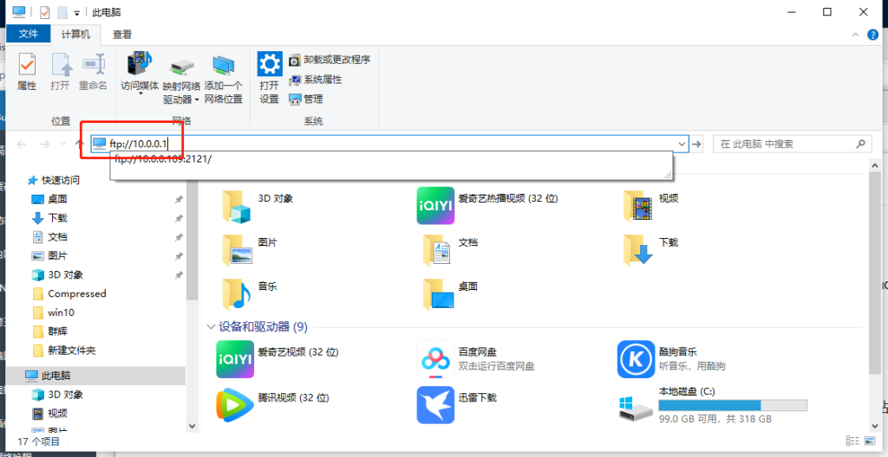
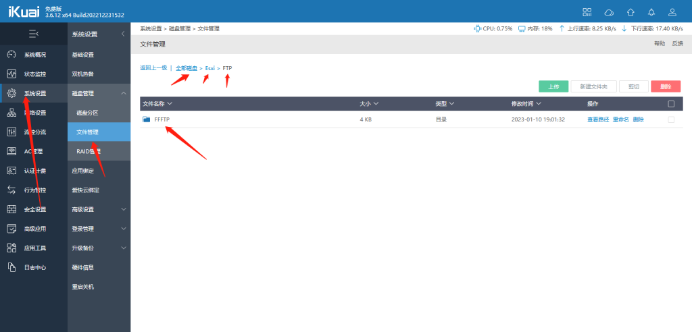

# 爱快路由器开启FTP服务器

FTP服务

一.名词解释
FTP：FTP是File Transfer Protocol的缩写，是网络上的一种文件传输协议。 FTP是File Transfer Protocol(文件传输协议)。顾名思义，就是专门用来传输文件的协议。

二.设置方法

在系统设置--磁盘管理--磁盘分区里面，先把磁盘进行分区，分好区之后点击“设置”。

绑定业务选择普通存储，挂载路径相当于电脑里面的盘符，可以随便填写一个。

创建好之后会在系统设置--磁盘管理--文件管理里面显示我们刚才创建的盘符。点击"文件名称"就能进入到这个盘符里面。

路径，不知道路径是什么可以点击文件管理进行查看。点击复制粘贴到文件目录里面即可。

在高级应用--FTP服务，首先开启FTP服务，服务端口默认21端口，可以不用修改，如果需要修改那么访问的时候必须加上修改的端口。点击“添加”。路径写刚才复制的

【用户名和密码】：用户名和密码可以随意设置。如果是设置匿名用户，那么用户名就必须设置成anonymous，密码随意设置。如果想要用匿名用户登录必须单独设置一条匿名用户的策略。

【权限】：权限分为只读和读写两种。

【FTP文件目录】：填写我们刚才创建的路径，不知道路径是什么可以点击文件管理进行查看。点击复制粘贴到文件目录里面即可。下图图1—图3有详细介绍。

【上行】：对上行速率进行限制。

【下行】：对下行速率进行限制。

电脑打开 FTP://路由器Ip

我们在里面新建一个文件夹

回到爱快上就可以看到刚才建的文件夹了

