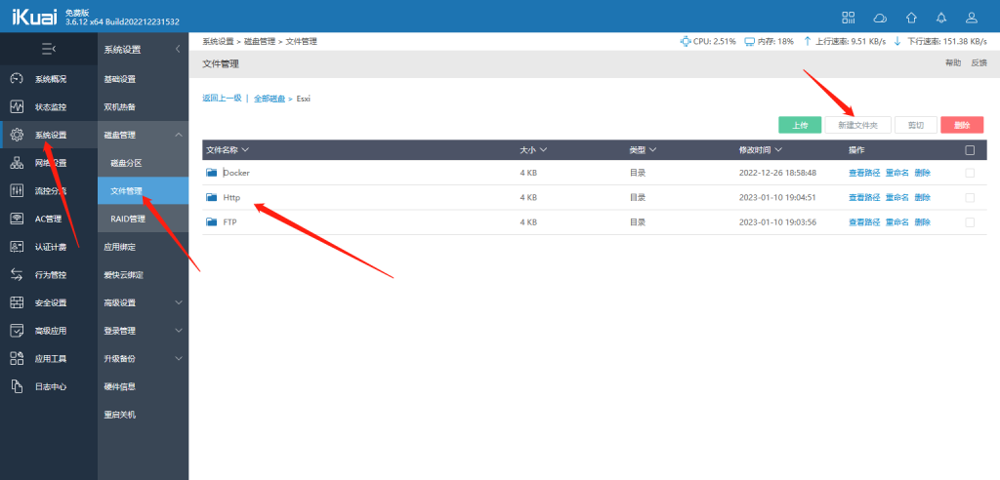
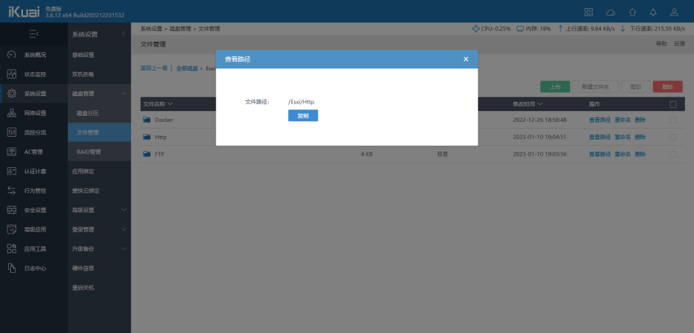
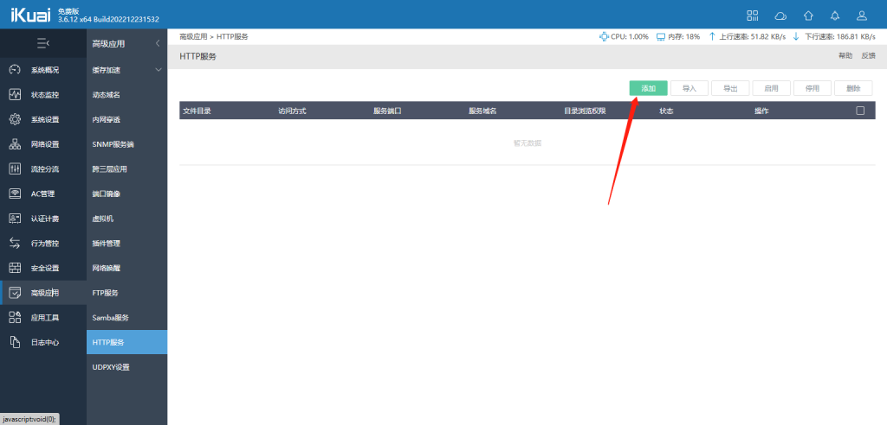
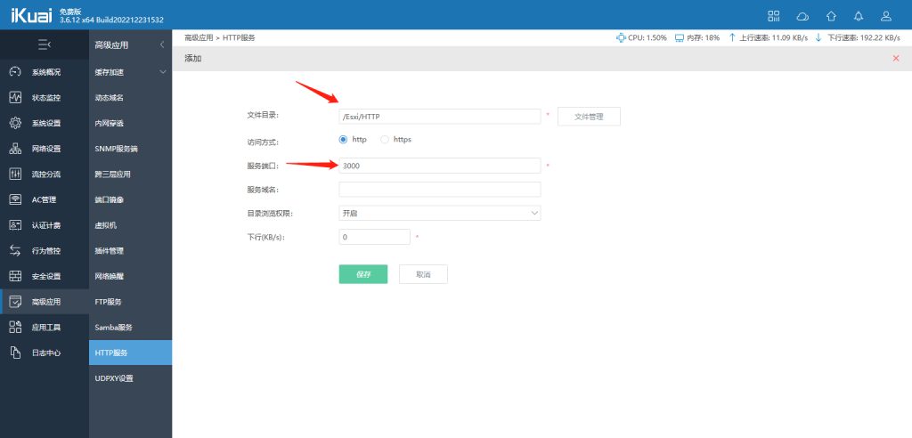
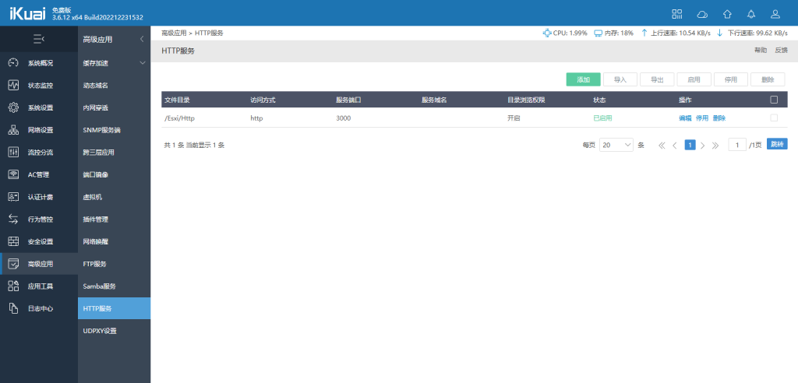
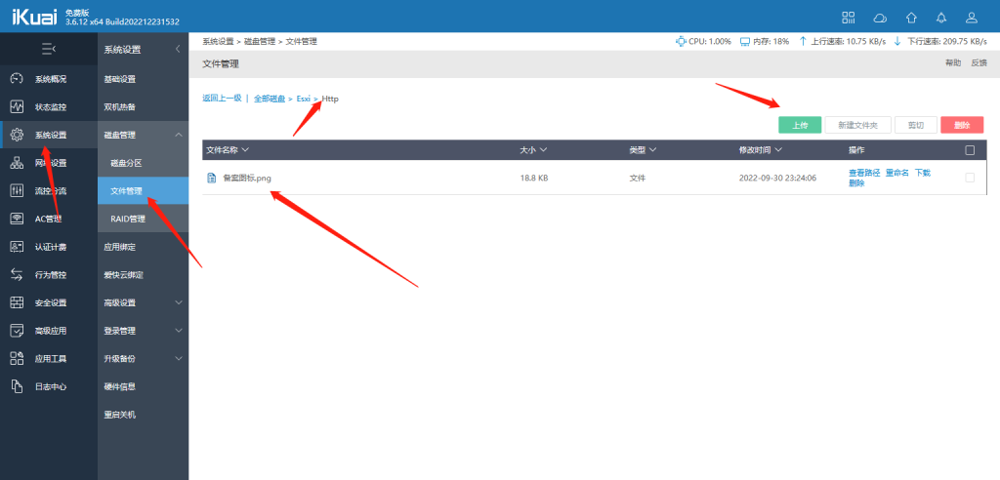
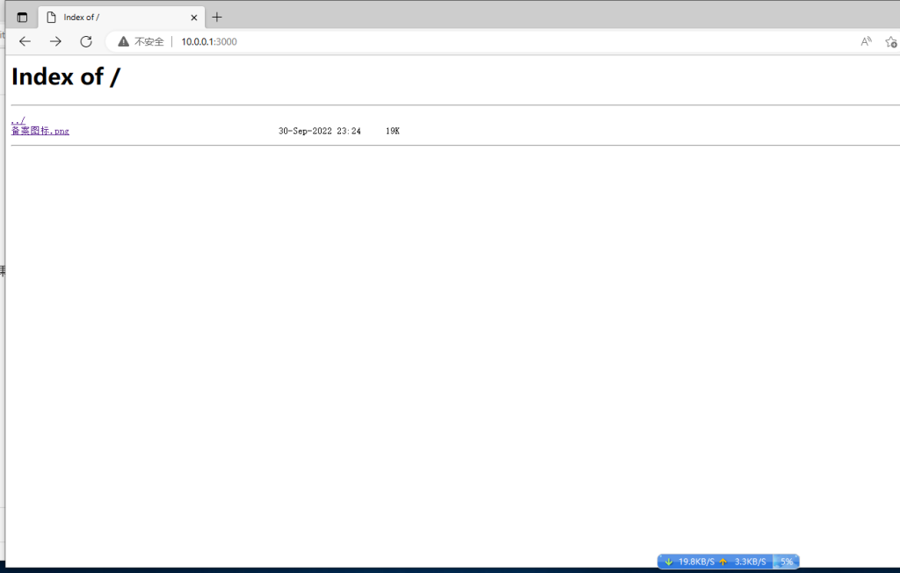

# 爱快路由器开启HTTP服务

HTTP服务

名词解释
HTTP：全称是HyperText Transfer Protocal即超文本传输协议,用于文件的传输。

在系统设置--磁盘管理--文件管理   新建一个文件夹为HTTP目录

点一上 查看路径 复制 等下要用到

在高级应用--HTTP服务里面点击“添加"。

【文件目录】：填写我们刚才创建的路径，不知道路径是什么可以点击文件管理进行查看。点击复制粘贴到文件目录里面即可。下图图1—图3有详细介绍。

【访问方式】：分为http、https。

【服务端口】：服务端口填写路由上没有设置的端口，不要与其他端口冲突就行。

【目录浏览权限】：目录浏览权限分为开启和关闭。如果选择关闭的话就不能进行浏览。

【下行】：对下行速率进行限制。

回到文件管理 随便上传一张图片

在浏览器中输入ip:port即可进行HTTP服务访问，如果访问方式选择的是https那么就在网址栏输入https://ip:端口就能访问了。

注意事项:

1.HTTP端口不能和路由器自身使用的WEB管理端口冲突，因各地普遍封锁80和433端口，设置80和443后外网外部无法访问是正常现象。

2.一定要在设置完HTTP服务后上传文件。