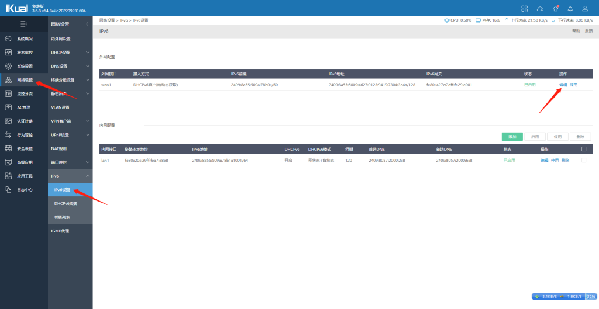
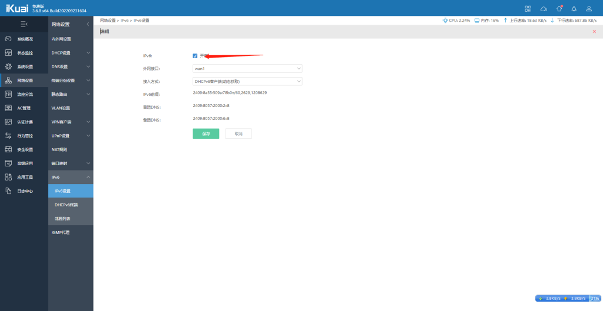
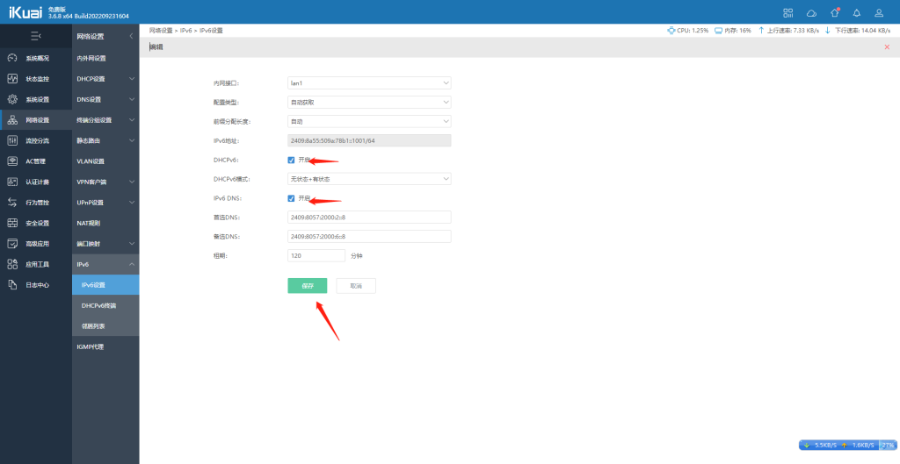
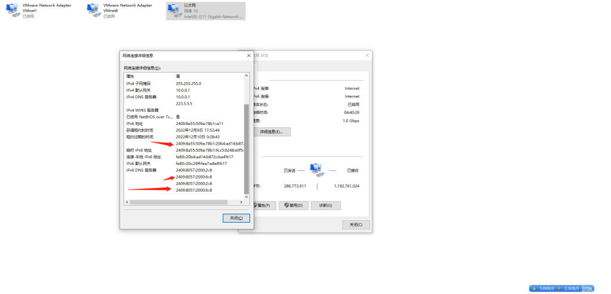
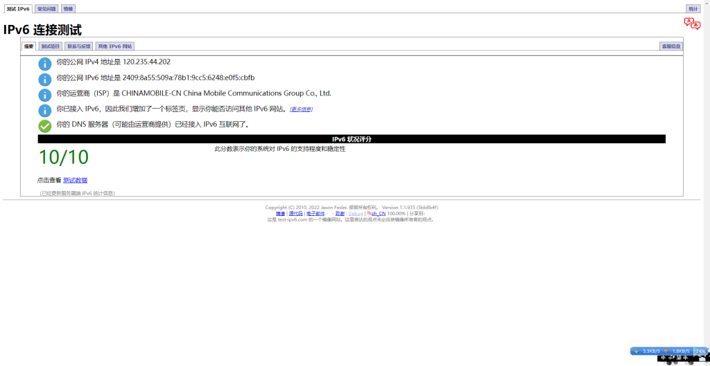

# 爱快路由器开启IPV6

## 前提 前提 前提 光猫改桥接模式路由器要PPPoE拔号

登录爱快  网络设置-IPV6

WAN 编辑 勾选 开启

再点一下LAN 编辑

把这2个勾 勾选上

电脑网络 先禁用 再开启 看看有没有ipv6地址 有这些 240开头的就是ipv6公网

再打开 [IPv6 测试 (test-ipv6.com)](http://www.test-ipv6.com/)

显示10项全通过 表示你已经有ipv6了